# RAG Flow 系统架构文档

## 架构概述

RAG Flow 采用模块化的分层架构设计，将文档处理和向量检索分离为两个核心模块，通过清晰的接口进行协作。系统设计遵循单一职责原则，每个模块专注于特定的功能领域。

## 整体架构

### 系统架构图

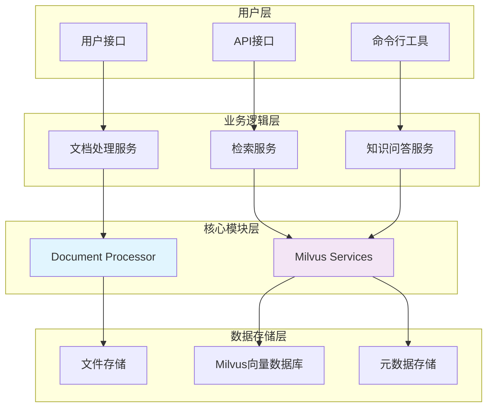

### 模块依赖关系

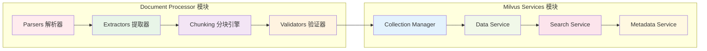

## 核心模块架构

### Document Processor 模块架构

#### 模块结构图

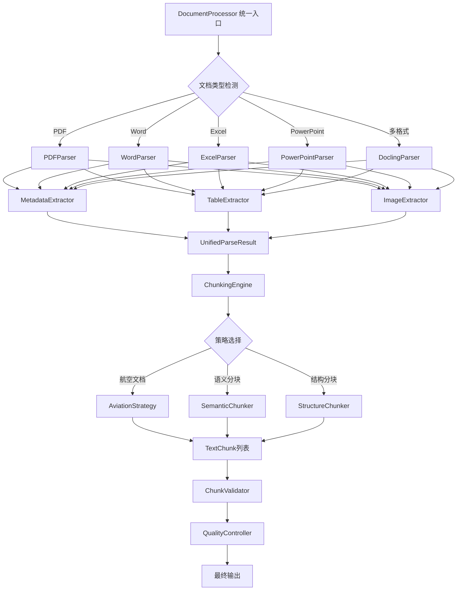

#### 数据流图

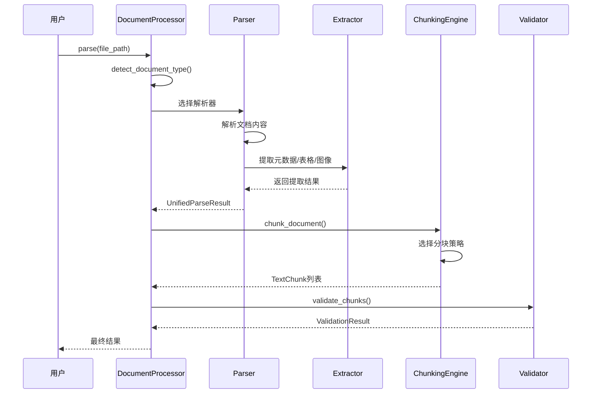

### Milvus Services 模块架构

#### 模块结构图

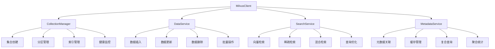

#### 服务交互图

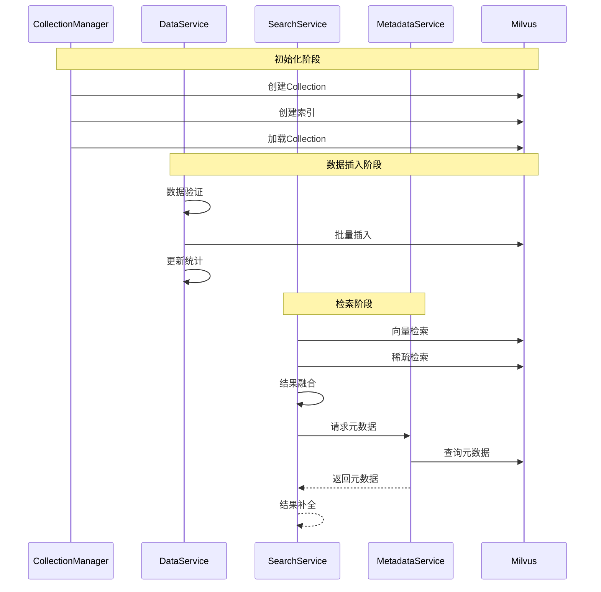

## 技术架构

### 技术栈架构

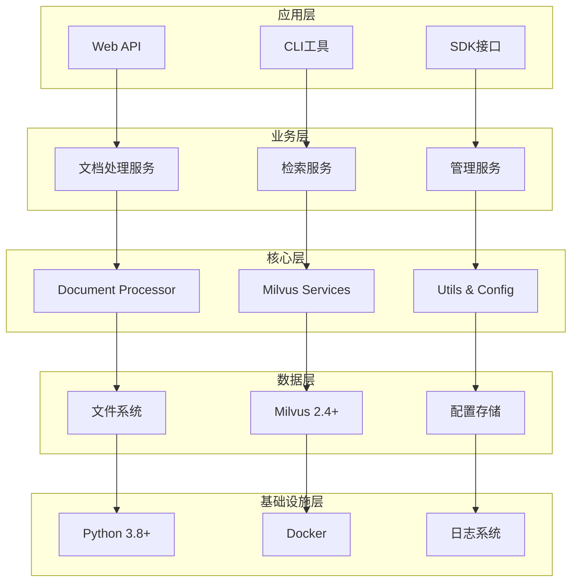

### 数据架构

#### 数据流架构

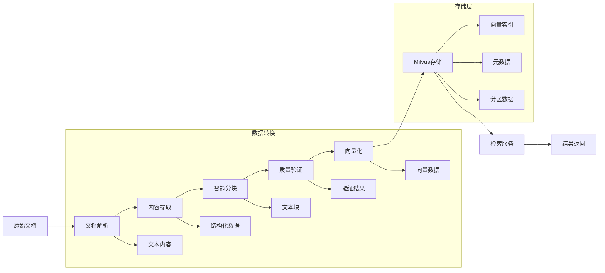

#### 数据模型

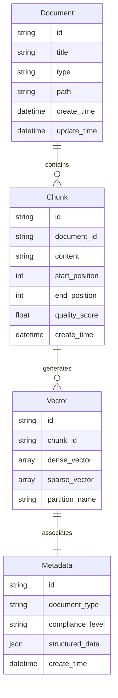

## 部署架构

### 单机部署架构

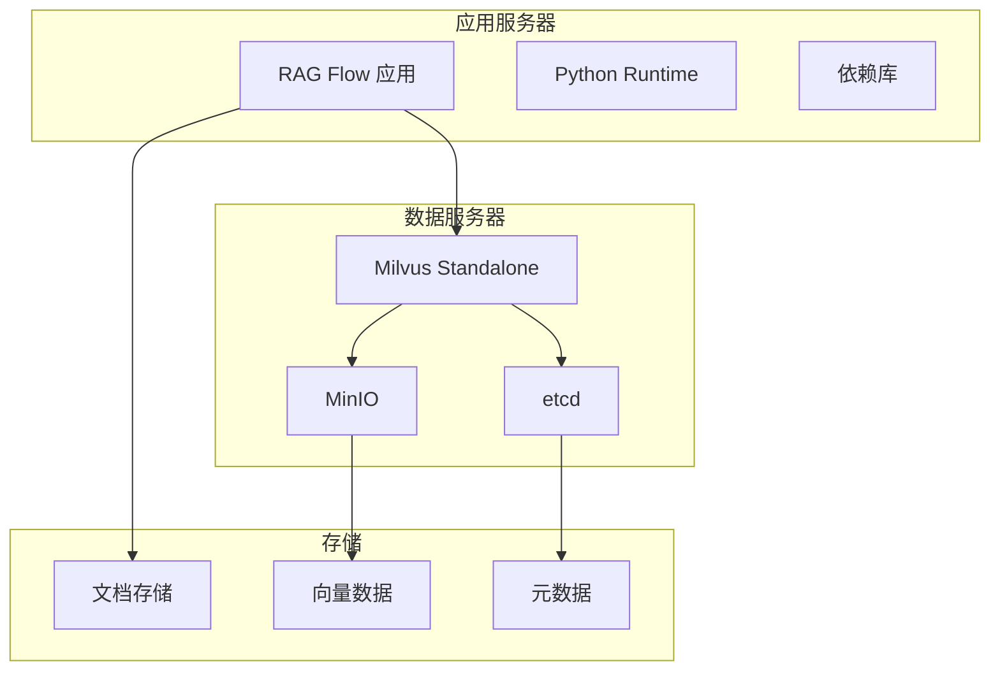

### 分布式部署架构

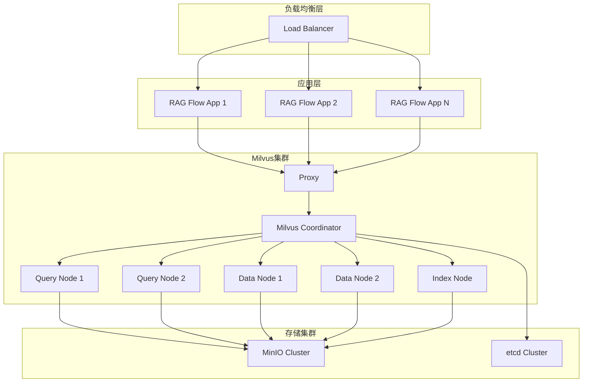

## 性能架构

### 性能优化策略

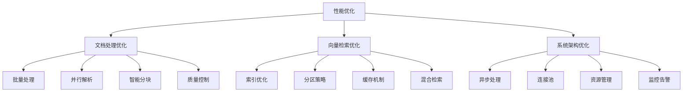

### 扩展性设计

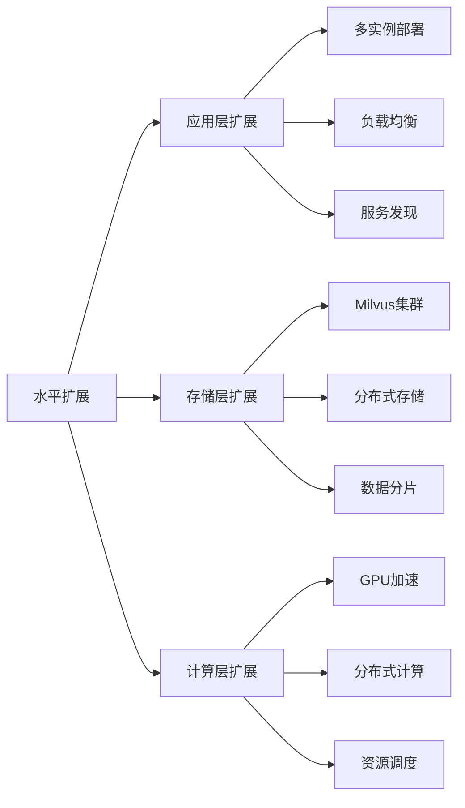

## 安全架构

### 安全层次

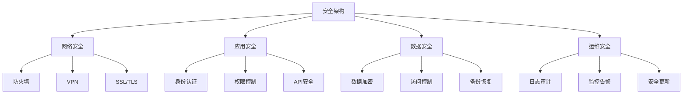

## 监控架构

### 监控体系

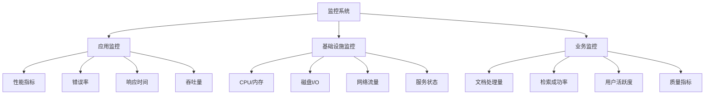

## 总结

RAG Flow 的架构设计具有以下特点：

1. **模块化设计**: 清晰的模块边界和职责分离
2. **可扩展性**: 支持水平和垂直扩展
3. **高性能**: 多层次的性能优化策略
4. **高可用**: 分布式部署和故障恢复机制
5. **安全性**: 全方位的安全保障措施
6. **可维护性**: 完善的监控和运维体系

这种架构设计确保了系统的稳定性、性能和可扩展性，能够满足航空行业对知识管理系统的高要求。
