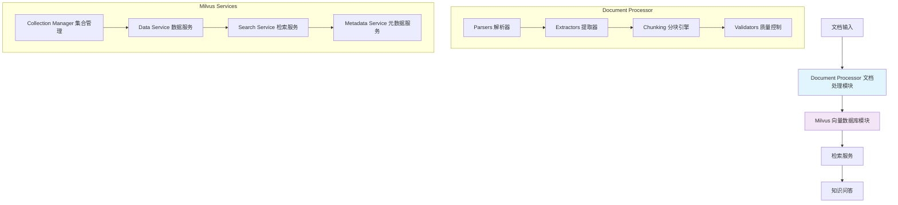
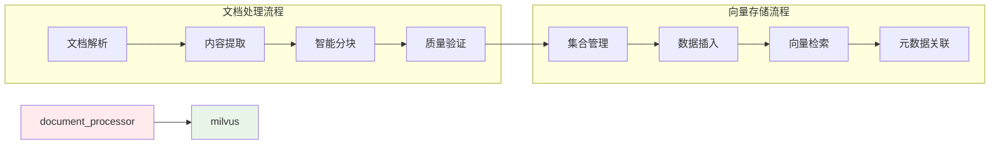

# RAG Flow - 航空知识管理系统

## 项目概述

RAG Flow 是一个专为航空行业设计的智能知识管理系统，基于检索增强生成（RAG）技术，提供高效的文档处理、知识检索和智能问答服务。系统专门针对航空维修手册、规章制度、技术标准等专业文档进行优化。

## 核心特性

### 🚀 智能文档处理
- **多格式支持**: PDF、Word、Excel、PowerPoint、HTML、Markdown等
- **高质量解析**: 基于Docling的统一文档解析，保持结构和格式
- **智能分块**: 针对航空文档特点的专业分块策略
- **内容提取**: 表格、图像、元数据的精确提取
- **质量控制**: 全流程质量验证和优化建议

### 🔍 高性能向量检索
- **向量数据库**: 基于Milvus的高性能向量存储和检索
- **混合检索**: 向量相似度 + BM25全文检索 + 精确匹配
- **智能融合**: 多种检索策略的智能结果融合
- **元数据过滤**: 支持复杂的元数据条件过滤
- **分区管理**: 按文档类型和业务场景的分区管理

### ✈️ 航空专业优化
- **文档类型识别**: 自动识别维修手册、规章制度、技术标准等
- **专业分块策略**: 保持程序完整性、识别警告信息
- **合规性管理**: 支持合规等级标记和过滤
- **版本控制**: 文档版本管理和更新追踪

## 系统架构

### 整体架构图



### 核心模块关系



## 核心模块详解

### Document Processor - 文档处理模块

**功能定位**: 将各种格式的文档转换为结构化的、适合RAG系统处理的数据

**核心组件**:
- **Parsers**: 多格式文档解析器（PDF、Word、Excel、PowerPoint、Docling统一解析）
- **Extractors**: 内容提取器（元数据、表格、图像提取）
- **Chunking**: 智能分块引擎（航空文档专用策略、语义分块、结构分块）
- **Validators**: 质量控制器（分块验证、质量评估、优化建议）

**数据流向**: 
```
原始文档 → 解析器 → 内容提取 → 智能分块 → 质量验证 → 结构化数据
```

**关键特性**:
- 支持15+种文档格式
- 航空文档专业优化
- 全流程质量控制
- 可扩展的分块策略

### Milvus - 向量数据库模块

**功能定位**: 提供高性能的向量存储、检索和管理服务

**核心组件**:
- **Collection Manager**: 集合和分区管理、索引优化、健康监控
- **Data Service**: 数据插入、更新、删除、批量操作
- **Search Service**: 向量检索、混合检索、查询优化
- **Metadata Service**: 元数据关联、缓存策略、复合查询

**数据流向**:
```
结构化数据 → 集合管理 → 数据插入 → 向量检索 → 元数据关联 → 检索结果
```

**关键特性**:
- 高性能向量检索
- 混合检索策略
- 智能缓存机制
- 分区管理优化

## 技术栈

### 核心技术
- **Python 3.8+**: 主要开发语言
- **Milvus 2.4+**: 向量数据库
- **Docling**: 统一文档解析库
- **PyMuPDF**: PDF处理
- **python-docx**: Word文档处理
- **openpyxl**: Excel文档处理

### 依赖库
- **向量处理**: numpy, scipy
- **文档处理**: pymupdf, python-docx, openpyxl, python-pptx
- **机器学习**: transformers, torch（可选）
- **数据处理**: pandas, pillow
- **网络通信**: requests, aiohttp

## 快速开始

### 环境要求
- Python 3.8+
- Milvus 2.4+
- 8GB+ RAM（推荐16GB）
- 50GB+ 存储空间

### 安装步骤

1. **克隆项目**
```bash
git clone <repository-url>
cd rag_flow
```

2. **安装依赖**
```bash
# 基础依赖
pip install -r requirements.txt

# Docling依赖（可选，用于高级文档处理）
pip install docling

# OCR依赖（可选，用于图像文字识别）
pip install pytesseract
```

3. **启动Milvus服务**
```bash
# 使用Docker启动Milvus
docker run -d --name milvus \
  -p 19530:19530 \
  -p 9091:9091 \
  milvusdb/milvus:latest
```

4. **配置系统**
```python
# 配置Milvus连接
MILVUS_URI = "http://localhost:19530"
MILVUS_TOKEN = "root:Milvus"

# 配置文档处理
DOCLING_CONFIG = {
    'enable_ocr': True,
    'enable_table_structure': True,
    'enable_picture_description': True
}
```

### 基本使用

```python
from rag_flow.src.core.document_processor import DocumentProcessor
from rag_flow.src.core.milvus import MilvusCollectionManager, MilvusDataService

# 1. 初始化文档处理器
processor = DocumentProcessor({
    'use_docling': True,
    'docling_config': {
        'enable_ocr': True,
        'enable_table_structure': True
    }
})

# 2. 解析文档
result = processor.parse("航空维修手册.pdf")
print(f"解析完成: {len(result.text_content)} 字符")

# 3. 初始化Milvus服务
collection_manager = MilvusCollectionManager()
data_service = MilvusDataService(collection_manager.client)

# 4. 创建集合
collection_manager.create_aviation_collection("aviation_docs")

# 5. 插入数据
data_service.insert_data(
    collection_name="aviation_docs",
    data={
        "document_title": result.metadata['title'],
        "document_content": result.text_content,
        "document_type": "maintenance_manual"
    }
)
```

## 配置说明

### 文档处理配置
```python
DOCUMENT_PROCESSOR_CONFIG = {
    'use_docling': True,                    # 是否使用Docling
    'enable_performance_monitoring': True,  # 性能监控
    'docling_config': {
        'enable_ocr': True,                 # OCR识别
        'enable_table_structure': True,     # 表格结构识别
        'enable_picture_description': True, # 图片描述
        'table_mode': 'accurate',          # 表格模式
        'images_scale': 2                   # 图片缩放
    },
    'chunking_config': {
        'chunk_size': 1000,                # 分块大小
        'chunk_overlap': 200,              # 重叠大小
        'default_strategy': 'aviation'     # 分块策略
    }
}
```

### Milvus配置
```python
MILVUS_CONFIG = {
    'uri': 'http://localhost:19530',
    'token': 'root:Milvus',
    'collection_config': {
        'dimension': 768,                   # 向量维度
        'metric_type': 'L2',               # 距离度量
        'index_type': 'IVF_FLAT',          # 索引类型
        'nlist': 1024                      # 索引参数
    },
    'search_config': {
        'nprobe': 16,                      # 搜索参数
        'top_k': 10,                       # 返回结果数
        'vector_weight': 0.7,              # 向量权重
        'sparse_weight': 0.3               # 稀疏向量权重
    }
}
```

## 性能优化

### 文档处理优化
- **批量处理**: 使用批量接口处理大量文档
- **分块策略**: 根据文档类型选择合适的分块策略
- **质量控制**: 启用质量验证确保数据质量
- **并行处理**: 利用多进程处理大文档

### 向量检索优化
- **索引优化**: 根据数据规模选择合适的索引类型
- **分区策略**: 按业务场景划分分区
- **缓存策略**: 启用元数据缓存提高查询性能
- **混合检索**: 结合多种检索策略提高召回率

## 监控和运维

### 系统监控
- **性能指标**: 文档处理速度、检索响应时间
- **质量指标**: 解析成功率、分块质量评分
- **资源监控**: CPU、内存、存储使用情况
- **错误监控**: 异常日志、失败率统计

### 日志管理
- **分级日志**: DEBUG、INFO、WARNING、ERROR
- **模块日志**: 按模块分别记录日志
- **性能日志**: 关键操作的性能数据
- **审计日志**: 重要操作的审计记录

## 扩展开发

### 添加新的文档格式
1. 在`parsers/`目录下创建新的解析器
2. 实现标准的解析接口
3. 在`DocumentProcessor`中注册新格式
4. 更新配置和文档

### 自定义分块策略
1. 继承`ChunkingStrategy`基类
2. 实现`chunk_text`方法
3. 在分块引擎中注册策略
4. 配置策略参数

### 扩展检索功能
1. 在`search_service.py`中添加新方法
2. 实现检索逻辑
3. 更新API接口
4. 添加相应测试

## 贡献指南

1. **代码规范**: 遵循PEP 8和项目编码规范
2. **文档更新**: 同步更新相关文档
3. **测试覆盖**: 添加完整的单元测试和集成测试
4. **性能考虑**: 关注性能影响和优化
5. **向后兼容**: 保持API的向后兼容性

## 许可证

本项目采用 MIT 许可证，详见 [LICENSE](LICENSE) 文件。

## 联系方式

- **项目维护者**: Sniperz
- **创建日期**: 2024-01-15
- **当前版本**: v1.0.0

---

*RAG Flow - 让航空知识管理更智能*
