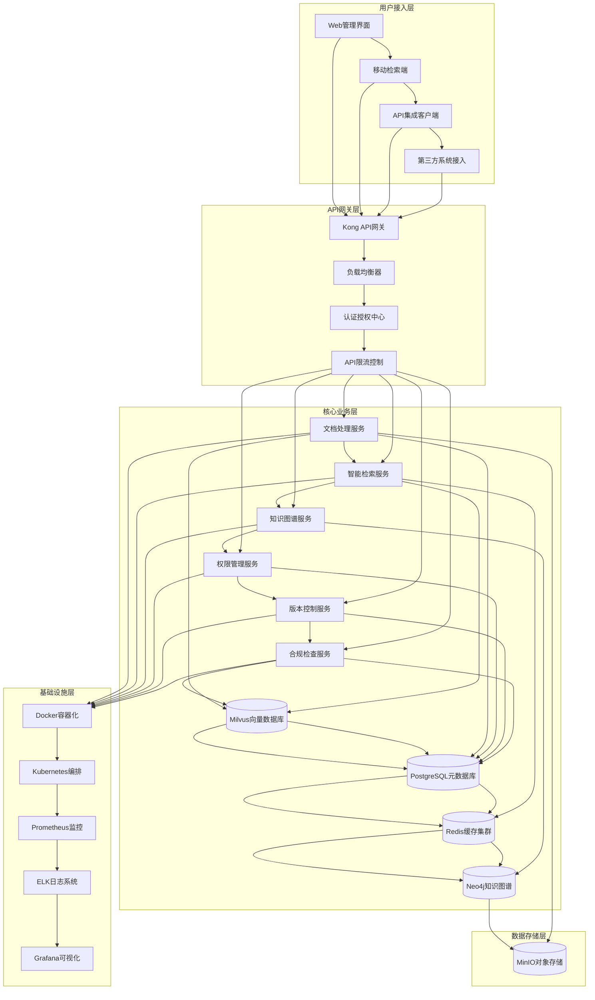
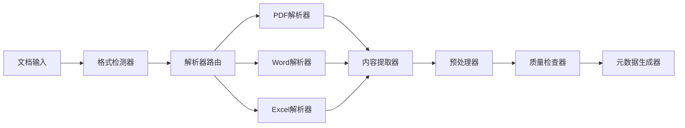
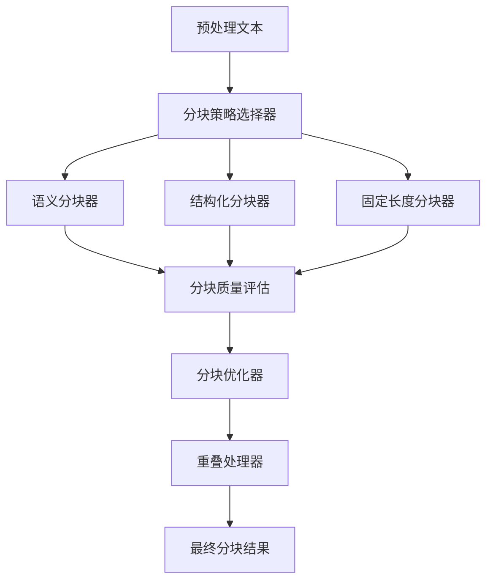
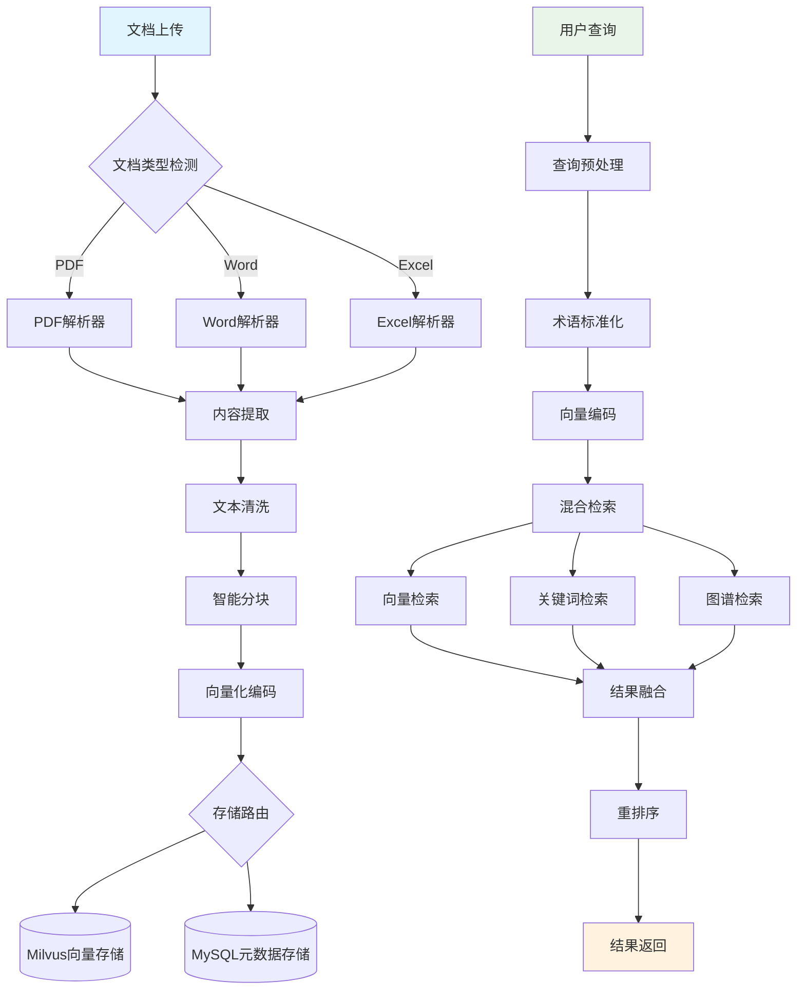
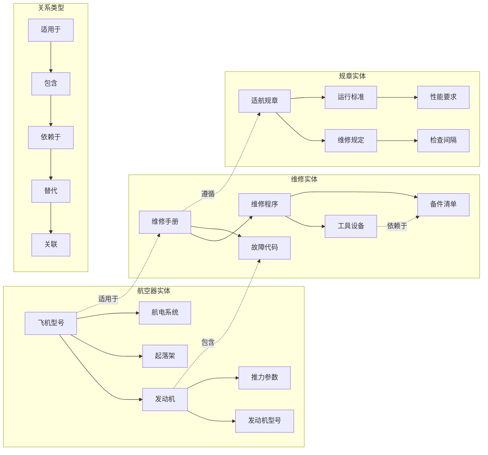
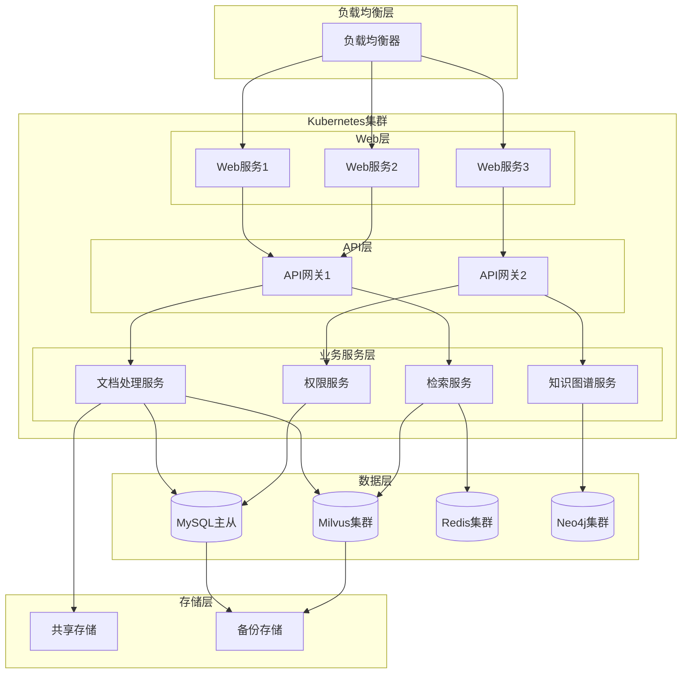
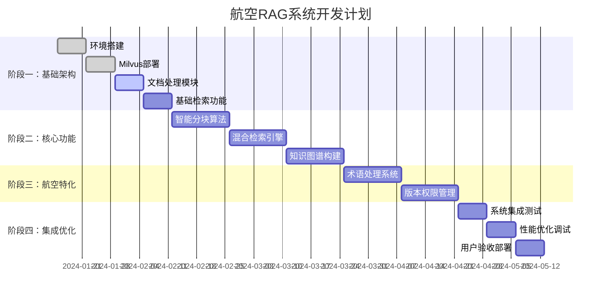

# 航空行业RAG知识库系统 - 技术架构设计文档

## 文档说明
本文档专注于航空RAG系统的技术架构设计，包括系统组件关系、数据流设计、技术选型说明和接口设计规范。
配套文档：[开发计划文档](./development_plan.md) - 包含功能需求、开发里程碑和任务分配。

## 1. 技术架构概述

### 1.1 架构设计原则
- **微服务架构**: 组件解耦，独立部署和扩展
- **数据驱动**: 以向量数据库为核心的数据处理流程
- **高可用性**: 分布式部署，故障自动恢复
- **安全合规**: 满足航空行业数据安全和合规要求

### 1.2 核心技术选型
- **向量数据库**: Milvus 2.3+ - 分布式向量检索引擎
- **后端框架**: FastAPI - 高性能异步API框架
- **文档处理**: Unstructured + PyMuPDF - 多格式文档解析
- **向量模型**: BGE-M3, Sentence-Transformers - 多语言语义编码
- **知识图谱**: Neo4j - 实体关系存储和推理
- **缓存系统**: Redis - 查询结果缓存和会话管理
- **消息队列**: RabbitMQ - 异步任务处理
- **大语言模型**: DeepSeek-V2.5 - 国产推理模型，支持故障诊断
- **推理引擎**: PyKE + NetworkX - 故障树分析和贝叶斯网络推理
- **语音识别**: 科大讯飞语音云 - 航空专业术语识别
- **OCR识别**: PaddleOCR - 开源中英文混合识别
- **对话管理**: Rasa Core - 交互式诊断对话

## 2. 系统整体架构

### 2.1 分层架构设计



### 2.2 核心组件架构

#### 2.2.1 文档处理引擎架构


**组件职责**:
- **格式检测器**: 自动识别文档格式和编码
- **解析器路由**: 根据文档类型选择合适的解析器
- **内容提取器**: 提取文本、图像、表格等多模态内容
- **预处理器**: 文本清洗、标准化、去重处理
- **质量检查器**: 内容完整性和准确性验证
- **元数据生成器**: 自动生成文档元数据

#### 2.2.2 智能分块引擎架构


**分块策略**:
- **语义分块**: 基于句法分析和语义相似度
- **结构化分块**: 针对表格、列表等结构化内容
- **层次化分块**: 保持文档层次结构
- **自适应分块**: 根据内容特征动态调整分块大小

### 2.3 数据处理流程



## 3. 核心功能模块

### 3.1 文档处理模块

#### 3.1.1 技术选型
- **PDF解析**: PyMuPDF + pdfplumber
- **Office文档**: python-docx + openpyxl
- **OCR识别**: PaddleOCR + Tesseract
- **图像处理**: OpenCV + PIL

#### 3.1.2 处理流程
```python
class DocumentProcessor:
    """文档处理核心类"""
    
    def __init__(self):
        self.parsers = {
            'pdf': PDFParser(),
            'docx': WordParser(),
            'xlsx': ExcelParser(),
            'pptx': PowerPointParser()
        }
    
    def process_document(self, file_path: str) -> DocumentContent:
        """
        处理文档并提取内容
        
        Args:
            file_path: 文档路径
            
        Returns:
            DocumentContent: 提取的文档内容对象
        """
        file_type = self._detect_file_type(file_path)
        parser = self.parsers.get(file_type)
        
        if not parser:
            raise UnsupportedFileTypeError(f"不支持的文件类型: {file_type}")
        
        # 提取内容
        content = parser.extract_content(file_path)
        
        # 内容清洗
        cleaned_content = self._clean_content(content)
        
        # 结构化处理
        structured_content = self._structure_content(cleaned_content)
        
        return structured_content
```

### 3.2 智能分块模块

#### 3.2.1 分块策略
- **固定长度分块**: 适用于通用文本内容
- **语义分块**: 基于句法分析的智能分块
- **结构化分块**: 针对表格、列表等结构化内容
- **层次化分块**: 保持文档层次结构的分块方式

#### 3.2.2 实现方案
```python
class SemanticChunker:
    """语义分块器"""
    
    def __init__(self, model_name: str = "sentence-transformers/paraphrase-multilingual-MiniLM-L12-v2"):
        self.sentence_model = SentenceTransformer(model_name)
        self.max_chunk_size = 512
        self.overlap_size = 50
    
    def chunk_document(self, content: str, metadata: dict) -> List[Chunk]:
        """
        对文档进行语义分块
        
        Args:
            content: 文档内容
            metadata: 文档元数据
            
        Returns:
            List[Chunk]: 分块结果列表
        """
        # 句子分割
        sentences = self._split_sentences(content)
        
        # 计算句子向量
        sentence_embeddings = self.sentence_model.encode(sentences)
        
        # 基于相似度进行分块
        chunks = self._semantic_clustering(sentences, sentence_embeddings)
        
        # 生成分块对象
        chunk_objects = []
        for i, chunk_text in enumerate(chunks):
            chunk = Chunk(
                id=f"{metadata['doc_id']}_{i}",
                content=chunk_text,
                metadata={
                    **metadata,
                    'chunk_index': i,
                    'chunk_type': 'semantic'
                }
            )
            chunk_objects.append(chunk)
        
        return chunk_objects
```

### 3.3 向量化模块

#### 3.3.1 模型集成架构
```python
class EmbeddingModelManager:
    """向量化模型管理器"""
    
    def __init__(self):
        self.models = {
            'bge-large-zh': BGEModel('BAAI/bge-large-zh-v1.5'),
            'm3e-base': M3EModel('moka-ai/m3e-base'),
            'openai-ada': OpenAIModel('text-embedding-ada-002'),
            'aviation-custom': CustomAviationModel('aviation-bert-v1.0')
        }
        self.router = ModelRouter()
    
    def encode(self, texts: List[str], content_type: str = 'general') -> np.ndarray:
        """
        文本向量化编码
        
        Args:
            texts: 待编码文本列表
            content_type: 内容类型 (general, technical, regulation)
            
        Returns:
            np.ndarray: 向量矩阵
        """
        # 根据内容类型选择最优模型
        model_name = self.router.select_model(content_type)
        model = self.models[model_name]
        
        # 批量编码
        embeddings = model.encode(texts)
        
        # 向量后处理
        embeddings = self._post_process_embeddings(embeddings)
        
        return embeddings

### 3.4 检索引擎模块

#### 3.4.1 Milvus集成方案
```python
class MilvusRetriever:
    """Milvus向量检索器"""

    def __init__(self, host: str = "localhost", port: int = 19530):
        self.connections = connections
        self.connections.connect("default", host=host, port=port)
        self.collection_name = "aviation_knowledge"
        self._init_collection()

    def _init_collection(self):
        """初始化Milvus集合"""
        fields = [
            FieldSchema(name="id", dtype=DataType.VARCHAR, max_length=100, is_primary=True),
            FieldSchema(name="embedding", dtype=DataType.FLOAT_VECTOR, dim=768),
            FieldSchema(name="content", dtype=DataType.VARCHAR, max_length=65535),
            FieldSchema(name="doc_type", dtype=DataType.VARCHAR, max_length=50),
            FieldSchema(name="category", dtype=DataType.VARCHAR, max_length=100),
            FieldSchema(name="timestamp", dtype=DataType.INT64)
        ]

        schema = CollectionSchema(fields, "航空知识库向量集合")

        if not utility.has_collection(self.collection_name):
            collection = Collection(self.collection_name, schema)

            # 创建索引
            index_params = {
                "metric_type": "COSINE",
                "index_type": "IVF_FLAT",
                "params": {"nlist": 1024}
            }
            collection.create_index("embedding", index_params)

    def search(self, query_vector: List[float], top_k: int = 10,
               filters: dict = None) -> List[SearchResult]:
        """
        向量检索

        Args:
            query_vector: 查询向量
            top_k: 返回结果数量
            filters: 过滤条件

        Returns:
            List[SearchResult]: 检索结果列表
        """
        collection = Collection(self.collection_name)
        collection.load()

        # 构建过滤表达式
        expr = self._build_filter_expression(filters) if filters else None

        # 执行检索
        search_params = {"metric_type": "COSINE", "params": {"nprobe": 10}}
        results = collection.search(
            data=[query_vector],
            anns_field="embedding",
            param=search_params,
            limit=top_k,
            expr=expr,
            output_fields=["content", "doc_type", "category"]
        )

        return self._format_results(results[0])

#### 3.4.2 混合检索策略
```python
class HybridRetriever:
    """混合检索器"""

    def __init__(self):
        self.vector_retriever = MilvusRetriever()
        self.keyword_retriever = ElasticsearchRetriever()
        self.graph_retriever = Neo4jRetriever()
        self.reranker = CrossEncoderReranker()

    def retrieve(self, query: str, retrieval_config: dict) -> List[SearchResult]:
        """
        混合检索主方法

        Args:
            query: 查询文本
            retrieval_config: 检索配置

        Returns:
            List[SearchResult]: 重排序后的检索结果
        """
        # 1. 向量检索
        query_embedding = self._encode_query(query)
        vector_results = self.vector_retriever.search(
            query_embedding,
            top_k=retrieval_config.get('vector_top_k', 20)
        )

        # 2. 关键词检索
        keyword_results = self.keyword_retriever.search(
            query,
            top_k=retrieval_config.get('keyword_top_k', 10)
        )

        # 3. 知识图谱检索
        graph_results = self.graph_retriever.search(
            query,
            top_k=retrieval_config.get('graph_top_k', 5)
        )

        # 4. 结果融合
        merged_results = self._merge_results(
            vector_results, keyword_results, graph_results
        )

        # 5. 重排序
        reranked_results = self.reranker.rerank(query, merged_results)

        return reranked_results[:retrieval_config.get('final_top_k', 10)]
```

### 3.5 知识图谱模块

#### 3.5.1 实体识别与关系抽取
```python
class AviationKnowledgeGraph:
    """航空知识图谱构建器"""

    def __init__(self):
        self.ner_model = load_model("aviation_ner_model")
        self.relation_extractor = RelationExtractor("aviation_relations")
        self.graph_db = Neo4jConnector()

    def build_graph_from_document(self, document: Document) -> None:
        """
        从文档构建知识图谱

        Args:
            document: 文档对象
        """
        # 1. 实体识别
        entities = self._extract_entities(document.content)

        # 2. 关系抽取
        relations = self._extract_relations(document.content, entities)

        # 3. 实体链接
        linked_entities = self._link_entities(entities)

        # 4. 图谱更新
        self._update_graph(linked_entities, relations, document.metadata)

    def _extract_entities(self, text: str) -> List[Entity]:
        """提取航空领域实体"""
        # 使用预训练的航空NER模型
        ner_results = self.ner_model.predict(text)

        entities = []
        for result in ner_results:
            entity = Entity(
                text=result['text'],
                label=result['label'],
                start=result['start'],
                end=result['end'],
                confidence=result['confidence']
            )
            entities.append(entity)

        return entities
```

#### 3.5.2 航空知识图谱结构



## 4. 航空行业特定功能

### 4.1 专业术语处理

#### 4.1.1 术语词典构建
```python
class AviationTerminologyManager:
    """航空术语管理器"""

    def __init__(self):
        self.terminology_db = self._load_terminology_database()
        self.synonym_mapper = SynonymMapper()
        self.abbreviation_expander = AbbreviationExpander()

    def normalize_query(self, query: str) -> str:
        """
        查询标准化处理

        Args:
            query: 原始查询

        Returns:
            str: 标准化后的查询
        """
        # 1. 缩写展开
        expanded_query = self.abbreviation_expander.expand(query)

        # 2. 同义词替换
        normalized_query = self.synonym_mapper.normalize(expanded_query)

        # 3. 术语标准化
        standardized_query = self._standardize_terminology(normalized_query)

        return standardized_query

    def _load_terminology_database(self) -> dict:
        """加载航空术语数据库"""
        return {
            'aircraft_types': ['A320', 'B737', 'C919', 'ARJ21'],
            'components': ['发动机', 'landing gear', '起落架', 'engine'],
            'procedures': ['MEL', 'CDL', 'STC', 'AD'],
            'regulations': ['CCAR', 'FAR', 'EASA', 'ICAO']
        }
```

### 4.2 多语言支持

#### 4.2.1 中英文混合处理
```python
class MultilingualProcessor:
    """多语言处理器"""

    def __init__(self):
        self.language_detector = LanguageDetector()
        self.translators = {
            'zh-en': ChineseToEnglishTranslator(),
            'en-zh': EnglishToChineseTranslator()
        }
        self.cross_lingual_embedder = CrossLingualEmbedder()

    def process_multilingual_query(self, query: str) -> ProcessedQuery:
        """
        处理多语言查询

        Args:
            query: 多语言查询文本

        Returns:
            ProcessedQuery: 处理后的查询对象
        """
        # 1. 语言检测
        languages = self.language_detector.detect_languages(query)

        # 2. 语言分离
        language_segments = self._separate_languages(query, languages)

        # 3. 统一编码
        unified_embedding = self.cross_lingual_embedder.encode(query)

        # 4. 构建处理结果
        processed_query = ProcessedQuery(
            original_query=query,
            languages=languages,
            segments=language_segments,
            embedding=unified_embedding
        )

        return processed_query

### 4.3 版本管理系统

#### 4.3.1 文档版本控制
```python
class DocumentVersionManager:
    """文档版本管理器"""

    def __init__(self):
        self.version_db = VersionDatabase()
        self.diff_calculator = DocumentDiffCalculator()
        self.approval_workflow = ApprovalWorkflow()

    def create_new_version(self, doc_id: str, content: str,
                          metadata: dict, user_id: str) -> DocumentVersion:
        """
        创建文档新版本

        Args:
            doc_id: 文档ID
            content: 文档内容
            metadata: 元数据
            user_id: 用户ID

        Returns:
            DocumentVersion: 新版本对象
        """
        # 1. 获取当前版本
        current_version = self.version_db.get_latest_version(doc_id)

        # 2. 计算差异
        diff = self.diff_calculator.calculate_diff(
            current_version.content if current_version else "",
            content
        )

        # 3. 创建新版本
        new_version = DocumentVersion(
            doc_id=doc_id,
            version_number=self._generate_version_number(doc_id),
            content=content,
            metadata=metadata,
            diff=diff,
            created_by=user_id,
            created_at=datetime.now(),
            status="pending_approval"
        )

        # 4. 启动审批流程
        self.approval_workflow.start_approval(new_version)

        return new_version

### 4.4 权限控制系统

#### 4.4.1 细粒度权限管理
```python
class PermissionManager:
    """权限管理器"""

    def __init__(self):
        self.rbac = RoleBasedAccessControl()
        self.abac = AttributeBasedAccessControl()
        self.audit_logger = AuditLogger()

    def check_access_permission(self, user: User, resource: Resource,
                               action: str) -> bool:
        """
        检查访问权限

        Args:
            user: 用户对象
            resource: 资源对象
            action: 操作类型 (read, write, delete)

        Returns:
            bool: 是否有权限
        """
        # 1. 基于角色的权限检查
        rbac_result = self.rbac.check_permission(user.roles, resource.type, action)

        # 2. 基于属性的权限检查
        abac_result = self.abac.check_permission(
            user.attributes,
            resource.attributes,
            action,
            self._get_environment_attributes()
        )

        # 3. 综合判断
        has_permission = rbac_result and abac_result

        # 4. 记录审计日志
        self.audit_logger.log_access_attempt(
            user_id=user.id,
            resource_id=resource.id,
            action=action,
            result=has_permission,
            timestamp=datetime.now()
        )

        return has_permission

## 5. 技术实施方案

### 5.1 开发环境配置

#### 5.1.1 技术栈选择
- **后端框架**: FastAPI + Python 3.9+
- **向量数据库**: Milvus 2.3+
- **关系数据库**: MySQL 8.0+ / PostgreSQL 13+
- **缓存系统**: Redis 6.0+
- **消息队列**: RabbitMQ / Apache Kafka
- **容器化**: Docker + Kubernetes
- **监控系统**: Prometheus + Grafana

#### 5.1.2 依赖库清单
```python
# requirements.txt
fastapi==0.104.1
uvicorn==0.24.0
pymilvus==2.3.4
sqlalchemy==2.0.23
redis==5.0.1
celery==5.3.4
transformers==4.35.2
sentence-transformers==2.2.2
spacy==3.7.2
neo4j==5.14.1
elasticsearch==8.11.0
pydantic==2.5.0
python-multipart==0.0.6
python-jose==3.3.0
passlib==1.7.4
bcrypt==4.1.1
```

### 5.2 部署架构

#### 5.2.1 部署架构图



#### 5.2.2 微服务部署方案
```yaml
# docker-compose.yml
version: '3.8'

services:
  # API网关
  api-gateway:
    image: nginx:alpine
    ports:
      - "80:80"
      - "443:443"
    volumes:
      - ./nginx.conf:/etc/nginx/nginx.conf
    depends_on:
      - document-service
      - retrieval-service
      - knowledge-graph-service

  # 文档处理服务
  document-service:
    build: ./services/document-processor
    environment:
      - MILVUS_HOST=milvus-standalone
      - MYSQL_HOST=mysql
      - REDIS_HOST=redis
    depends_on:
      - milvus-standalone
      - mysql
      - redis

  # 检索服务
  retrieval-service:
    build: ./services/retrieval-engine
    environment:
      - MILVUS_HOST=milvus-standalone
      - ELASTICSEARCH_HOST=elasticsearch
    depends_on:
      - milvus-standalone
      - elasticsearch

  # 知识图谱服务
  knowledge-graph-service:
    build: ./services/knowledge-graph
    environment:
      - NEO4J_HOST=neo4j
    depends_on:
      - neo4j

  # Milvus向量数据库
  milvus-standalone:
    image: milvusdb/milvus:v2.3.4
    command: ["milvus", "run", "standalone"]
    environment:
      ETCD_ENDPOINTS: etcd:2379
      MINIO_ADDRESS: minio:9000
    volumes:
      - milvus_data:/var/lib/milvus
    ports:
      - "19530:19530"
    depends_on:
      - etcd
      - minio

  # MySQL数据库
  mysql:
    image: mysql:8.0
    environment:
      MYSQL_ROOT_PASSWORD: root_password
      MYSQL_DATABASE: aviation_rag
    volumes:
      - mysql_data:/var/lib/mysql
    ports:
      - "3306:3306"

  # Redis缓存
  redis:
    image: redis:6.2-alpine
    volumes:
      - redis_data:/data
    ports:
      - "6379:6379"

volumes:
  milvus_data:
  mysql_data:
  redis_data:
```

### 5.3 性能优化策略

#### 5.3.1 向量检索优化
```python
class PerformanceOptimizer:
    """性能优化器"""

    def __init__(self):
        self.cache_manager = CacheManager()
        self.index_optimizer = IndexOptimizer()
        self.query_optimizer = QueryOptimizer()

    def optimize_retrieval_performance(self, collection_name: str) -> None:
        """
        优化检索性能

        Args:
            collection_name: 集合名称
        """
        # 1. 索引优化
        self.index_optimizer.optimize_index_parameters(collection_name)

        # 2. 查询缓存
        self.cache_manager.enable_query_cache(collection_name)

        # 3. 向量压缩
        self._enable_vector_compression(collection_name)

        # 4. 分区策略
        self._optimize_partition_strategy(collection_name)

    def _enable_vector_compression(self, collection_name: str) -> None:
        """启用向量压缩"""
        # 使用PQ (Product Quantization) 压缩
        compression_config = {
            "index_type": "IVF_PQ",
            "params": {
                "nlist": 1024,
                "m": 8,  # 子向量数量
                "nbits": 8  # 每个子向量的位数
            }
        }

        collection = Collection(collection_name)
        collection.create_index("embedding", compression_config)

## 6. 开发实施计划

### 6.1 项目开发时间线



### 6.2 项目里程碑

#### 阶段一：基础架构搭建 (4周)
**目标**: 完成核心基础设施和基本功能模块
- **第1周**: 环境搭建、技术选型确认、项目初始化
- **第2周**: Milvus集群部署、基础数据模型设计
- **第3周**: 文档处理模块开发、API框架搭建
- **第4周**: 基础检索功能实现、单元测试编写

**交付物**:
- 完整的开发环境
- 基础API接口
- 文档处理pipeline
- 基本向量检索功能

#### 阶段二：核心功能开发 (6周)
**目标**: 实现智能分块、向量化、混合检索等核心功能
- **第5-6周**: 智能分块算法实现、多模型集成
- **第7-8周**: 混合检索引擎开发、结果重排序
- **第9-10周**: 知识图谱构建、实体关系抽取

**交付物**:
- 智能分块系统
- 多模型向量化引擎
- 混合检索系统
- 基础知识图谱

#### 阶段三：航空特化功能 (4周)
**目标**: 实现航空行业特定功能和优化
- **第11-12周**: 航空术语处理、多语言支持
- **第13-14周**: 版本管理、权限控制系统

**交付物**:
- 航空术语词典
- 多语言处理模块
- 版本控制系统
- 权限管理系统

#### 阶段四：系统集成与优化 (3周)
**目标**: 系统集成、性能优化、测试验证
- **第15周**: 系统集成、接口联调
- **第16周**: 性能优化、压力测试
- **第17周**: 用户验收测试、文档完善

**交付物**:
- 完整系统
- 性能测试报告
- 用户手册
- 部署文档

### 6.2 团队配置建议

#### 6.2.1 核心团队结构
- **项目经理** (1人): 项目管理、进度控制、风险管理
- **架构师** (1人): 技术架构设计、技术选型、代码审查
- **后端开发工程师** (3人): 核心业务逻辑开发
- **算法工程师** (2人): NLP算法、向量检索优化
- **前端开发工程师** (1人): 用户界面开发
- **测试工程师** (1人): 功能测试、性能测试
- **运维工程师** (1人): 部署、监控、运维

#### 6.2.2 技能要求
- **Python开发**: 熟练掌握Python、FastAPI、异步编程
- **向量数据库**: 熟悉Milvus、向量检索原理
- **机器学习**: 了解NLP、embedding模型、知识图谱
- **数据库技术**: MySQL、Redis、Elasticsearch
- **容器化技术**: Docker、Kubernetes
- **航空领域知识**: 了解航空术语、规章制度

### 6.3 风险评估与应对策略

#### 6.3.1 技术风险
| 风险项 | 风险等级 | 影响 | 应对策略 |
|--------|----------|------|----------|
| Milvus性能不达预期 | 中 | 检索速度慢 | 预研测试、备选方案(Pinecone) |
| 模型精度不足 | 高 | 检索准确率低 | 多模型对比、领域微调 |
| 数据质量问题 | 中 | 系统效果差 | 数据清洗、质量监控 |
| 并发性能瓶颈 | 中 | 系统响应慢 | 负载测试、架构优化 |

#### 6.3.2 业务风险
| 风险项 | 风险等级 | 影响 | 应对策略 |
|--------|----------|------|----------|
| 需求变更频繁 | 中 | 开发进度延迟 | 敏捷开发、版本控制 |
| 用户接受度低 | 高 | 项目失败 | 用户调研、原型验证 |
| 数据安全问题 | 高 | 合规风险 | 安全审计、权限控制 |
| 成本超预算 | 中 | 资源不足 | 成本监控、分阶段实施 |

### 6.4 质量保证措施

#### 6.4.1 代码质量
```python
# 代码质量检查配置
# .pre-commit-config.yaml
repos:
  - repo: https://github.com/psf/black
    rev: 23.9.1
    hooks:
      - id: black
        language_version: python3.9

  - repo: https://github.com/pycqa/flake8
    rev: 6.1.0
    hooks:
      - id: flake8
        args: [--max-line-length=88]

  - repo: https://github.com/pycqa/isort
    rev: 5.12.0
    hooks:
      - id: isort
        args: [--profile=black]

  - repo: https://github.com/pre-commit/mirrors-mypy
    rev: v1.6.1
    hooks:
      - id: mypy
        additional_dependencies: [types-all]
```

#### 6.4.2 测试策略
```python
# 测试覆盖率配置
# pytest.ini
[tool:pytest]
testpaths = tests
python_files = test_*.py
python_classes = Test*
python_functions = test_*
addopts =
    --cov=src
    --cov-report=html
    --cov-report=term-missing
    --cov-fail-under=80
```

## 7. 监控与运维

### 7.1 系统监控

#### 7.1.1 关键指标监控
```python
class SystemMonitor:
    """系统监控器"""

    def __init__(self):
        self.prometheus_client = PrometheusClient()
        self.alert_manager = AlertManager()

    def collect_metrics(self) -> dict:
        """收集系统指标"""
        metrics = {
            # 性能指标
            'response_time': self._get_avg_response_time(),
            'throughput': self._get_requests_per_second(),
            'error_rate': self._get_error_rate(),

            # 资源指标
            'cpu_usage': self._get_cpu_usage(),
            'memory_usage': self._get_memory_usage(),
            'disk_usage': self._get_disk_usage(),

            # 业务指标
            'search_accuracy': self._get_search_accuracy(),
            'user_satisfaction': self._get_user_satisfaction(),
            'document_processing_rate': self._get_processing_rate()
        }

        # 发送到Prometheus
        self.prometheus_client.send_metrics(metrics)

        # 检查告警条件
        self._check_alerts(metrics)

        return metrics
```

### 7.2 数据备份与恢复

#### 7.2.1 备份策略
```bash
#!/bin/bash
# backup_script.sh

# Milvus数据备份
milvus_backup() {
    echo "开始备份Milvus数据..."
    kubectl exec -n milvus milvus-standalone-0 -- \
        milvus-backup create \
        --collection-names="aviation_knowledge" \
        --backup-name="backup_$(date +%Y%m%d_%H%M%S)"
}

# MySQL数据备份
mysql_backup() {
    echo "开始备份MySQL数据..."
    mysqldump -h mysql-service -u root -p$MYSQL_PASSWORD \
        aviation_rag > /backup/mysql_backup_$(date +%Y%m%d_%H%M%S).sql
}

# 执行备份
milvus_backup
mysql_backup

echo "备份完成"
```

## 8. 总结

### 8.1 技术亮点
1. **高性能向量检索**: 基于Milvus的分布式向量数据库，支持亿级向量检索
2. **智能混合检索**: 结合向量检索、关键词检索、知识图谱的多路检索策略
3. **航空领域特化**: 专门针对航空行业的术语处理、多语言支持、合规性检查
4. **可扩展架构**: 微服务架构设计，支持水平扩展和模块化部署
5. **企业级安全**: 完善的权限控制、审计日志、数据加密机制

### 8.2 预期效果
- **检索准确率**: 达到90%以上的语义检索准确率
- **响应时间**: 平均检索响应时间小于500ms
- **并发能力**: 支持1000+并发用户同时访问
- **数据规模**: 支持TB级文档数据和亿级向量存储
- **可用性**: 99.9%的系统可用性保证

### 8.3 后续扩展方向
1. **多模态检索**: 支持图像、音频、视频等多媒体内容检索
2. **智能问答**: 基于检索结果的自动问答生成
3. **知识推理**: 基于知识图谱的逻辑推理能力
4. **个性化推荐**: 基于用户行为的个性化内容推荐
5. **移动端支持**: 开发移动应用，支持离线检索

---

**文档版本**: v1.0
**创建日期**: 2024-01-15
**作者**: 技术架构团队
**审核**: 项目经理
```
```
```
