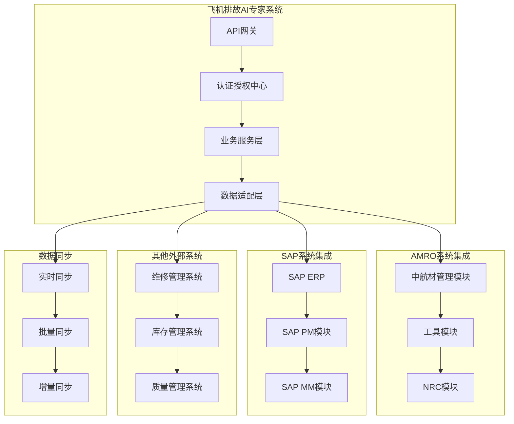

# 系统集成与外部对接方案

## 1. 外部系统集成架构

### 1.1 集成架构设计



### 1.2 集成技术选型

#### API集成方案
- **REST API**: 主要集成方式，支持JSON/XML数据格式
- **GraphQL**: 复杂查询场景，减少数据传输量
- **WebSocket**: 实时数据推送和状态同步
- **消息队列**: RabbitMQ/Kafka处理异步集成

#### 数据同步策略
- **实时同步**: 关键业务数据的即时同步
- **批量同步**: 大量历史数据的定期同步
- **增量同步**: 基于时间戳的变更数据同步
- **事件驱动**: 基于业务事件的触发式同步

## 2. AMRO系统集成方案

### 2.1 中航材管理模块集成

```python
class AMROIntegrationService:
    """AMRO系统集成服务"""
    
    def __init__(self):
        self.amro_client = AMROAPIClient()
        self.data_mapper = AMRODataMapper()
        self.sync_manager = DataSyncManager()
    
    async def sync_material_data(self) -> SyncResult:
        """
        同步中航材数据
        
        Returns:
            SyncResult: 同步结果
        """
        try:
            # 1. 获取中航材数据
            material_data = await self.amro_client.get_material_inventory()
            
            # 2. 数据映射转换
            mapped_data = self.data_mapper.map_material_data(material_data)
            
            # 3. 更新本地知识库
            update_result = await self._update_material_knowledge(mapped_data)
            
            # 4. 记录同步日志
            await self._log_sync_operation('material_sync', update_result)
            
            return SyncResult(
                status='success',
                records_processed=len(mapped_data),
                timestamp=datetime.now()
            )
            
        except Exception as e:
            logger.error(f"AMRO材料数据同步失败: {e}")
            return SyncResult(
                status='failed',
                error_message=str(e),
                timestamp=datetime.now()
            )
    
    async def get_spare_parts_info(self, part_number: str) -> SparePartInfo:
        """
        获取备件信息
        
        Args:
            part_number: 备件号
            
        Returns:
            SparePartInfo: 备件信息
        """
        # 1. 从AMRO系统查询备件信息
        amro_part_info = await self.amro_client.get_spare_part(part_number)
        
        # 2. 数据格式转换
        part_info = SparePartInfo(
            part_number=amro_part_info['partNumber'],
            description=amro_part_info['description'],
            manufacturer=amro_part_info['manufacturer'],
            stock_quantity=amro_part_info['stockQty'],
            unit_price=amro_part_info['unitPrice'],
            lead_time=amro_part_info['leadTime'],
            applicable_aircraft=amro_part_info['applicableAircraft']
        )
        
        return part_info

class AMROAPIClient:
    """AMRO API客户端"""
    
    def __init__(self):
        self.base_url = settings.AMRO_API_BASE_URL
        self.api_key = settings.AMRO_API_KEY
        self.session = aiohttp.ClientSession()
    
    async def get_material_inventory(self) -> List[dict]:
        """获取材料库存数据"""
        url = f"{self.base_url}/api/v1/materials/inventory"
        headers = {
            'Authorization': f'Bearer {self.api_key}',
            'Content-Type': 'application/json'
        }
        
        async with self.session.get(url, headers=headers) as response:
            if response.status == 200:
                data = await response.json()
                return data['materials']
            else:
                raise AMROAPIException(f"API调用失败: {response.status}")
    
    async def get_spare_part(self, part_number: str) -> dict:
        """获取备件信息"""
        url = f"{self.base_url}/api/v1/spare-parts/{part_number}"
        headers = {
            'Authorization': f'Bearer {self.api_key}',
            'Content-Type': 'application/json'
        }
        
        async with self.session.get(url, headers=headers) as response:
            if response.status == 200:
                return await response.json()
            else:
                raise AMROAPIException(f"备件查询失败: {response.status}")
```

### 2.2 工具模块集成

```python
class ToolManagementIntegration:
    """工具管理集成服务"""
    
    def __init__(self):
        self.tool_api_client = ToolAPIClient()
        self.tool_mapper = ToolDataMapper()
    
    async def get_required_tools(self, maintenance_procedure: str) -> List[ToolInfo]:
        """
        获取维修程序所需工具
        
        Args:
            maintenance_procedure: 维修程序ID
            
        Returns:
            List[ToolInfo]: 所需工具列表
        """
        # 1. 从工具模块查询所需工具
        required_tools = await self.tool_api_client.get_procedure_tools(maintenance_procedure)
        
        # 2. 检查工具可用性
        tool_availability = await self._check_tool_availability(required_tools)
        
        # 3. 构建工具信息列表
        tool_info_list = []
        for tool in required_tools:
            availability = tool_availability.get(tool['toolId'], False)
            tool_info = ToolInfo(
                tool_id=tool['toolId'],
                tool_name=tool['toolName'],
                tool_type=tool['toolType'],
                specification=tool['specification'],
                is_available=availability,
                location=tool.get('location', ''),
                calibration_due=tool.get('calibrationDue', None)
            )
            tool_info_list.append(tool_info)
        
        return tool_info_list
    
    async def reserve_tools(self, tool_ids: List[str], maintenance_order: str) -> ReservationResult:
        """
        预订工具
        
        Args:
            tool_ids: 工具ID列表
            maintenance_order: 维修工单号
            
        Returns:
            ReservationResult: 预订结果
        """
        reservation_requests = []
        for tool_id in tool_ids:
            reservation_requests.append({
                'toolId': tool_id,
                'maintenanceOrder': maintenance_order,
                'requestedBy': 'ai_diagnosis_system',
                'requestTime': datetime.now().isoformat()
            })
        
        result = await self.tool_api_client.reserve_tools(reservation_requests)
        
        return ReservationResult(
            successful_reservations=result['successful'],
            failed_reservations=result['failed'],
            reservation_id=result['reservationId']
        )
```

### 2.3 NRC模块集成

```python
class NRCIntegrationService:
    """NRC(不可修复组件)模块集成服务"""
    
    def __init__(self):
        self.nrc_client = NRCAPIClient()
        self.component_analyzer = ComponentAnalyzer()
    
    async def check_component_repairability(self, component_id: str, 
                                          fault_description: str) -> RepairabilityAssessment:
        """
        检查组件可修复性
        
        Args:
            component_id: 组件ID
            fault_description: 故障描述
            
        Returns:
            RepairabilityAssessment: 可修复性评估
        """
        # 1. 获取组件信息
        component_info = await self.nrc_client.get_component_info(component_id)
        
        # 2. 分析故障类型
        fault_analysis = self.component_analyzer.analyze_fault(
            component_info, fault_description
        )
        
        # 3. 查询NRC规则
        nrc_rules = await self.nrc_client.get_nrc_rules(component_id)
        
        # 4. 评估可修复性
        is_repairable = self._assess_repairability(fault_analysis, nrc_rules)
        
        # 5. 生成建议
        recommendations = self._generate_recommendations(
            component_info, fault_analysis, is_repairable
        )
        
        return RepairabilityAssessment(
            component_id=component_id,
            is_repairable=is_repairable,
            confidence=fault_analysis.confidence,
            recommendations=recommendations,
            nrc_applicable=not is_repairable
        )
    
    def _assess_repairability(self, fault_analysis: FaultAnalysis, 
                            nrc_rules: List[NRCRule]) -> bool:
        """评估组件可修复性"""
        for rule in nrc_rules:
            if self._rule_matches_fault(rule, fault_analysis):
                return False  # 匹配NRC规则，不可修复
        
        # 基于故障严重程度判断
        if fault_analysis.severity_level >= 8:  # 严重故障
            return False
        
        return True  # 默认可修复
```

## 3. SAP系统集成方案

### 3.1 SAP ERP集成

```python
class SAPIntegrationService:
    """SAP系统集成服务"""
    
    def __init__(self):
        self.sap_client = SAPAPIClient()
        self.data_transformer = SAPDataTransformer()
        self.workflow_manager = WorkflowManager()
    
    async def create_maintenance_order(self, diagnosis_result: DiagnosisResult) -> MaintenanceOrder:
        """
        基于诊断结果创建SAP维修工单
        
        Args:
            diagnosis_result: 诊断结果
            
        Returns:
            MaintenanceOrder: 创建的维修工单
        """
        # 1. 构建SAP工单数据
        order_data = self.data_transformer.transform_diagnosis_to_order(diagnosis_result)
        
        # 2. 调用SAP API创建工单
        sap_order = await self.sap_client.create_maintenance_order(order_data)
        
        # 3. 关联备件需求
        if diagnosis_result.required_parts:
            await self._create_material_reservations(sap_order.order_id, diagnosis_result.required_parts)
        
        # 4. 启动工作流
        await self.workflow_manager.start_maintenance_workflow(sap_order.order_id)
        
        return MaintenanceOrder(
            order_id=sap_order.order_id,
            order_type=sap_order.order_type,
            equipment_id=diagnosis_result.equipment_id,
            priority=self._calculate_priority(diagnosis_result),
            estimated_duration=diagnosis_result.estimated_repair_time,
            required_skills=diagnosis_result.required_skills
        )
    
    async def update_maintenance_progress(self, order_id: str, progress_data: dict) -> bool:
        """
        更新维修进度到SAP
        
        Args:
            order_id: 工单ID
            progress_data: 进度数据
            
        Returns:
            bool: 更新是否成功
        """
        try:
            # 1. 格式化进度数据
            sap_progress_data = self.data_transformer.transform_progress_data(progress_data)
            
            # 2. 调用SAP API更新进度
            result = await self.sap_client.update_order_progress(order_id, sap_progress_data)
            
            # 3. 同步状态到本地
            await self._sync_order_status(order_id, result.status)
            
            return result.success
            
        except Exception as e:
            logger.error(f"SAP维修进度更新失败: {e}")
            return False

class SAPAPIClient:
    """SAP API客户端"""
    
    def __init__(self):
        self.base_url = settings.SAP_API_BASE_URL
        self.username = settings.SAP_USERNAME
        self.password = settings.SAP_PASSWORD
        self.session = self._create_session()
    
    def _create_session(self) -> aiohttp.ClientSession:
        """创建SAP API会话"""
        auth = aiohttp.BasicAuth(self.username, self.password)
        return aiohttp.ClientSession(auth=auth)
    
    async def create_maintenance_order(self, order_data: dict) -> SAPMaintenanceOrder:
        """创建SAP维修工单"""
        url = f"{self.base_url}/api/maintenance/orders"
        
        async with self.session.post(url, json=order_data) as response:
            if response.status == 201:
                result = await response.json()
                return SAPMaintenanceOrder(
                    order_id=result['orderId'],
                    order_type=result['orderType'],
                    status=result['status']
                )
            else:
                raise SAPAPIException(f"工单创建失败: {response.status}")
```

### 3.2 SAP PM模块集成

```python
class SAPPMIntegration:
    """SAP PM(设备维护)模块集成"""
    
    def __init__(self):
        self.pm_client = SAPPMClient()
        self.equipment_mapper = EquipmentDataMapper()
    
    async def get_equipment_history(self, equipment_id: str) -> EquipmentHistory:
        """
        获取设备维修历史
        
        Args:
            equipment_id: 设备ID
            
        Returns:
            EquipmentHistory: 设备历史记录
        """
        # 1. 从SAP PM获取设备信息
        equipment_data = await self.pm_client.get_equipment_master_data(equipment_id)
        
        # 2. 获取维修历史
        maintenance_history = await self.pm_client.get_maintenance_history(equipment_id)
        
        # 3. 获取故障历史
        fault_history = await self.pm_client.get_fault_history(equipment_id)
        
        # 4. 数据整合
        history = EquipmentHistory(
            equipment_id=equipment_id,
            equipment_info=self.equipment_mapper.map_equipment_data(equipment_data),
            maintenance_records=self.equipment_mapper.map_maintenance_records(maintenance_history),
            fault_records=self.equipment_mapper.map_fault_records(fault_history)
        )
        
        return history
    
    async def create_preventive_maintenance_plan(self, equipment_id: str, 
                                               diagnosis_insights: List[str]) -> PMPlan:
        """
        基于诊断洞察创建预防性维护计划
        
        Args:
            equipment_id: 设备ID
            diagnosis_insights: 诊断洞察
            
        Returns:
            PMPlan: 预防性维护计划
        """
        # 1. 分析设备状态
        equipment_condition = await self._analyze_equipment_condition(equipment_id)
        
        # 2. 生成维护建议
        maintenance_recommendations = self._generate_maintenance_recommendations(
            equipment_condition, diagnosis_insights
        )
        
        # 3. 创建SAP PM计划
        pm_plan_data = {
            'equipmentId': equipment_id,
            'planType': 'PREVENTIVE',
            'recommendations': maintenance_recommendations,
            'frequency': self._calculate_maintenance_frequency(equipment_condition),
            'priority': self._calculate_plan_priority(equipment_condition)
        }
        
        sap_plan = await self.pm_client.create_maintenance_plan(pm_plan_data)
        
        return PMPlan(
            plan_id=sap_plan.plan_id,
            equipment_id=equipment_id,
            plan_type='PREVENTIVE',
            frequency=sap_plan.frequency,
            next_due_date=sap_plan.next_due_date
        )
```

## 4. 数据同步与一致性保障

### 4.1 数据同步策略

```python
class DataSynchronizationManager:
    """数据同步管理器"""
    
    def __init__(self):
        self.sync_schedulers = {}
        self.conflict_resolver = ConflictResolver()
        self.sync_monitor = SyncMonitor()
    
    def setup_sync_schedules(self):
        """设置同步计划"""
        # AMRO系统 - 每小时同步
        self.sync_schedulers['amro'] = AsyncIOScheduler()
        self.sync_schedulers['amro'].add_job(
            self.sync_amro_data,
            'interval',
            hours=1,
            id='amro_sync'
        )
        
        # SAP系统 - 每30分钟同步
        self.sync_schedulers['sap'] = AsyncIOScheduler()
        self.sync_schedulers['sap'].add_job(
            self.sync_sap_data,
            'interval',
            minutes=30,
            id='sap_sync'
        )
        
        # 启动调度器
        for scheduler in self.sync_schedulers.values():
            scheduler.start()
    
    async def sync_amro_data(self):
        """同步AMRO数据"""
        try:
            amro_service = AMROIntegrationService()
            
            # 同步材料数据
            material_result = await amro_service.sync_material_data()
            
            # 同步工具数据
            tool_result = await amro_service.sync_tool_data()
            
            # 记录同步结果
            await self.sync_monitor.record_sync_result('amro', {
                'material_sync': material_result,
                'tool_sync': tool_result
            })
            
        except Exception as e:
            logger.error(f"AMRO数据同步失败: {e}")
            await self.sync_monitor.record_sync_error('amro', str(e))
    
    async def handle_data_conflict(self, conflict: DataConflict) -> ConflictResolution:
        """处理数据冲突"""
        resolution = await self.conflict_resolver.resolve(conflict)
        
        # 记录冲突解决过程
        await self._log_conflict_resolution(conflict, resolution)
        
        return resolution

class ConflictResolver:
    """数据冲突解决器"""
    
    def __init__(self):
        self.resolution_strategies = {
            'timestamp_based': self._resolve_by_timestamp,
            'source_priority': self._resolve_by_source_priority,
            'manual_review': self._require_manual_review
        }
    
    async def resolve(self, conflict: DataConflict) -> ConflictResolution:
        """解决数据冲突"""
        strategy = self._select_resolution_strategy(conflict)
        resolution = await self.resolution_strategies[strategy](conflict)
        
        return resolution
    
    def _select_resolution_strategy(self, conflict: DataConflict) -> str:
        """选择冲突解决策略"""
        if conflict.field_type == 'critical':
            return 'manual_review'
        elif conflict.has_timestamp:
            return 'timestamp_based'
        else:
            return 'source_priority'
```

## 5. 实施建议

### 5.1 集成实施阶段

**第一阶段（4周）：基础集成框架**
- API网关和认证系统搭建
- 数据适配层开发
- 基础同步机制实现

**第二阶段（6周）：核心系统集成**
- AMRO系统集成开发
- SAP系统集成开发
- 数据映射和转换逻辑

**第三阶段（4周）：高级功能和优化**
- 实时同步机制
- 冲突解决机制
- 监控和告警系统

### 5.2 风险控制措施

**数据安全风险**：
- 实施端到端加密
- API访问权限控制
- 数据传输审计日志

**系统可用性风险**：
- 实现断路器模式
- 设置超时和重试机制
- 建立降级方案

**数据一致性风险**：
- 实施事务性同步
- 建立数据校验机制
- 设置冲突检测和解决流程
