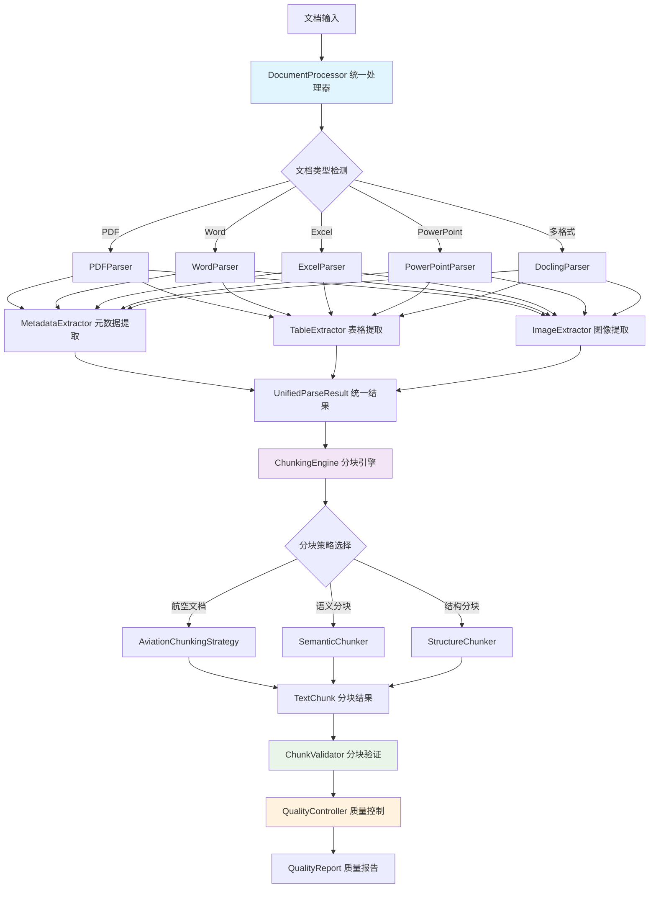
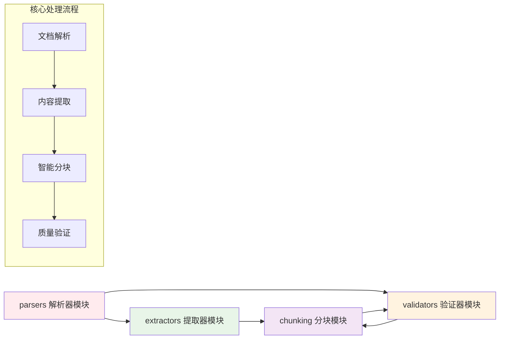
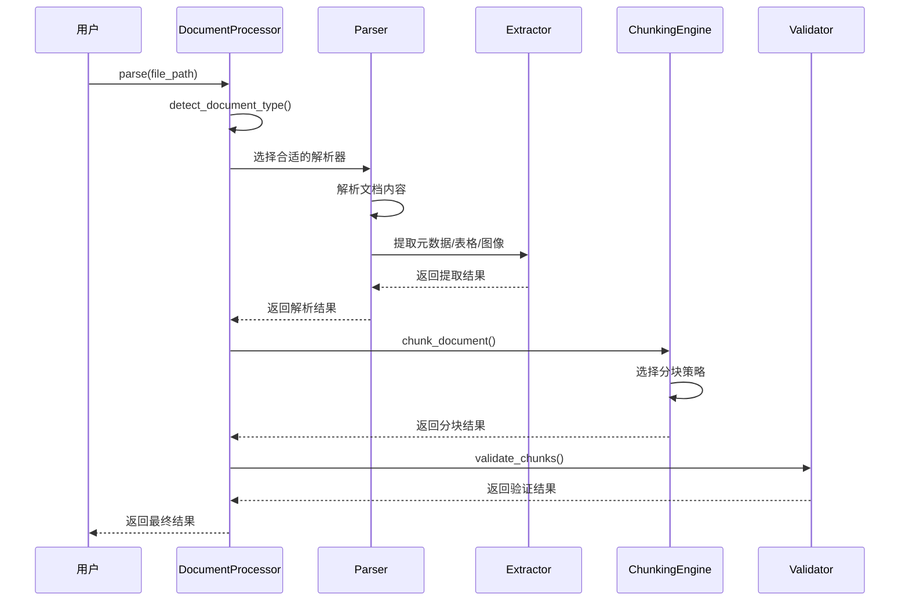
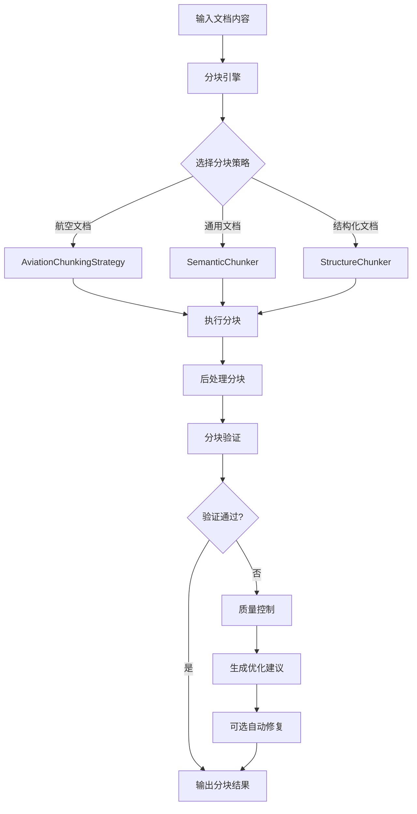

# 文档预处理模块

## 概述

文档预处理模块是航空RAG系统的核心组件之一，提供多格式文档的解析、内容提取、智能分块等功能。该模块专门针对航空行业文档特点进行优化，支持维修手册、规章制度、技术标准、培训资料等多种文档类型的处理。

## 功能特性

### 🔧 多格式文档解析
- **PDF文档处理**: 基于PyMuPDF的高性能PDF解析，支持文本提取、表格识别、图像提取
- **Word文档处理**: 基于python-docx的Word文档解析，保持格式和结构
- **Excel文档处理**: 基于openpyxl的Excel数据提取，支持多工作表和表格
- **PowerPoint文档处理**: 基于python-pptx的演示文稿内容提取
- **Docling统一处理**: 基于Docling库的多格式统一解析，支持PDF、Word、HTML、Excel、CSV、Markdown、图片等格式

### 📊 智能内容提取
- **文本内容提取**: 保持文档结构的文本提取
- **表格数据提取**: 智能表格识别和数据结构化
- **图像内容提取**: 图像信息提取和可选OCR文本识别
- **元数据提取**: 文档属性、创建信息、统计数据等
- **公式识别**: 支持LaTeX格式的数学公式提取
- **代码块识别**: 自动识别和提取代码片段
- **图片描述**: 基于视觉模型的图片内容描述

### 🎯 航空文档优化
- **维修手册分块**: 按章节和步骤进行智能分块
- **规章制度分块**: 按条款和规定进行结构化分块
- **技术标准分块**: 按标准项和规范进行分块
- **培训资料分块**: 按知识点和学习单元分块

## 模块架构

### 整体架构图



### 模块依赖关系



## 模块结构

```
document_processor/
├── __init__.py                 # 模块初始化和统一导出
├── README.md                   # 模块文档（本文件）
├── parsers/                    # 文档解析器模块
│   ├── __init__.py
│   ├── pdf_parser.py          # PDF解析器
│   ├── word_parser.py         # Word解析器
│   ├── excel_parser.py        # Excel解析器
│   ├── powerpoint_parser.py   # PowerPoint解析器
│   ├── docling_parser.py      # Docling统一解析器
│   └── document_processor.py  # 统一文档处理器
├── chunking/                   # 智能分块引擎模块
│   ├── __init__.py
│   ├── chunking_engine.py     # 分块引擎核心
│   ├── aviation_strategy.py   # 航空文档分块策略
│   ├── semantic_chunker.py    # 语义分块器
│   └── structure_chunker.py   # 结构分块器
├── extractors/                 # 内容提取器模块
│   ├── __init__.py
│   ├── metadata_extractor.py  # 元数据提取器
│   ├── table_extractor.py     # 表格提取器
│   └── image_extractor.py     # 图像提取器
├── validators/                 # 质量控制和验证模块
│   ├── __init__.py
│   ├── chunk_validator.py     # 分块验证器
│   └── quality_controller.py  # 质量控制器
├── config/                     # 配置管理
│   ├── config_manager.py      # 配置管理器
│   └── docling_config.yaml    # Docling配置文件
├── utils/                      # 工具类
│   ├── batch_processor.py     # 批量处理器
│   └── performance_monitor.py # 性能监控器
├── api/                        # API接口
│   └── docling_api.py         # Docling API封装
├── cli/                        # 命令行工具
│   └── docling_cli.py         # Docling命令行接口
├── tests/                      # 测试文件
│   └── test_docling_parser.py # Docling解析器测试
└── requirements.txt            # 依赖库清单
```

## 核心工作流程

### 1. 文档处理主流程



### 2. 分块处理流程



## 各子模块功能详解

### parsers/ - 文档解析器模块

**功能定位**: 负责将各种格式的文档转换为统一的结构化数据

**核心组件**:
- `DocumentProcessor`: 统一文档处理入口，自动检测文档类型并路由到相应解析器
- `PDFParser`: 专门处理PDF文档，支持文本、表格、图像提取
- `WordParser`: 处理Word文档，保持格式和结构信息
- `ExcelParser`: 处理Excel文档，支持多工作表和复杂表格
- `PowerPointParser`: 处理PowerPoint文档，提取幻灯片内容
- `DoclingParser`: 基于Docling库的统一解析器，支持多种格式

**数据流向**: 文档文件 → 解析器 → UnifiedParseResult → 后续模块

### extractors/ - 内容提取器模块

**功能定位**: 从解析后的文档中提取特定类型的内容和元数据

**核心组件**:
- `MetadataExtractor`: 提取文档元数据（标题、作者、创建时间等）
- `TableExtractor`: 专门提取和处理表格数据
- `ImageExtractor`: 提取图像信息，支持OCR文本识别

**数据流向**: 解析结果 → 提取器 → 结构化数据 → 合并到最终结果

### chunking/ - 智能分块引擎模块

**功能定位**: 将长文档智能分割为适合RAG系统处理的文本块

**核心组件**:
- `ChunkingEngine`: 分块引擎核心，管理多种分块策略
- `AviationChunkingStrategy`: 专门针对航空文档的分块策略
- `SemanticChunker`: 基于语义的智能分块
- `StructureChunker`: 基于文档结构的分块

**数据流向**: 文档内容 → 分块引擎 → 策略选择 → TextChunk列表 → 验证模块

### validators/ - 质量控制和验证模块

**功能定位**: 确保文档处理和分块的质量，提供优化建议

**核心组件**:
- `ChunkValidator`: 验证分块质量，检查大小、完整性、连贯性
- `QualityController`: 整体质量控制，生成质量报告和优化建议

**数据流向**: 分块结果 → 验证器 → 质量评估 → 优化建议 → 质量报告
│   ├── table_extractor.py     # 表格提取器
│   └── image_extractor.py     # 图像提取器
└── validators/                 # 质量控制器
    ├── __init__.py
    ├── chunk_validator.py     # 分块验证器
    └── quality_controller.py  # 质量控制器
```

## 快速开始

### 基本使用

```python
from rag_flow.src.core.document_processor import DocumentProcessor

# 初始化文档处理器
processor = DocumentProcessor()

# 解析文档
result = processor.parse("path/to/document.pdf")

# 获取文本内容
text_content = result.text_content

# 获取结构化数据
tables = result.structured_data.get('tables', [])
images = result.structured_data.get('images', [])

# 获取元数据
metadata = result.metadata
```

### 使用Docling解析器

```python
from rag_flow.src.core.document_processor.parsers import DoclingParser

# 初始化Docling解析器
config = {
    'enable_ocr': True,
    'enable_table_structure': True,
    'enable_picture_description': True,
    'enable_formula_enrichment': True,
    'enable_code_enrichment': True
}
parser = DoclingParser(config)

# 解析多种格式的文档
result = parser.parse("document.html")  # HTML文件
result = parser.parse("data.csv")       # CSV文件
result = parser.parse("readme.md")      # Markdown文件
result = parser.parse("image.png")      # 图片文件（OCR）

# 转换为Markdown格式
markdown_content = parser.convert_to_markdown("document.pdf", "output.md")

# 批量处理
files = ["doc1.html", "doc2.csv", "doc3.md"]
results = parser.batch_convert(files, output_dir="markdown_output")
```

### 配置选项

```python
config = {
    'pdf_config': {
        'extract_images': True,
        'extract_tables': True,
        'ocr_enabled': False
    },
    'word_config': {
        'preserve_formatting': True,
        'extract_tables': True
    },
    'excel_config': {
        'read_only': True,
        'max_rows': 10000
    },
    'powerpoint_config': {
        'extract_notes': True,
        'extract_shapes': True
    },
    # Docling配置
    'use_docling': True,  # 启用Docling解析器
    'prefer_docling_for_common_formats': False,  # 对于PDF等格式是否优先使用Docling
    'docling_config': {
        'enable_ocr': True,
        'enable_table_structure': True,
        'enable_picture_description': False,
        'enable_formula_enrichment': True,
        'enable_code_enrichment': True,
        'generate_picture_images': True,
        'images_scale': 2,
        'max_num_pages': None,
        'max_file_size': None,
        'enable_remote_services': False
    }
}

processor = DocumentProcessor(config)
```

### 批量处理

```python
# 批量处理多个文档
file_paths = [
    "manual1.pdf",
    "regulation.docx", 
    "data.xlsx",
    "training.pptx"
]

results = processor.parse_batch(file_paths)

for result in results:
    print(f"文档类型: {result.document_type.value}")
    print(f"文本长度: {len(result.text_content)}")
```

## API接口

### DocumentProcessor

主要的统一文档处理接口。

#### 方法

- `parse(file_path: str) -> UnifiedParseResult`: 解析单个文档
- `parse_batch(file_paths: List[str]) -> List[UnifiedParseResult]`: 批量解析文档
- `detect_document_type(file_path: str) -> DocumentType`: 检测文档类型
- `is_supported_format(file_path: str) -> bool`: 检查格式支持
- `extract_text_only(file_path: str) -> str`: 仅提取文本
- `extract_metadata_only(file_path: str) -> Dict`: 仅提取元数据

### 专用解析器

#### PDFParser

```python
from rag_flow.src.core.document_processor.parsers import PDFParser

parser = PDFParser({
    'extract_images': True,
    'extract_tables': True,
    'ocr_enabled': False
})

result = parser.parse("document.pdf")
```

#### WordParser

```python
from rag_flow.src.core.document_processor.parsers import WordParser

parser = WordParser({
    'preserve_formatting': True,
    'extract_tables': True
})

result = parser.parse("document.docx")
```

#### ExcelParser

```python
from rag_flow.src.core.document_processor.parsers import ExcelParser

parser = ExcelParser({
    'read_only': True,
    'data_only': True,
    'max_rows': 10000
})

result = parser.parse("document.xlsx")
```

#### PowerPointParser

```python
from rag_flow.src.core.document_processor.parsers import PowerPointParser

parser = PowerPointParser({
    'extract_notes': True,
    'extract_shapes': True
})

result = parser.parse("document.pptx")
```

#### DoclingParser

```python
from rag_flow.src.core.document_processor.parsers import DoclingParser

parser = DoclingParser({
    'enable_ocr': True,
    'enable_table_structure': True,
    'enable_picture_description': True,
    'enable_formula_enrichment': True,
    'enable_code_enrichment': True,
    'generate_picture_images': True,
    'images_scale': 2
})

result = parser.parse("document.html")
```

## 数据结构

### UnifiedParseResult

统一解析结果对象：

```python
@dataclass
class UnifiedParseResult:
    document_type: DocumentType          # 文档类型
    text_content: str                    # 文本内容
    metadata: Dict[str, Any]             # 元数据
    structured_data: Dict[str, Any]      # 结构化数据
    structure_info: Dict[str, Any]       # 结构信息
    original_result: Union[...]          # 原始解析结果
```

### 结构化数据格式

不同文档类型的结构化数据：

```python
# PDF文档
structured_data = {
    'tables': [
        {
            'page_number': 1,
            'table_index': 0,
            'data': [['列1', '列2'], ['值1', '值2']],
            'bbox': (x, y, width, height),
            'rows': 2,
            'columns': 2
        }
    ],
    'images': [
        {
            'page_number': 1,
            'bbox': (x, y, width, height),
            'width': 800,
            'height': 600,
            'format': 'png',
            'image_data': b'...'
        }
    ],
    'page_count': 10
}

# Word文档
structured_data = {
    'tables': [...],
    'paragraphs': [
        {
            'index': 0,
            'text': '段落内容',
            'style': 'Heading 1',
            'runs': [...]
        }
    ]
}

# Excel文档
structured_data = {
    'worksheets': [
        {
            'name': 'Sheet1',
            'data': [['A1', 'B1'], ['A2', 'B2']],
            'rows': 2,
            'columns': 2
        }
    ],
    'tables': [...]
}

# PowerPoint文档
structured_data = {
    'slides': [
        {
            'slide_number': 1,
            'title': '幻灯片标题',
            'content': '幻灯片内容',
            'shapes': [...]
        }
    ],
    'notes': [
        {
            'slide_number': 1,
            'notes_text': '备注内容'
        }
    ]
}
```

## 配置参数

### 全局配置

```python
config = {
    'pdf_config': {...},      # PDF解析器配置
    'word_config': {...},     # Word解析器配置  
    'excel_config': {...},    # Excel解析器配置
    'powerpoint_config': {...} # PowerPoint解析器配置
}
```

### PDF配置

```python
pdf_config = {
    'extract_images': True,        # 是否提取图像
    'extract_tables': True,        # 是否提取表格
    'preserve_layout': True,       # 是否保持布局
    'ocr_enabled': False          # 是否启用OCR
}
```

### Word配置

```python
word_config = {
    'preserve_formatting': True,           # 是否保持格式
    'extract_tables': True,               # 是否提取表格
    'extract_headers_footers': False      # 是否提取页眉页脚
}
```

### Excel配置

```python
excel_config = {
    'read_only': True,            # 只读模式
    'data_only': True,           # 只读取数据值
    'extract_formulas': False,   # 是否提取公式
    'max_rows': None,           # 最大读取行数
    'max_cols': None            # 最大读取列数
}
```

### PowerPoint配置

```python
powerpoint_config = {
    'extract_notes': True,                    # 是否提取备注
    'extract_shapes': True,                   # 是否提取形状信息
    'preserve_slide_structure': True          # 是否保持幻灯片结构
}
```

### Docling配置

```python
docling_config = {
    'enable_ocr': True,                       # 是否启用OCR文本识别
    'enable_table_structure': True,           # 是否启用表格结构识别
    'enable_picture_description': False,      # 是否启用图片描述（需要视觉模型）
    'enable_formula_enrichment': True,        # 是否启用公式识别
    'enable_code_enrichment': True,           # 是否启用代码识别
    'generate_picture_images': True,          # 是否生成图片
    'images_scale': 2,                        # 图片缩放比例
    'max_num_pages': None,                    # 最大页数限制
    'max_file_size': None,                    # 最大文件大小限制（字节）
    'artifacts_path': None,                   # 模型文件路径
    'enable_remote_services': False           # 是否启用远程服务
}
```

## 错误处理

模块提供完善的错误处理机制：

```python
try:
    result = processor.parse("document.pdf")
except FileNotFoundError:
    print("文件不存在")
except ValueError as e:
    print(f"文件格式不支持: {e}")
except Exception as e:
    print(f"解析失败: {e}")
```

## 性能优化

### 大文件处理

- Excel文档使用只读模式减少内存占用
- PDF文档支持页面级别的处理
- 支持批量处理优化

### 内存管理

- 自动释放文档对象
- 可配置的数据提取选项
- 流式处理支持

## 扩展开发

### 添加新的文档格式

1. 在`parsers/`目录下创建新的解析器
2. 实现标准的解析接口
3. 在`DocumentProcessor`中注册新格式
4. 更新配置和文档

### 自定义分块策略

1. 在`chunking/`目录下实现新策略
2. 继承基础分块接口
3. 配置策略参数
4. 集成到分块引擎

## 依赖库

### 必需依赖

- `pymupdf`: PDF文档处理
- `python-docx`: Word文档处理
- `openpyxl`: Excel文档处理
- `python-pptx`: PowerPoint文档处理

### Docling依赖

- `docling`: Docling核心库（统一文档处理）
- `pandas`: 数据处理（表格导出）
- `PIL/Pillow`: 图像处理

### 可选依赖

- `pytesseract`: OCR文本识别
- `transformers`: 深度学习模型（公式、代码识别）
- `torch`: PyTorch（视觉模型支持）

## 安装说明

### 基础安装

```bash
# 安装基础依赖
pip install pymupdf python-docx openpyxl python-pptx pillow pandas

# 安装Docling（可选）
pip install docling

# 安装OCR支持（可选）
pip install pytesseract

# 安装深度学习支持（可选）
pip install transformers torch
```

### Docling模型下载

```bash
# 下载Docling预训练模型（用于离线使用）
docling-tools models download
```

## 注意事项

1. **文件格式支持**: 确保文档格式在支持列表中
2. **内存使用**: 大文件处理时注意内存占用
3. **编码问题**: 处理中文文档时注意编码设置
4. **依赖安装**: 确保所需的第三方库已正确安装
5. **权限问题**: 确保对文档文件有读取权限
6. **Docling模型**: 首次使用Docling时会自动下载模型，建议预先下载
7. **GPU支持**: 启用图片描述等高级功能时建议使用GPU加速

## 工具和接口

### 命令行工具

```bash
# 安装依赖
pip install -r requirements.txt

# 解析单个文件
python cli/docling_cli.py parse document.pdf -o output.md

# 批量处理目录
python cli/docling_cli.py batch /path/to/docs -o /path/to/output --directory --recursive

# 检查依赖状态
python cli/docling_cli.py check

# 显示支持的格式
python cli/docling_cli.py formats

# 查看性能统计
python cli/docling_cli.py stats --detailed
```

### Web API服务

```bash
# 启动API服务
python api/docling_api.py --host 0.0.0.0 --port 8000

# 或使用uvicorn
uvicorn api.docling_api:app --host 0.0.0.0 --port 8000 --reload
```

API端点：
- `GET /` - 服务状态
- `GET /health` - 健康检查
- `POST /parse` - 同步解析文档
- `POST /parse-async` - 异步解析文档
- `GET /task/{task_id}` - 获取任务状态
- `GET /stats` - 性能统计
- `GET /formats` - 支持的格式

### 批量处理工具

```python
from utils.batch_processor import BatchProcessor, ConsoleProgressCallback

# 配置批量处理器
config = {
    'max_workers': 4,
    'continue_on_error': True,
    'output_format': 'markdown'
}

processor = BatchProcessor(config)
callback = ConsoleProgressCallback()

# 批量处理目录
result = processor.process_directory(
    'input_dir', 'output_dir',
    recursive=True,
    progress_callback=callback
)
```

## 配置管理

### 配置文件

使用YAML格式的配置文件 `config/docling_config.yaml`：

```yaml
global:
  use_docling: true
  prefer_docling_for_common_formats: false
  log_level: "INFO"

docling:
  ocr:
    enabled: true
    languages: ["zh", "en"]
  table_structure:
    enabled: true
    mode: "accurate"
  image_processing:
    generate_images: true
    scale: 2
```

### 环境变量

支持通过环境变量覆盖配置：

```bash
export DOCLING_USE_DOCLING=true
export DOCLING_ENABLE_OCR=true
export DOCLING_MAX_FILE_SIZE=104857600
```

### 配置管理器

```python
from config.config_manager import get_config_manager

config_manager = get_config_manager()
docling_config = config_manager.get_docling_config()
```

## 性能监控

### 监控功能

- 处理时间统计
- 成功率监控
- 内存使用跟踪
- 文件类型分析
- 解析器性能对比

### 使用示例

```python
from utils.performance_monitor import get_performance_monitor, ProcessingContext

monitor = get_performance_monitor()

# 使用上下文管理器
with ProcessingContext('file.pdf', 1024, '.pdf', 'docling'):
    # 处理文档
    result = process_document('file.pdf')

# 获取统计信息
stats = monitor.get_current_stats()
print(f"成功率: {stats['success_rate']:.2%}")
```

## 更新日志

### v1.1.0 (2024-12-17)
- 新增Docling统一文档处理器
- 支持HTML、CSV、Markdown、图片等新格式
- 集成OCR文本识别功能
- 支持公式和代码块识别
- 支持图片内容描述（可选）
- 提供批量转换功能
- 统一输出为Markdown格式
- 完善的错误处理和日志记录
- 新增命令行工具和Web API
- 集成性能监控系统
- 支持配置管理和环境变量
- 提供Docker部署支持

### v1.0.0 (2024-01-15)
- 初始版本发布
- 支持PDF、Word、Excel、PowerPoint文档解析
- 实现统一的文档处理接口
- 提供完整的元数据提取功能
- 支持表格和图像内容提取
