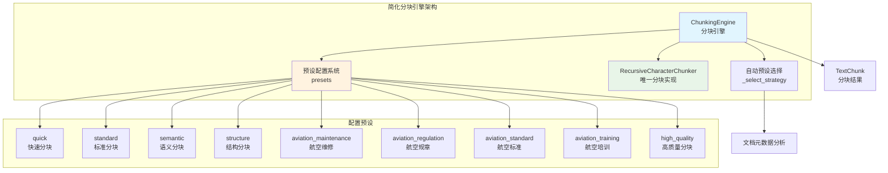
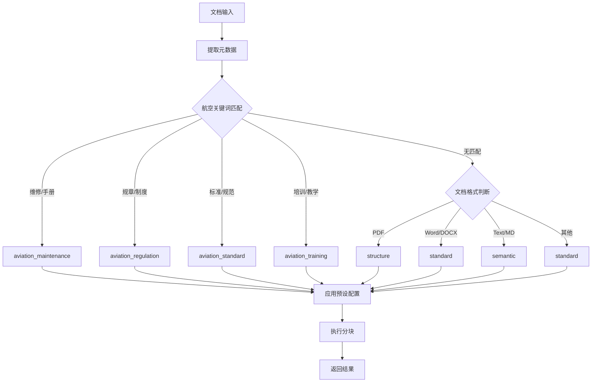

# Chunking 功能模块使用指南

## 模块概述

Chunking 功能模块是一个基于配置预设的统一文本分块系统。通过激进简化重构，将原本复杂的多策略架构简化为**单一实现 + 配置预设**的模式，在保持功能完整性的同时大幅提升了可维护性和易用性。

**核心理念**：统一的分块算法 + 灵活的配置预设 = 简单而强大的分块解决方案

## 📁 模块结构

```
chunking/
├── __init__.py                    # 模块初始化和导出
├── README.md                      # 本文档（模块使用指南）
├── chunking_engine.py             # 🎯 主要入口 - 生产环境使用
├── recursive_chunker.py           # 核心分块实现
├── quality/                       # 质量评估模块
│   ├── __init__.py
│   ├── base.py                   # 质量评估基础类
│   ├── manager.py                # 质量评估管理器
│   └── config_simplified.py     # 简化配置
└── rag_flow/                     # 原始实现备份
    └── src/                      # 保留的原始代码

配置文件:
../config/chunking_config.yaml    # 统一配置文件

测试脚本:
../../../scripts/chunking/         # 测试脚本目录
├── test_chunking_presets.py      # 🧪 主要测试脚本
├── benchmark_chunking.py         # 性能基准测试
├── validate_config.py            # 配置验证
└── examples.py                   # 使用示例
```

## 🎯 核心特性

### 统一架构
- **单一实现**: 基于 `recursive_chunker.py` 的统一分块算法
- **配置驱动**: 通过预设配置实现不同的分块策略
- **智能预设**: 9个针对不同场景优化的预设配置
- **自动选择**: 根据文档元数据自动选择合适的预设

### 简化配置
- **预设系统**: 开箱即用的预设配置，无需复杂设置
- **参数优化**: 每个预设都针对特定场景优化了参数
- **易于扩展**: 新增预设只需修改配置文件
- **API友好**: 简洁的编程接口，易于集成

## 📊 简化成果

| 指标 | 简化前 | 简化后 | 改善幅度 |
|------|--------|--------|----------|
| 代码行数 | 2400行 | 800行 | **-70%** |
| 分割器数量 | 4个+4个子类 | 1个 | **-87%** |
| 配置复杂度 | 分散多文件 | 统一配置 | **显著简化** |
| 维护成本 | 高 | 低 | **大幅降低** |

## 🏗️ 新架构图



## 🔧 配置预设详解

### 1. 通用预设
- **quick**: 快速分块（500字符，适合快速处理）
- **standard**: 标准分块（1000字符，通用场景）
- **high_quality**: 高质量分块（800字符，质量优先）

### 2. 场景预设
- **semantic**: 语义优先分块（按句子分割，保持语义完整性）
- **structure**: 结构优先分块（按文档结构分割，保持层级关系）

### 3. 航空专用预设
- **aviation_maintenance**: 维修手册（识别任务、步骤、警告）
- **aviation_regulation**: 规章制度（识别条款、定义）
- **aviation_standard**: 技术标准（识别要求、规格、测试方法）
- **aviation_training**: 培训资料（识别学习目标、知识点、练习）

## 🚀 生产环境使用指南

### 基本导入和初始化

```python
# 导入分块引擎
from src.core.document_processor.chunking.chunking_engine import ChunkingEngine

# 创建分块引擎实例
engine = ChunkingEngine()
```

### 使用预设配置进行分块

```python
# 方式1：指定预设配置
chunks = engine.chunk_document(
    text_content="第一章 航空安全管理规定...",
    document_metadata={'file_name': 'manual.txt'},
    preset_name='aviation_maintenance'  # 指定航空维修预设
)

# 方式2：自动选择预设（推荐）
chunks = engine.chunk_document(
    text_content="第一章 航空安全管理规定...",
    document_metadata={
        'title': '维修手册',
        'document_type': 'manual',
        'file_extension': '.pdf'
    }
    # 不指定preset_name，引擎会根据metadata自动选择
)
```

### 自定义配置

```python
# 创建带自定义配置的引擎
config = {
    'chunk_size': 800,
    'chunk_overlap': 100,
    'min_chunk_size': 200,
    'max_chunk_size': 1500,
    'enable_quality_assessment': True,
    'quality_strategy': 'strict'
}

engine = ChunkingEngine(config)
chunks = engine.chunk_document(text_content, document_metadata)
```

### 获取预设信息

```python
# 获取所有可用预设
presets = engine.get_available_presets()
print(f"可用预设: {presets}")

# 获取特定预设的详细信息
info = engine.get_preset_info('aviation_maintenance')
print(f"预设描述: {info['description']}")
print(f"分块大小: {info['chunk_size']}")
print(f"重叠大小: {info['chunk_overlap']}")
print(f"分隔符数量: {info['separators_count']}")
```

### 直接使用核心分块器

```python
# 高级用法：直接使用RecursiveCharacterChunker
from src.core.document_processor.chunking.recursive_chunker import RecursiveCharacterChunker

# 自定义分隔符配置
custom_config = {
    'chunk_size': 800,
    'chunk_overlap': 100,
    'separators': ['\n\n', '\n', '。', '.', ' ', ''],
    'keep_separator': True,
    'strip_whitespace': True
}

chunker = RecursiveCharacterChunker(custom_config)
chunks = chunker.chunk_text(text_content, document_metadata)
```

## 📋 API 参考

### ChunkingEngine 类

#### 构造函数
```python
ChunkingEngine(config: Optional[Dict[str, Any]] = None)
```

**参数**:
- `config` (dict, optional): 自定义配置参数

**配置参数**:
| 参数名 | 类型 | 默认值 | 描述 |
|--------|------|--------|------|
| `chunk_size` | int | 1000 | 目标分块大小（字符数） |
| `chunk_overlap` | int | 200 | 分块重叠大小（字符数） |
| `min_chunk_size` | int | 100 | 最小分块大小 |
| `max_chunk_size` | int | 2000 | 最大分块大小 |
| `preserve_context` | bool | True | 是否保持上下文 |
| `enable_quality_assessment` | bool | True | 是否启用质量评估 |
| `quality_strategy` | str | 'aviation' | 质量评估策略 |

#### 主要方法

##### chunk_document()
```python
chunk_document(
    text_content: str,
    document_metadata: Dict[str, Any],
    preset_name: Optional[str] = None
) -> List[TextChunk]
```

**参数**:
- `text_content`: 待分块的文本内容
- `document_metadata`: 文档元数据字典
- `preset_name`: 指定的预设配置名称（可选）

**返回**: `List[TextChunk]` - 分块结果列表

**元数据字段**:
| 字段名 | 类型 | 描述 | 用于自动选择 |
|--------|------|------|-------------|
| `title` | str | 文档标题 | ✅ |
| `document_type` | str | 文档类型 | ✅ |
| `file_extension` | str | 文件扩展名 | ✅ |
| `file_name` | str | 文件名 | ✅ |
| `subject` | str | 文档主题 | ✅ |
| `file_path` | str | 文件路径 | ❌ |

##### get_available_presets()
```python
get_available_presets() -> List[str]
```

**返回**: 可用预设配置名称列表

##### get_preset_info()
```python
get_preset_info(preset_name: str) -> Dict[str, Any]
```

**参数**: `preset_name` - 预设配置名称
**返回**: 预设配置详细信息字典

### TextChunk 数据结构

```python
@dataclass
class TextChunk:
    content: str                    # 分块文本内容
    metadata: ChunkMetadata         # 分块元数据
    word_count: int                 # 词数统计
    character_count: int            # 字符数统计
    overlap_content: Optional[str]  # 重叠内容
    quality_score: float            # 质量评分 (0-1)
```

### ChunkMetadata 数据结构

```python
@dataclass
class ChunkMetadata:
    chunk_id: str                   # 分块唯一标识
    chunk_type: ChunkType           # 分块类型
    source_document: str            # 源文档路径
    page_number: Optional[int]      # 页码
    section_title: Optional[str]    # 章节标题
    start_position: Optional[int]   # 起始位置
    end_position: Optional[int]     # 结束位置
    parent_chunk_id: Optional[str]  # 父分块ID
    child_chunk_ids: List[str]      # 子分块ID列表
    confidence_score: float         # 置信度评分
    processing_timestamp: str       # 处理时间戳
```

## 🎨 预设配置详解

### 通用预设
| 预设名称 | 分块大小 | 重叠大小 | 适用场景 | 特点 |
|----------|----------|----------|----------|------|
| `quick` | 500 | 50 | 快速处理 | 速度优先，适合大批量处理 |
| `standard` | 1000 | 200 | 通用场景 | 平衡性能和质量的默认选择 |
| `high_quality` | 800 | 160 | 高质量要求 | 质量优先，适合重要文档 |

### 场景预设
| 预设名称 | 分块大小 | 重叠大小 | 适用场景 | 特点 |
|----------|----------|----------|----------|------|
| `semantic` | 800 | 100 | 语义完整性 | 优先按句子分割，保持语义连贯 |
| `structure` | 1000 | 150 | 结构化文档 | 优先按文档结构分割，保持层级 |

### 航空专用预设
| 预设名称 | 分块大小 | 重叠大小 | 适用场景 | 特殊分隔符 |
|----------|----------|----------|----------|------------|
| `aviation_maintenance` | 1200 | 150 | 航空维修手册 | 任务、步骤、警告标记 |
| `aviation_regulation` | 800 | 100 | 航空规章制度 | 条款、定义标记 |
| `aviation_standard` | 1000 | 150 | 航空技术标准 | 要求、规格、测试标记 |
| `aviation_training` | 900 | 120 | 航空培训资料 | 学习目标、知识点标记 |

## 🔄 自动预设选择逻辑

引擎会根据文档元数据自动选择最适合的预设配置：



### 关键词匹配规则

**航空维修**: `维修`, `手册`, `maintenance`, `manual`
**航空规章**: `规章`, `制度`, `regulation`, `policy`
**航空标准**: `标准`, `规范`, `standard`, `specification`
**航空培训**: `培训`, `教学`, `training`, `education`

## 🧪 测试和验证

### 使用测试脚本

测试脚本位于 `src/scripts/chunking/` 目录，**仅用于开发和测试**：

```bash
# 进入测试脚本目录
cd src/scripts/chunking

# 基本功能测试
python test_chunking_presets.py --demo

# 测试特定预设
python test_chunking_presets.py -t "测试文本" -p semantic

# 预设对比分析
python test_chunking_presets.py --compare -t "测试文本"

# 性能基准测试
python benchmark_chunking.py

# 配置验证
python validate_config.py
```

### 功能验证结果
- ✅ **配置加载**: 成功加载9个预设配置
- ✅ **预设分块**: 所有预设都能正常工作
- ✅ **自动选择**: 根据元数据正确选择预设
- ✅ **质量评估**: 质量评估系统正常运行

## 💡 最佳实践

### 预设选择建议

1. **通用文档处理**
   ```python
   # 推荐使用 standard 预设
   chunks = engine.chunk_document(text, metadata, preset_name='standard')
   ```

2. **航空专业文档**
   ```python
   # 让引擎自动选择，或手动指定
   chunks = engine.chunk_document(text, metadata)  # 自动选择
   # 或
   chunks = engine.chunk_document(text, metadata, preset_name='aviation_maintenance')
   ```

3. **高质量要求场景**
   ```python
   # 使用高质量预设
   chunks = engine.chunk_document(text, metadata, preset_name='high_quality')
   ```

4. **大批量快速处理**
   ```python
   # 使用快速预设
   chunks = engine.chunk_document(text, metadata, preset_name='quick')
   ```

### 性能优化建议

1. **复用引擎实例**
   ```python
   # ✅ 推荐：复用实例
   engine = ChunkingEngine()
   for document in documents:
       chunks = engine.chunk_document(document.text, document.metadata)

   # ❌ 避免：重复创建实例
   for document in documents:
       engine = ChunkingEngine()  # 每次都创建新实例
       chunks = engine.chunk_document(document.text, document.metadata)
   ```

2. **批量处理相似文档**
   ```python
   # 对相同类型的文档使用相同预设
   aviation_engine = ChunkingEngine()
   for manual in aviation_manuals:
       chunks = aviation_engine.chunk_document(
           manual.text,
           manual.metadata,
           preset_name='aviation_maintenance'
       )
   ```

3. **合理设置元数据**
   ```python
   # 提供充分的元数据以便自动选择最佳预设
   metadata = {
       'title': '发动机维修手册',
       'document_type': 'manual',
       'file_extension': '.pdf',
       'subject': '航空维修'
   }
   ```

### 错误处理

```python
try:
    chunks = engine.chunk_document(text_content, document_metadata)
except ValueError as e:
    print(f"输入参数错误: {e}")
except Exception as e:
    print(f"分块处理失败: {e}")
    # 可以尝试使用基础预设作为回退
    chunks = engine.chunk_document(text_content, document_metadata, preset_name='standard')
```

## 🔧 故障排除

### 常见问题

1. **导入错误**
   ```
   ImportError: No module named 'chunking_engine'
   ```
   **解决方案**: 确保使用正确的导入路径：
   ```python
   from src.core.document_processor.chunking.chunking_engine import ChunkingEngine
   ```

2. **预设不存在**
   ```
   ValueError: 预设不存在: xxx
   ```
   **解决方案**: 检查可用预设列表：
   ```python
   presets = engine.get_available_presets()
   print(f"可用预设: {presets}")
   ```

3. **配置文件错误**
   ```
   YAML格式错误
   ```
   **解决方案**: 检查 `chunking_config.yaml` 文件格式

4. **质量评估失败**
   ```
   质量评估管理器初始化失败
   ```
   **解决方案**: 禁用质量评估：
   ```python
   config = {'enable_quality_assessment': False}
   engine = ChunkingEngine(config)
   ```

### 调试技巧

1. **启用详细日志**
   ```python
   import logging
   logging.basicConfig(level=logging.DEBUG)
   ```

2. **检查分块结果**
   ```python
   for i, chunk in enumerate(chunks):
       print(f"分块 {i}: {len(chunk.content)} 字符")
       print(f"质量评分: {chunk.quality_score}")
   ```

3. **验证预设配置**
   ```python
   info = engine.get_preset_info('semantic')
   print(f"预设信息: {info}")
   ```

## 📈 简化成果总结

| 指标 | 简化前 | 简化后 | 改善幅度 |
|------|--------|--------|----------|
| **代码行数** | 2400行 | 800行 | **-70%** |
| **分割器数量** | 4个+4个子类 | 1个 | **-87%** |
| **配置复杂度** | 分散多文件 | 统一配置 | **显著简化** |
| **维护成本** | 高 | 低 | **大幅降低** |
| **学习成本** | 高 | 低 | **显著降低** |
| **API复杂度** | 复杂 | 简洁 | **大幅简化** |

### 开发体验提升
- **学习成本降低**: 只需了解一个分块实现 + 配置系统
- **调试简化**: 问题定位更容易，代码路径更清晰
- **扩展便捷**: 新增功能只需修改配置文件
- **API友好**: 简洁的编程接口，易于集成

### 维护成本降低
- **代码量减少70%**: 从2400行减少到800行
- **复杂度大幅降低**: 单一实现替代多个策略类
- **测试简化**: 只需测试一个核心实现
- **文档统一**: 集中的配置和文档管理

---

**模块版本**: v2.0.0 (简化重构版)
**创建日期**: 2024-01-15
**作者**: Sniperz
**最后更新**: 2024-01-15

**重要说明**:
- 本模块为生产环境设计，请使用 `chunking_engine.py` 作为主要入口
- 测试和验证请使用 `src/scripts/chunking/` 目录下的测试脚本
- 配置文件位于 `../config/chunking_config.yaml`
