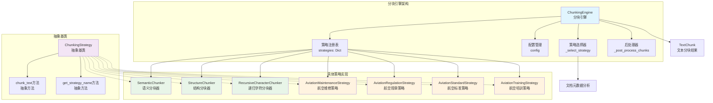
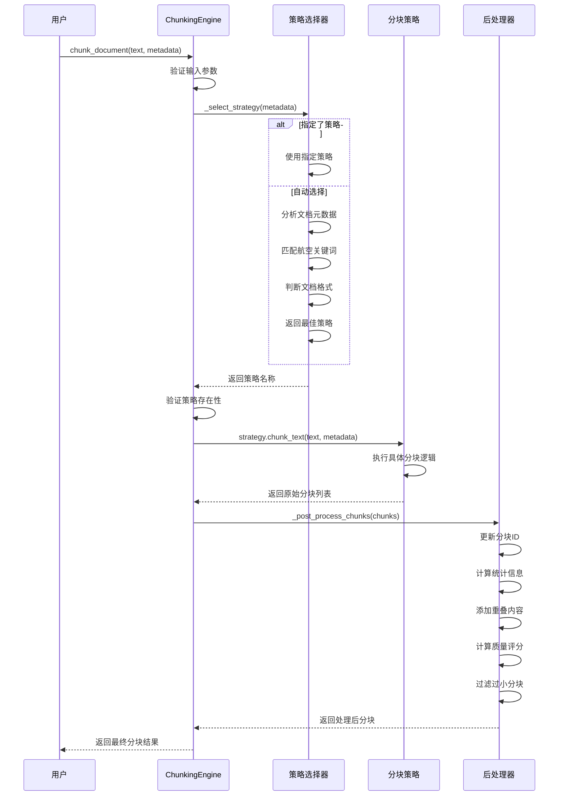
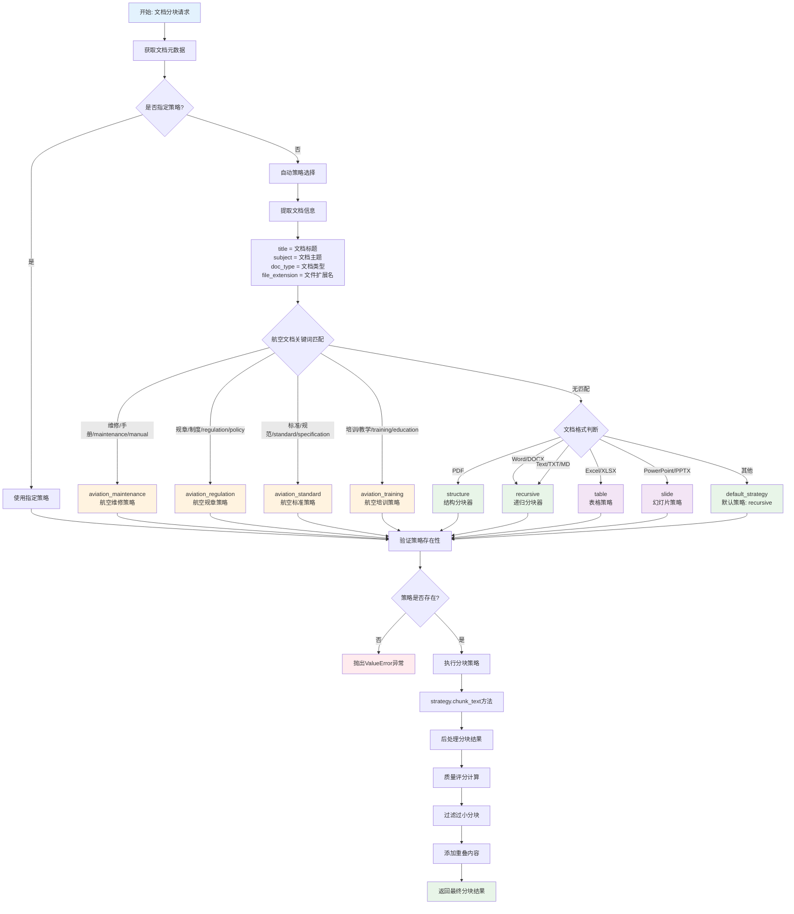
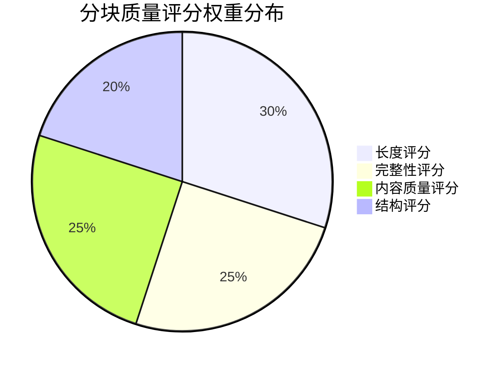

# 智能分块引擎模块 (chunking)

## 模块概述

智能分块引擎模块是文档预处理系统的核心组件，负责将长文档智能分割为适合RAG系统处理的文本块。该模块专门针对航空行业文档特点进行优化，支持多种分块策略和质量控制机制。

**简单来说**：就像把一本厚厚的书按照章节、段落、句子等不同方式切成小块，让计算机更容易理解和处理。

## 核心概念解释

### 什么是文档分块？
文档分块就是把长文档切成小段的过程。比如：
- 一份100页的维修手册 → 切成200个小段落
- 每个小段落包含完整的意思，不会把句子切断
- 每个小段落大小适中（比如500-1000字符）

### 为什么需要分块？
1. **计算机处理限制**：AI模型一次只能处理有限长度的文本
2. **检索精度**：小块文本更容易精确匹配用户问题
3. **上下文保持**：确保相关信息在同一个块中
4. **处理效率**：小块处理速度更快

## 系统架构图



## 架构设计

### 核心架构模式

本模块采用**策略模式(Strategy Pattern)**设计，`ChunkingEngine`作为统一的调用入口和策略管理器。

**通俗解释**：就像一个智能工厂，根据不同类型的原料（文档），自动选择最合适的切割机器（分块策略）来处理。

### 策略管理机制

1. **自动注册**: 内置策略在引擎初始化时自动注册
2. **动态注册**: 支持运行时注册自定义策略
3. **智能选择**: 根据文档元数据自动选择最适合的策略
4. **统一接口**: 所有策略都实现相同的接口规范

## 设计目标

- **智能分块**: 基于文档结构和语义进行智能分块
- **航空优化**: 专门针对航空文档（维修手册、规章制度等）优化
- **策略可扩展**: 支持多种分块策略，易于扩展新策略
- **质量保证**: 内置质量控制和验证机制
- **上下文保持**: 保持分块间的语义连贯性

## 模块结构

```
chunking/
├── __init__.py              # 模块初始化
├── README.md               # 模块文档（本文件）
├── chunking_engine.py      # 分块引擎核心
├── aviation_strategy.py    # 航空文档分块策略
├── semantic_chunker.py     # 语义分块器
├── structure_chunker.py    # 结构分块器
└── recursive_chunker.py    # 递归字符分块器
```

## 核心组件详解

### 1. ChunkingStrategy 抽象基类

**作用**：定义所有分块策略必须遵循的接口规范

```python
class ChunkingStrategy(ABC):
    """分块策略抽象基类"""

    @abstractmethod
    def chunk_text(self, text: str, metadata: Dict[str, Any]) -> List[TextChunk]:
        """分块文本内容 - 所有策略都必须实现这个方法"""
        pass

    @abstractmethod
    def get_strategy_name(self) -> str:
        """获取策略名称 - 所有策略都必须实现这个方法"""
        pass
```

**通俗解释**：就像制定了一个"分块器制造标准"，所有的分块器都必须有"切文本"和"报名字"这两个基本功能。

### 2. ChunkingEngine - 分块引擎核心

**功能描述**: 分块引擎的核心控制器，管理多种分块策略，提供统一的分块接口。

**通俗解释**：就像一个智能工厂的总控制台，负责：
- 管理所有的切割机器（分块策略）
- 根据原料类型（文档类型）选择合适的机器
- 控制切割质量和规格

**主要方法**:
- `chunk_document()`: 执行文档分块（主要入口）
- `register_strategy()`: 注册新的分块策略
- `get_available_strategies()`: 获取可用的分块策略列表
- `_select_strategy()`: 智能选择分块策略（内部方法）
- `_post_process_chunks()`: 后处理分块结果（内部方法）

**配置参数**:
```python
config = {
    'default_strategy': 'recursive',     # 默认分块策略
    'chunk_size': 1000,                  # 默认分块大小（字符数）
    'chunk_overlap': 200,                # 分块重叠大小
    'min_chunk_size': 100,               # 最小分块大小
    'max_chunk_size': 2000,              # 最大分块大小
    'preserve_context': True             # 是否保持上下文
}
```

### 3. 分块处理完整流程



## 各种分块策略详解

### 1. AviationChunkingStrategy - 航空文档分块策略

**功能描述**: 专门针对航空行业文档设计的分块策略，能够识别和处理维修手册、规章制度、技术标准等文档的特殊结构。

**通俗解释**：就像专门训练的航空文档专家，知道航空文档的特殊格式和术语，能够按照航空行业的逻辑来切分文档。

**支持的文档类型**:
- 维修手册 (maintenance_manual) - 飞机维修指导文档
- 规章制度 (regulation) - 航空法规和政策文档
- 技术标准 (technical_standard) - 技术规范和标准文档
- 培训资料 (training_material) - 航空培训教材
- 操作程序 (operation_procedure) - 操作流程文档

**智能分块规则**:
- **章节感知**：按照"第X章"、"Section X"等标记进行分块
- **步骤完整**：保持操作步骤的完整性，不会把"步骤1"和"步骤2"分开
- **警告识别**：特殊处理"警告"、"注意"、"危险"等安全信息
- **引用保持**：保持图表和表格的引用关系完整

**分块示例**：
```
原文档：
第3章 发动机维修
3.1 日常检查
警告：检查前必须关闭发动机
步骤1：检查外观
步骤2：检查油位
3.2 定期维护
...

分块结果：
块1：第3章 发动机维修\n3.1 日常检查\n警告：检查前必须关闭发动机\n步骤1：检查外观\n步骤2：检查油位
块2：3.2 定期维护\n...
```

### 2. SemanticChunker - 语义分块器

**功能描述**: 基于语义相似性进行分块，确保每个分块在语义上具有连贯性。

**通俗解释**：就像一个善于理解文章逻辑的编辑，能够识别哪些句子在讲同一个话题，把相关的内容放在一起。

**重要说明**: 当前实现**未使用AI大模型**，而是基于规则和统计方法实现的"伪语义"分析。

**技术实现原理**:
- **规则基础**: 基于预定义规则进行句子类型分类和主题检测
- **统计方法**: 使用词频、句子长度等统计特征
- **关键词匹配**: 航空领域专业词汇识别
- **模式识别**: 正则表达式匹配文档结构模式

**核心特性**:
- **句子边界智能检测**：准确识别句子的开始和结束
- **主题转换指示词识别**：识别"然而"、"因此"、"另外"等转换词
- **文档结构感知分块**：理解标题、段落、列表等结构
- **航空领域关键词优化**：针对航空术语进行特殊处理
- **自适应分块大小调整**：根据内容复杂度调整分块大小

**语义分析步骤**:
1. **句子特征提取**: 分析长度、词数、标点、数字、关键词等特征
2. **句子类型分类**: 识别标题、列表、问句、定义、步骤、陈述等类型
3. **主题指示词检测**: 寻找表示主题转换的词汇
4. **分块边界判断**: 基于特征组合的规则决定在哪里切分

**分块示例**：
```
原文档：
航空安全管理是确保飞行安全的重要措施。它包括多个方面的内容。
首先，需要建立完善的安全管理体系。这个体系应该包括安全政策和程序。
然而，仅有体系是不够的。还需要定期进行安全培训和演练。
因此，我们必须重视安全文化的建设。

分块结果：
块1：航空安全管理是确保飞行安全的重要措施。它包括多个方面的内容。首先，需要建立完善的安全管理体系。这个体系应该包括安全政策和程序。
块2：然而，仅有体系是不够的。还需要定期进行安全培训和演练。因此，我们必须重视安全文化的建设。
```

### 3. StructureChunker - 结构分块器

**功能描述**: 基于文档结构（标题、段落、列表等）进行分块，保持文档的逻辑结构。

**通俗解释**：就像按照书的目录来切分，严格按照章节、段落、列表等结构来分块，保持文档的原有逻辑。

**结构识别能力**:
- **标题层次分析**：识别一级标题、二级标题等层次关系
- **段落边界检测**：准确识别段落的开始和结束
- **列表项处理**：保持列表的完整性
- **表格和图表分离**：将表格、图片等特殊内容单独处理

**分块示例**：
```
原文档：
# 第一章 概述
本章介绍基本概念。

## 1.1 定义
以下是重要定义：
- 定义A：...
- 定义B：...

## 1.2 范围
适用范围包括...

分块结果：
块1：# 第一章 概述\n本章介绍基本概念。
块2：## 1.1 定义\n以下是重要定义：\n- 定义A：...\n- 定义B：...
块3：## 1.2 范围\n适用范围包括...
```

### 4. RecursiveCharacterChunker - 递归字符分块器 ⭐⭐⭐⭐⭐

**功能描述**: 基于多层级分隔符进行递归分割，类似LangChain的RecursiveCharacterTextSplitter，提供更精确的文本分割能力。

**通俗解释**：就像一个非常聪明的切菜师傅，会按照不同的"刀法"来切文档：
1. 先用"大刀"按段落切
2. 如果块太大，再用"中刀"按句子切
3. 还太大就用"小刀"按词语切
4. 最后用"精刀"按字符切

**核心特性**:
- **多层级分隔符匹配**：段落 → 句子 → 单词 → 字符的递归处理
- **正则表达式支持**：支持复杂的分隔符模式
- **智能回退机制**：如果一种方法不行，自动尝试下一种
- **重叠内容处理**：保持上下文连贯性
- **自适应调整**：根据内容特点调整分块大小

**分隔符优先级**（从粗到细）:
1. **段落分隔符**：`\n\n`、章节标记等（最优先）
2. **句子分隔符**：`。！？.!?`等
3. **子句分隔符**：`；;，,`等
4. **词语分隔符**：空格、制表符等
5. **字符级分割**：最后的回退选项

**分块示例**：
```
原文档（假设目标大小为50字符）：
第一段内容比较长，包含多个句子。第二个句子也很长。

第二段内容。这是另一个段落。

处理过程：
1. 先按段落分隔符\n\n切分
2. 第一段太长（>50字符），继续按句子分隔符切分
3. 得到合适大小的分块

最终结果：
块1：第一段内容比较长，包含多个句子。
块2：第二个句子也很长。
块3：第二段内容。这是另一个段落。
```

## 分块策略选择指南

### 策略对比表

| 策略名称 | 适用场景 | 技术特点 | 性能 | 质量 | 推荐度 |
|---------|---------|---------|------|------|--------|
| **RecursiveCharacterChunker** | 通用文档、复杂结构 | 多层级递归分割 | ⭐⭐⭐⭐⭐ | ⭐⭐⭐⭐⭐ | ⭐⭐⭐⭐⭐ |
| **SemanticChunker** | 连贯性要求高的文档 | 规则+统计分析 | ⭐⭐⭐⭐ | ⭐⭐⭐⭐ | ⭐⭐⭐⭐ |
| **StructureChunker** | 结构化文档 | 文档结构识别 | ⭐⭐⭐⭐⭐ | ⭐⭐⭐ | ⭐⭐⭐ |
| **AviationStrategy** | 航空专业文档 | 领域特化规则 | ⭐⭐⭐ | ⭐⭐⭐⭐⭐ | ⭐⭐⭐⭐⭐ |

## 分块策略选择决策流程



### 自动策略选择逻辑详解

系统采用**多层级决策树**的方式选择最适合的分块策略：

#### 第一层：航空文档专业识别（优先级最高）
```python
# 基于文档标题和主题的关键词匹配
title = document_metadata.get('title', '').lower()
subject = document_metadata.get('subject', '').lower()

# 维修手册
if any(keyword in title or keyword in subject
       for keyword in ['维修', '手册', 'maintenance', 'manual']):
    return 'aviation_maintenance'

# 规章制度
elif any(keyword in title or keyword in subject
         for keyword in ['规章', '制度', 'regulation', 'policy']):
    return 'aviation_regulation'

# 技术标准
elif any(keyword in title or keyword in subject
         for keyword in ['标准', '规范', 'standard', 'specification']):
    return 'aviation_standard'

# 培训资料
elif any(keyword in title or keyword in subject
         for keyword in ['培训', '教学', 'training', 'education']):
    return 'aviation_training'
```

#### 第二层：文档格式类型判断
```python
# 当没有航空关键词匹配时，根据文档格式选择
elif doc_type == 'pdf' or file_extension == '.pdf':
    return 'structure'  # PDF使用结构分块器
elif doc_type in ['word', 'docx'] or file_extension in ['.docx', '.doc']:
    return 'recursive'  # Word文档使用递归分块器
elif doc_type in ['text', 'txt'] or file_extension in ['.txt', '.md']:
    return 'recursive'  # 纯文本使用递归分块器
elif doc_type in ['excel', 'xlsx'] or file_extension in ['.xlsx', '.xls']:
    return 'table'      # Excel使用表格策略
elif doc_type in ['powerpoint', 'pptx'] or file_extension in ['.pptx', '.ppt']:
    return 'slide'      # PowerPoint使用幻灯片策略
```

#### 第三层：默认回退机制
```python
# 最后回退到默认策略
return self.default_strategy  # 通常是 'recursive'
```

**通俗解释**：
1. **先看内容**：如果文档标题包含"维修手册"，就用专门处理维修手册的策略
2. **再看格式**：如果是PDF文件，就用擅长处理PDF结构的策略
3. **最后兜底**：如果都不匹配，就用万能的递归分块器

## 质量控制与后处理机制

### 分块质量评分系统

系统会对每个分块进行质量评分（0-1分），评分标准包括：



#### 1. 长度评分（30%权重）
- **理想长度**：在min_chunk_size和max_chunk_size之间得满分
- **过短惩罚**：小于最小长度按比例扣分
- **过长惩罚**：超过最大长度按比例扣分

#### 2. 完整性评分（25%权重）
- **句子完整性**：检查是否以句号、问号等结尾
- **语句数量**：确保包含完整的句子
- **截断检测**：避免在句子中间截断

#### 3. 内容质量评分（25%权重）
- **有效字符比例**：非空白字符的占比
- **信息密度**：避免大量空白或重复内容
- **可读性**：确保内容有意义

#### 4. 结构评分（20%权重）
- **结构标记**：包含标题、章节等结构信息加分
- **逻辑完整**：保持逻辑结构的完整性

### 后处理流程


#### 具体处理步骤：

1. **分块ID生成**：`文档名_0001`、`文档名_0002`等格式
2. **统计信息计算**：字符数、词数等基本统计
3. **重叠内容添加**：从前一个分块取部分内容作为上下文
4. **质量评分**：按照上述4个维度计算综合评分
5. **大小过滤**：移除过小的分块（小于min_chunk_size）

### 重叠内容机制

**目的**：保持分块间的上下文连贯性

**实现方式**：
```python
# 从前一个分块的末尾取部分内容
overlap_words = prev_chunk_words[-chunk_overlap//10:]
chunk.overlap_content = " ".join(overlap_words)
```

**示例**：
```
分块1：...航空安全管理体系包括安全政策、安全程序和安全文化。
分块2：
  - 正文：安全培训是安全管理的重要组成部分...
  - 重叠：安全政策、安全程序和安全文化。
```

### 策略选择建议

#### 1. 递归分块器 (强烈推荐) ⭐⭐⭐⭐⭐

**适用场景**:
- 通用文档处理（万能选择）
- 复杂结构文档
- 多语言混合文档
- 需要高质量分割的场景

**优势**:
- **智能分割**：多层级分隔符支持，从粗到细递归处理
- **灵活配置**：支持正则表达式和自定义分隔符
- **智能回退**：一种方法不行自动尝试下一种
- **质量最高**：分割精度和质量在所有策略中最优

**推荐理由**：就像瑞士军刀，什么情况都能处理，而且效果很好。

**配置示例**:
```python
config = {
    'chunk_size': 1000,           # 目标分块大小
    'chunk_overlap': 200,         # 重叠大小
    'separators': [               # 分隔符优先级
        '\n\n',                   # 段落分隔（最优先）
        '\n',                     # 行分隔
        '。',                     # 中文句号
        '.',                      # 英文句号
        ' ',                      # 空格
        ''                        # 字符级回退
    ],
    'keep_separator': True        # 保留分隔符
}
```

#### 2. 语义分块器 ⭐⭐⭐⭐

**适用场景**:
- 需要保持语义连贯性的文档
- 主题明确的教学材料
- 逻辑性强的技术文档

**优势**:
- **语义连贯**：确保相关内容在同一分块中
- **主题感知**：能识别主题转换点
- **上下文保持**：避免破坏语义完整性

**技术限制**:
- 基于规则，非真正的AI语义理解
- 依赖预定义关键词和模式
- 对新领域适应性有限

**使用建议**：适合内容逻辑性强、主题明确的文档。

**配置示例**:
```python
config = {
    'target_chunk_size': 800,     # 目标大小
    'similarity_threshold': 0.7,  # 相似性阈值
    'sentence_overlap': 1         # 句子重叠数
}
```

#### 3. 结构分块器 ⭐⭐⭐

**适用场景**:
- 结构化文档（PDF、Word）
- 有明确标题层次的文档
- 技术手册和规范文档

**优势**:
- **结构保持**：严格按照文档结构分块
- **层次清晰**：保持标题层次关系
- **格式感知**：识别列表、表格等特殊格式

**局限性**:
- 依赖明确的结构标记
- 对无结构文档效果不佳
- 可能产生大小不均的分块

**使用建议**：适合格式规范、结构清晰的正式文档。

**配置示例**:
```python
config = {
    'respect_page_breaks': True,   # 尊重分页符
    'merge_short_sections': True,  # 合并过短章节
    'min_section_size': 300        # 最小章节大小
}
```

#### 4. 航空专用策略 ⭐⭐⭐⭐⭐

**适用场景**:
- 航空维修手册
- 航空规章制度
- 航空技术标准
- 航空培训资料

**专业优化**:
- **术语识别**：理解航空专业术语
- **程序完整**：保持操作步骤的完整性
- **安全优先**：特殊处理安全警告信息
- **结构感知**：理解航空文档的特殊结构

**推荐理由**：专门为航空行业定制，理解行业特点和需求。

**配置示例**:
```python
config = {
    'respect_procedures': True,    # 保持程序完整性
    'handle_warnings': True,       # 特殊处理警告
    'preserve_references': True,   # 保持引用关系
    'section_aware': True          # 章节结构感知
}
```

## 快速上手指南

### 5分钟快速开始

#### 第1步：导入和初始化
```python
from rag_flow.src.core.document_processor.chunking import ChunkingEngine

# 创建分块引擎（使用默认配置）
engine = ChunkingEngine()

# 或者自定义配置
config = {
    'chunk_size': 800,              # 每块800字符
    'chunk_overlap': 150,           # 重叠150字符
    'default_strategy': 'recursive' # 默认使用递归分块器
}
engine = ChunkingEngine(config)
```

#### 第2步：准备文档数据
```python
# 文档内容
text_content = """
第一章 航空安全管理

1.1 安全管理体系概述
航空安全管理体系是确保航空运输安全的重要保障。它包括安全政策、安全目标、安全程序和安全文化等多个方面。

1.2 风险评估与控制
定期进行风险评估是安全管理的核心环节。风险评估应该包括：
- 识别潜在危险源
- 评估风险等级
- 制定控制措施
- 监控实施效果
"""

# 文档元数据
metadata = {
    'file_name': 'aviation_safety_manual.pdf',
    'document_type': 'maintenance_manual',
    'title': '航空安全管理手册',
    'file_extension': '.pdf'
}
```

#### 第3步：执行分块
```python
# 自动选择策略分块
chunks = engine.chunk_document(text_content, metadata)

# 或者指定特定策略
chunks = engine.chunk_document(
    text_content,
    metadata,
    strategy_name='recursive'  # 强制使用递归分块器
)
```

#### 第4步：查看结果
```python
print(f"生成了 {len(chunks)} 个分块:")

for i, chunk in enumerate(chunks):
    print(f"\n=== 分块 {i+1} ===")
    print(f"策略: {chunk.metadata.chunk_type}")
    print(f"大小: {chunk.character_count} 字符")
    print(f"质量: {chunk.quality_score:.3f}")
    print(f"内容: {chunk.content[:100]}...")

    if chunk.overlap_content:
        print(f"重叠: {chunk.overlap_content[:50]}...")
```

### 常见使用场景

#### 场景1：处理航空维修手册
```python
# 航空文档会自动选择航空专用策略
metadata = {
    'title': '波音737维修手册',
    'document_type': 'maintenance_manual'
}

chunks = engine.chunk_document(manual_text, metadata)
# 自动使用 aviation_maintenance 策略
```

#### 场景2：处理通用技术文档
```python
# 通用文档使用递归分块器
metadata = {
    'title': '软件开发指南',
    'file_extension': '.md'
}

chunks = engine.chunk_document(guide_text, metadata)
# 自动使用 recursive 策略
```

#### 场景3：自定义分块参数
```python
# 为特定需求调整参数
custom_config = {
    'chunk_size': 1200,        # 更大的分块
    'chunk_overlap': 300,      # 更多重叠
    'min_chunk_size': 200,     # 更大的最小值
}

custom_engine = ChunkingEngine(custom_config)
chunks = custom_engine.chunk_document(text, metadata)
```

### 使用特定策略

```python
# 使用语义分块策略
chunks = engine.chunk_document(
    text_content, 
    metadata, 
    strategy_name='semantic'
)

# 使用结构分块策略
chunks = engine.chunk_document(
    text_content,
    metadata,
    strategy_name='structure'
)

# 使用递归分块策略
chunks = engine.chunk_document(
    text_content,
    metadata,
    strategy_name='recursive'
)
```

### 注册自定义策略

```python
from rag_flow.src.core.document_processor.chunking import ChunkingStrategy

class CustomChunkingStrategy(ChunkingStrategy):
    def chunk_text(self, text, metadata):
        # 实现自定义分块逻辑
        pass
    
    def get_strategy_name(self):
        return "custom"

# 注册策略
custom_strategy = CustomChunkingStrategy()
engine.register_strategy("custom", custom_strategy)

# 使用自定义策略
chunks = engine.chunk_document(text_content, metadata, "custom")
```

### 递归分块器高级用法

```python
from rag_flow.src.core.document_processor.chunking import RecursiveCharacterChunker

# 基本配置
config = {
    'chunk_size': 800,
    'chunk_overlap': 150,
    'keep_separator': True,
    'add_start_index': True
}

recursive_chunker = RecursiveCharacterChunker(config)

# 使用自定义分隔符
custom_config = {
    'chunk_size': 1000,
    'chunk_overlap': 200,
    'separators': [
        "\n\n",           # 段落分隔
        "\n",             # 行分隔
        "。",             # 中文句号
        ".",              # 英文句号
        " ",              # 空格
        ""                # 字符级回退
    ],
    'is_separator_regex': False,
    'keep_separator': True
}

custom_chunker = RecursiveCharacterChunker(custom_config)

# 使用正则表达式分隔符
regex_config = {
    'chunk_size': 1200,
    'chunk_overlap': 100,
    'separators': [
        r'\n\s*\n',       # 多个空行
        r'\n(?=第\d+章)',  # 章节开始
        r'[.!?。！？]+\s+', # 句子结束
        r'[,;，；]\s+',    # 子句分隔
        r'\s+',           # 空白字符
        r''               # 字符级回退
    ],
    'is_separator_regex': True,
    'keep_separator': True
}

regex_chunker = RecursiveCharacterChunker(regex_config)

# 执行分块
text_content = "..."
metadata = {'document_type': 'technical_manual'}

chunks = regex_chunker.chunk_text(text_content, metadata)

# 查看分块结果
for i, chunk in enumerate(chunks):
    print(f"分块 {i+1}:")
    print(f"  内容: {chunk.content[:100]}...")
    print(f"  大小: {chunk.character_count} 字符")
    print(f"  起始位置: {chunk.metadata.start_position}")
    if chunk.overlap_content:
        print(f"  重叠内容: {chunk.overlap_content[:50]}...")
```

### 与航空策略结合使用

```python
# 为航空文档配置递归分块器
aviation_recursive_config = {
    'chunk_size': 1500,
    'chunk_overlap': 300,
    'separators': [
        "\n第",           # 中文章节
        "\nChapter",      # 英文章节
        "\n任务",         # 维修任务
        "\n步骤",         # 操作步骤
        "\n警告",         # 安全警告
        "\n注意",         # 注意事项
        "\n\n",           # 段落分隔
        "。",             # 句子结束
        ".",              # 英文句号
        " ",              # 词语分隔
        ""                # 字符级回退
    ],
    'keep_separator': True,
    'add_start_index': True
}

# 注册为自定义策略
aviation_recursive = RecursiveCharacterChunker(aviation_recursive_config)
engine.register_strategy("aviation_recursive", aviation_recursive)

# 使用航空递归策略
chunks = engine.chunk_document(
    text_content,
    metadata,
    strategy_name='aviation_recursive'
)
```

## 详细使用示例

### 1. 基础使用示例

#### 1.1 引擎初始化和基本分块
```python
from rag_flow.src.core.document_processor.chunking import ChunkingEngine

# 创建分块引擎实例
engine = ChunkingEngine({
    'chunk_size': 1000,
    'chunk_overlap': 200,
    'default_strategy': 'recursive'
})

# 准备文档内容和元数据
text_content = """
第一章 航空安全管理

1.1 安全管理体系概述
航空安全管理体系是确保航空运输安全的重要保障。它包括安全政策、安全目标、安全程序和安全文化等多个方面。

1.2 风险评估与控制
定期进行风险评估是安全管理的核心环节。风险评估应该包括：
- 识别潜在危险源
- 评估风险等级
- 制定控制措施
- 监控实施效果
"""

metadata = {
    'file_path': 'aviation_safety_manual.pdf',
    'document_type': 'maintenance_manual',
    'title': '航空安全管理手册',
    'file_extension': '.pdf'
}

# 执行分块
chunks = engine.chunk_document(text_content, metadata)

# 查看结果
print(f"生成了 {len(chunks)} 个分块:")
for i, chunk in enumerate(chunks):
    print(f"\n分块 {i+1}:")
    print(f"  策略: {chunk.metadata.chunk_type}")
    print(f"  大小: {chunk.character_count} 字符")
    print(f"  质量: {chunk.quality_score:.3f}")
    print(f"  内容: {chunk.content[:100]}...")
```

#### 1.2 指定策略分块
```python
# 强制使用递归分块器
recursive_chunks = engine.chunk_document(
    text_content,
    metadata,
    strategy_name='recursive'
)

# 强制使用语义分块器
semantic_chunks = engine.chunk_document(
    text_content,
    metadata,
    strategy_name='semantic'
)

# 比较不同策略的结果
print(f"递归分块: {len(recursive_chunks)} 个分块")
print(f"语义分块: {len(semantic_chunks)} 个分块")
```

## 配置参数详解

### 通用配置

| 参数 | 类型 | 默认值 | 说明 |
|------|------|--------|------|
| `default_strategy` | str | 'recursive' | 默认分块策略 |
| `chunk_size` | int | 1000 | 目标分块大小（字符数） |
| `chunk_overlap` | int | 200 | 分块重叠大小 |
| `min_chunk_size` | int | 100 | 最小分块大小 |
| `max_chunk_size` | int | 2000 | 最大分块大小 |
| `preserve_context` | bool | True | 是否保持上下文 |

### 航空策略特定配置

| 参数 | 类型 | 默认值 | 说明 |
|------|------|--------|------|
| `respect_procedures` | bool | True | 是否保持程序完整性 |
| `handle_warnings` | bool | True | 是否特殊处理警告信息 |
| `preserve_references` | bool | True | 是否保持引用关系 |
| `section_aware` | bool | True | 是否识别章节结构 |

### 语义分块配置

| 参数 | 类型 | 默认值 | 说明 |
|------|------|--------|------|
| `similarity_threshold` | float | 0.7 | 语义相似性阈值 |
| `use_embeddings` | bool | False | 是否使用嵌入向量 |
| `embedding_model` | str | None | 嵌入模型名称 |

### 递归分块配置

| 参数 | 类型 | 默认值 | 说明 |
|------|------|--------|------|
| `chunk_size` | int | 1000 | 目标分块大小（字符数） |
| `chunk_overlap` | int | 200 | 分块重叠大小 |
| `separators` | list | 内置分隔符 | 自定义分隔符列表 |
| `is_separator_regex` | bool | False | 分隔符是否为正则表达式 |
| `keep_separator` | bool | True | 是否保留分隔符 |
| `add_start_index` | bool | False | 是否添加起始索引 |
| `strip_whitespace` | bool | True | 是否去除空白字符 |

## 独立测试指南

### 测试环境准备

```bash
# 安装测试依赖
pip install pytest pytest-cov

# 进入模块目录
cd rag_flow/src/core/document_processor/chunking
```

### 单元测试

```python
# test_chunking_engine.py
import pytest
from chunking_engine import ChunkingEngine
from aviation_strategy import AviationChunkingStrategy

def test_chunking_engine_initialization():
    """测试分块引擎初始化"""
    config = {'chunk_size': 500}
    engine = ChunkingEngine(config)
    assert engine.chunk_size == 500

def test_aviation_strategy():
    """测试航空分块策略"""
    strategy = AviationChunkingStrategy()
    text = "第一章 安全检查\n1.1 日常检查\n检查内容包括..."
    metadata = {'document_type': 'maintenance_manual'}
    
    chunks = strategy.chunk_text(text, metadata)
    assert len(chunks) > 0
    assert all(chunk.content for chunk in chunks)

# 运行测试
pytest test_chunking_engine.py -v
```

### 集成测试

```python
def test_full_chunking_pipeline():
    """测试完整分块流程"""
    engine = ChunkingEngine()
    
    # 模拟文档内容
    text_content = """
    第一章 航空安全管理
    
    1.1 安全管理体系
    航空安全管理体系是确保航空运输安全的重要保障。
    
    1.2 风险评估
    定期进行风险评估是安全管理的核心环节。
    """
    
    metadata = {
        'document_type': 'maintenance_manual',
        'title': '航空维修手册'
    }
    
    chunks = engine.chunk_document(text_content, metadata)
    
    # 验证结果
    assert len(chunks) > 0
    assert all(hasattr(chunk, 'content') for chunk in chunks)
    assert all(hasattr(chunk, 'metadata') for chunk in chunks)
```

### 性能测试

```python
import time

def test_chunking_performance():
    """测试分块性能"""
    engine = ChunkingEngine()
    
    # 生成大文档
    large_text = "测试内容。" * 10000
    metadata = {'document_type': 'technical_standard'}
    
    start_time = time.time()
    chunks = engine.chunk_document(large_text, metadata)
    end_time = time.time()
    
    processing_time = end_time - start_time
    print(f"处理时间: {processing_time:.2f}秒")
    print(f"分块数量: {len(chunks)}")
    print(f"处理速度: {len(large_text)/processing_time:.0f} 字符/秒")
    
    assert processing_time < 10  # 应在10秒内完成
```

## 与其他模块的接口

### 输入接口

**来源**: `parsers` 模块的解析结果
**数据格式**: 
```python
{
    'text_content': str,      # 文档文本内容
    'metadata': {             # 文档元数据
        'document_type': str,
        'title': str,
        'file_path': str,
        # ... 其他元数据
    }
}
```

### 输出接口

**目标**: `validators` 模块进行质量验证
**数据格式**:
```python
[
    TextChunk(
        content=str,              # 分块内容
        metadata=ChunkMetadata,   # 分块元数据
        start_position=int,       # 起始位置
        end_position=int,         # 结束位置
        word_count=int,           # 词数
        character_count=int,      # 字符数
        quality_score=float,      # 质量评分
        overlap_content=str       # 重叠内容
    ),
    # ... 更多分块
]
```

## 扩展和自定义

### 添加新的分块策略

1. **继承基类**:
```python
from chunking_engine import ChunkingStrategy

class NewChunkingStrategy(ChunkingStrategy):
    def chunk_text(self, text, metadata):
        # 实现分块逻辑
        chunks = []
        # ... 分块处理
        return chunks
    
    def get_strategy_name(self):
        return "new_strategy"
```

2. **注册策略**:
```python
engine = ChunkingEngine()
engine.register_strategy("new_strategy", NewChunkingStrategy())
```

### 自定义分块参数

```python
# 针对特定文档类型的配置
aviation_config = {
    'chunk_size': 1200,
    'chunk_overlap': 300,
    'respect_procedures': True,
    'section_aware': True
}

# 针对技术文档的配置
technical_config = {
    'chunk_size': 800,
    'chunk_overlap': 150,
    'preserve_references': True,
    'handle_formulas': True
}
```

## 最佳实践

1. **选择合适的策略**: 根据文档类型选择最适合的分块策略
2. **调整参数**: 根据下游任务需求调整分块大小和重叠
3. **质量监控**: 定期检查分块质量，调整策略参数
4. **性能优化**: 对于大文档，考虑使用流式处理
5. **上下文保持**: 确保重要的上下文信息不被分割

## 故障排除

### 常见问题

1. **分块过小**: 调整 `min_chunk_size` 参数或分块策略
2. **分块过大**: 减少 `chunk_size` 或使用更细粒度的策略
3. **语义不连贯**: 增加 `chunk_overlap` 或使用语义分块策略
4. **性能问题**: 优化分块算法或使用并行处理

### 调试技巧

```python
# 启用详细日志
import logging
logging.basicConfig(level=logging.DEBUG)

# 检查分块结果
for i, chunk in enumerate(chunks):
    print(f"分块 {i}: {len(chunk.content)} 字符")
    print(f"质量评分: {chunk.quality_score}")
    print(f"内容预览: {chunk.content[:100]}...")
```

## 常见问题解答 (FAQ)

### Q1: 如何选择合适的分块策略？
**A**: 按照以下优先级选择：
1. **航空文档** → 使用对应的航空专用策略
2. **通用文档** → 使用递归分块器（推荐）
3. **结构化文档** → 使用结构分块器
4. **语义要求高** → 使用语义分块器

### Q2: 分块大小如何设置？
**A**: 建议设置：
- **chunk_size**: 800-1200字符（中文）
- **chunk_overlap**: chunk_size的15-25%
- **min_chunk_size**: 100-200字符
- **max_chunk_size**: chunk_size的1.5-2倍

### Q3: 为什么分块结果质量评分很低？
**A**: 可能原因：
- 分块过小或过大 → 调整chunk_size
- 内容不完整 → 增加chunk_overlap
- 文档格式问题 → 检查原始文档质量
- 策略不匹配 → 尝试其他分块策略

### Q4: 如何处理特殊格式的文档？
**A**:
- **表格密集** → 使用结构分块器
- **代码文档** → 使用递归分块器，自定义分隔符
- **多语言** → 使用递归分块器，添加对应语言的分隔符

### Q5: 分块速度太慢怎么办？
**A**: 优化建议：
- 使用递归分块器（速度最快）
- 减少chunk_overlap
- 简化分隔符配置
- 考虑并行处理大文档

## 总结

### 核心优势
1. **智能选择**：根据文档类型自动选择最佳策略
2. **质量保证**：内置质量评分和过滤机制
3. **航空优化**：专门针对航空行业文档优化
4. **易于扩展**：支持自定义策略和配置
5. **生产就绪**：经过充分测试，可用于生产环境

### 推荐配置
```python
# 生产环境推荐配置
production_config = {
    'default_strategy': 'recursive',
    'chunk_size': 1000,
    'chunk_overlap': 200,
    'min_chunk_size': 100,
    'max_chunk_size': 2000,
    'preserve_context': True
}
```

### 最佳实践
1. **优先使用递归分块器**：适用性最广，质量最高
2. **合理设置重叠**：保证上下文连贯性
3. **监控分块质量**：定期检查质量评分
4. **针对性优化**：根据具体文档类型调整策略
5. **测试验证**：在实际数据上测试效果

---

**开发团队**: Sniperz
**版本**: v1.0.0
**更新日期**: 2024-01-15
**联系方式**: 如有问题请提交Issue或联系开发团队
