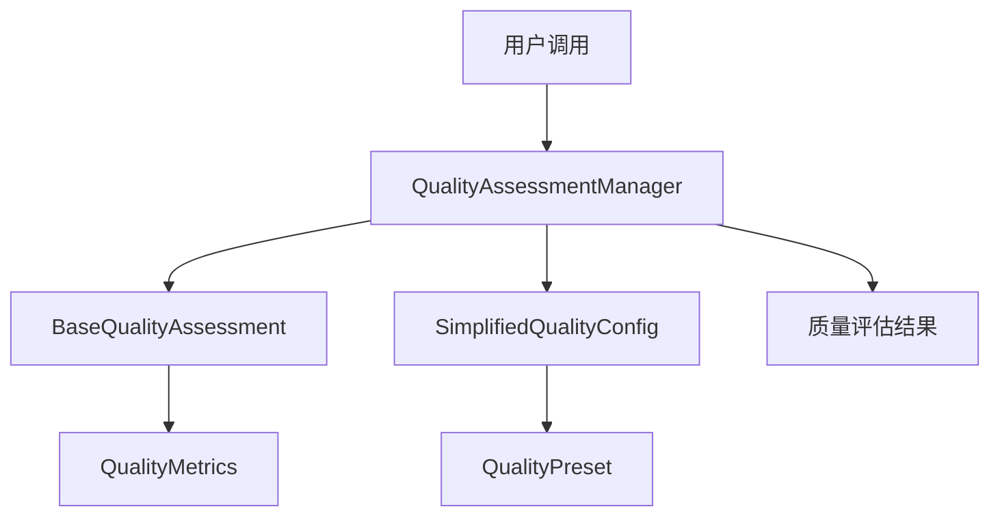
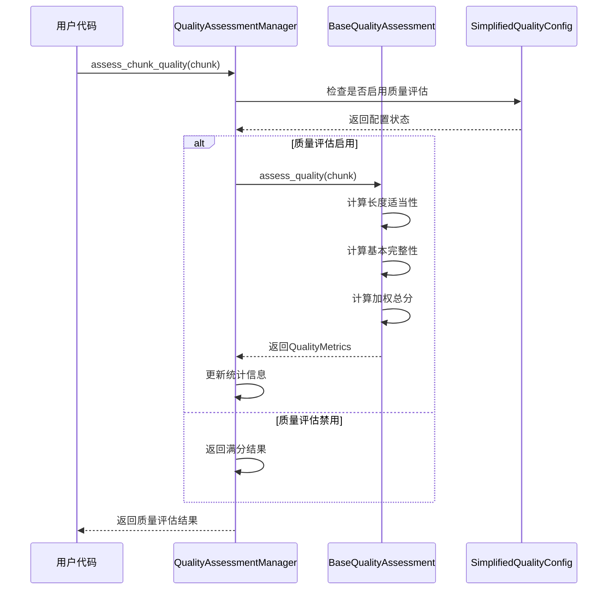

# 分块质量评估模块

## 概述

分块质量评估模块提供了一个轻量级的文本分块质量评估框架，专注于长度适当性和基本完整性检查。该模块采用简化的架构设计，提供高性能的质量评估能力，同时保持API的简洁性和易用性。

## 核心功能

- **长度适当性评估**: 检查分块长度是否在合理范围内
- **基本完整性评估**: 检查分块是否有明显的截断或不完整
- **预设配置管理**: 提供三种预设配置满足不同场景需求
- **批量处理支持**: 支持高效的批量质量评估
- **统计信息收集**: 提供详细的处理统计和性能指标

## 模块架构

### 文件结构

```
rag_flow/src/core/document_processor/chunking/quality/
├── __init__.py                 # 模块导出和接口定义
├── base.py                     # 基础类、数据结构和评估策略
├── manager.py                  # 质量评估管理器
├── config_simplified.py       # 配置系统和预设管理
└── README.md                   # 技术文档
```

### 架构设计

该模块采用分层架构设计，各组件职责明确：



### 组件依赖关系

- **manager.py** 依赖 **base.py** 和 **config_simplified.py**
- **base.py** 定义核心数据结构，被其他模块引用
- **config_simplified.py** 独立管理配置逻辑
- **__init__.py** 统一导出所有公共接口

## 代码结构分析

### __init__.py - 模块导出

该文件定义了模块的公共接口，导出所有核心类和函数：

```python
from .base import QualityMetrics, QualityAssessmentStrategy, BaseQualityAssessment
from .manager import QualityAssessmentManager
from .config_simplified import SimplifiedQualityConfig, QualityPreset, get_default_config
```

**主要导出**：
- `QualityAssessmentManager`: 主要的质量评估管理器
- `QualityMetrics`: 质量评估结果数据结构
- `SimplifiedQualityConfig`: 配置管理类
- `QualityPreset`: 预设配置枚举

### base.py - 基础类和数据结构

#### 核心数据结构

**QualityMetrics**: 质量评估结果的数据容器
```python
@dataclass
class QualityMetrics:
    overall_score: float          # 总体质量评分 (0-1)
    dimension_scores: Dict[str, float]  # 各维度评分
    confidence: float             # 评估置信度
    details: Dict[str, Any]       # 详细信息
    strategy_name: str            # 使用的策略名称
    processing_time: float        # 处理时间(毫秒)
```

**QualityAssessmentStrategy**: 抽象基类
- 定义质量评估策略的标准接口
- 提供配置管理和日志记录功能
- 子类需实现 `assess_quality()` 方法

#### BaseQualityAssessment 实现

核心评估策略类，实现两个主要评估维度：

1. **长度适当性评估** (`_calculate_length_appropriateness`)
2. **基本完整性评估** (`_calculate_basic_completeness`)

### manager.py - 质量评估管理器

#### QualityAssessmentManager 类

主要的质量评估管理器，提供以下核心功能：

**初始化方法**：
```python
def __init__(self, config_or_preset=None):
    # 支持预设名称、配置字典或配置对象
    # 自动初始化评估策略和统计收集
```

**核心方法**：
- `assess_chunk_quality(chunk)`: 评估单个分块质量
- `assess_chunks_batch(chunks)`: 批量评估分块质量
- `update_config(config_or_preset)`: 动态更新配置
- `get_statistics()`: 获取处理统计信息
- `is_enabled()`: 检查质量评估是否启用

**工作流程**：
1. 接收分块对象或分块列表
2. 根据配置决定是否进行质量评估
3. 调用评估策略进行质量计算
4. 收集统计信息并返回结果

### config_simplified.py - 配置系统

#### QualityPreset 枚举

定义三种预设配置：
```python
class QualityPreset(Enum):
    BASIC = "basic"        # 基础质量检查
    STRICT = "strict"      # 严格质量检查
    DISABLED = "disabled"  # 禁用质量检查
```

#### SimplifiedQualityConfig 类

配置管理类，负责：
- 预设配置的加载和管理
- 配置参数的验证和转换
- 默认值的提供和覆盖

**核心配置参数**：
- `min_length`: 最小分块长度
- `max_length`: 最大分块长度
- `optimal_length`: 最优分块长度
- `enable_quality_check`: 是否启用质量检查
- `length_weight`: 长度评估权重
- `completeness_weight`: 完整性评估权重

## 工作流程说明

### 质量评估流程



### 评估算法详解

#### 长度适当性评估算法

```python
def _calculate_length_appropriateness(self, chunk):
    char_count = len(chunk.content)
    optimal_min = self.optimal_length * 0.8  # 最优区间下限
    optimal_max = self.optimal_length * 1.2  # 最优区间上限

    if optimal_min <= char_count <= optimal_max:
        return 1.0  # 最优长度区间，满分
    elif char_count < self.min_length:
        return 0.2  # 过短，严重扣分
    elif char_count > self.max_length:
        return 0.3  # 过长，严重扣分
    else:
        # 线性映射到0.5-1.0区间
        if char_count < optimal_min:
            ratio = (char_count - self.min_length) / (optimal_min - self.min_length)
        else:
            ratio = (self.max_length - char_count) / (self.max_length - optimal_max)
        return 0.5 + ratio * 0.5
```

#### 基本完整性评估算法

```python
def _calculate_basic_completeness(self, chunk):
    content = chunk.content.strip()
    score = 0.7  # 基础分数

    # 检查结尾标点符号
    if content.endswith(('.', '。', '!', '！', '?', '？')):
        score += 0.2  # 有适当结尾标点加分
    elif content.endswith(('...', '…')):
        score -= 0.3  # 省略号结尾扣分（可能截断）

    # 检查内容长度和词汇数量
    if len(content) < 20:
        score -= 0.4  # 内容过短扣分
    if len(content.split()) < 3:
        score -= 0.3  # 词汇过少扣分

    return max(0.0, min(1.0, score))  # 确保分数在0-1范围内
```

## API接口文档

### QualityAssessmentManager

#### 构造函数

```python
def __init__(self, config_or_preset=None)
```

**参数**：
- `config_or_preset` (str|dict|SimplifiedQualityConfig, optional): 配置参数
  - 字符串: 预设名称 ('basic', 'strict', 'disabled')
  - 字典: 自定义配置参数
  - 配置对象: SimplifiedQualityConfig实例
  - None: 使用默认配置 ('basic')

#### 主要方法

##### assess_chunk_quality()

```python
def assess_chunk_quality(self, chunk) -> QualityMetrics
```

评估单个分块的质量。

**参数**：
- `chunk` (TextChunk): 待评估的文本分块对象

**返回值**：
- `QualityMetrics`: 质量评估结果对象

**示例**：
```python
manager = QualityAssessmentManager('basic')
metrics = manager.assess_chunk_quality(chunk)
print(f"总体评分: {metrics.overall_score:.3f}")
print(f"长度评分: {metrics.dimension_scores['length_appropriateness']:.3f}")
print(f"完整性评分: {metrics.dimension_scores['basic_completeness']:.3f}")
```

##### assess_chunks_batch()

```python
def assess_chunks_batch(self, chunks) -> List[QualityMetrics]
```

批量评估多个分块的质量。

**参数**：
- `chunks` (List[TextChunk]): 待评估的文本分块列表

**返回值**：
- `List[QualityMetrics]`: 质量评估结果列表

**示例**：
```python
manager = QualityAssessmentManager('strict')
results = manager.assess_chunks_batch(chunks)
avg_score = sum(r.overall_score for r in results) / len(results)
print(f"平均质量评分: {avg_score:.3f}")
```

##### update_config()

```python
def update_config(self, config_or_preset)
```

动态更新配置。

**参数**：
- `config_or_preset`: 新的配置（格式同构造函数）

**示例**：
```python
manager = QualityAssessmentManager('basic')
manager.update_config('strict')  # 切换到严格模式
```

##### get_statistics()

```python
def get_statistics() -> Dict[str, Any]
```

获取处理统计信息。

**返回值**：
```python
{
    'total_assessments': int,           # 总评估次数
    'total_processing_time_ms': float,  # 总处理时间
    'average_processing_time_ms': float, # 平均处理时间
    'enabled_assessments': int,         # 启用状态下的评估次数
    'disabled_assessments': int         # 禁用状态下的评估次数
}
```

### QualityMetrics 数据结构

```python
@dataclass
class QualityMetrics:
    overall_score: float                # 总体质量评分 (0.0-1.0)
    dimension_scores: Dict[str, float]  # 各维度评分
    confidence: float                   # 评估置信度 (0.0-1.0)
    details: Dict[str, Any]            # 详细信息
    strategy_name: str                 # 使用的策略名称
    processing_time: float             # 处理时间(毫秒)
```

**dimension_scores 包含**：
- `length_appropriateness`: 长度适当性评分
- `basic_completeness`: 基本完整性评分

**details 包含**：
- `chunk_length`: 分块字符数
- `word_count`: 分块词汇数
- `simplified_evaluation`: 是否使用简化评估

## 配置参数详解

### 预设配置对比

| 参数 | basic | strict | disabled | 说明 |
|------|-------|--------|----------|------|
| min_length | 50 | 100 | 1 | 最小分块长度（字符） |
| max_length | 2000 | 1500 | 10000 | 最大分块长度（字符） |
| optimal_length | 1000 | 800 | 1000 | 最优分块长度（字符） |
| enable_quality_check | True | True | False | 是否启用质量检查 |
| length_weight | 0.6 | 0.5 | 1.0 | 长度评估权重 |
| completeness_weight | 0.4 | 0.5 | 0.0 | 完整性评估权重 |

### 自定义配置示例

```python
from chunking.quality import QualityAssessmentManager, SimplifiedQualityConfig

# 方式1: 直接传入字典
custom_config = {
    'min_length': 80,
    'max_length': 1800,
    'optimal_length': 900,
    'enable_quality_check': True,
    'length_weight': 0.7,
    'completeness_weight': 0.3
}
manager = QualityAssessmentManager(custom_config)

# 方式2: 使用配置类
config = SimplifiedQualityConfig('basic')
config.update_config(
    min_length=80,
    max_length=1800,
    length_weight=0.7
)
manager = QualityAssessmentManager(config)

# 方式3: 基于预设修改
config = SimplifiedQualityConfig.from_preset('strict')
config.update_config(optimal_length=900)
manager = QualityAssessmentManager(config)
```

## 集成指南

### 与分块引擎集成

质量评估模块设计为与分块引擎无缝集成：

```python
from chunking_engine import ChunkingEngine
from chunking.quality import QualityAssessmentManager

# 在分块引擎中集成质量评估
class ChunkingEngine:
    def __init__(self, quality_config='basic'):
        self.quality_manager = QualityAssessmentManager(quality_config)

    def chunk_document(self, text, metadata=None, **kwargs):
        # 执行分块操作
        chunks = self._perform_chunking(text, metadata, **kwargs)

        # 质量评估
        if self.quality_manager.is_enabled():
            quality_results = self.quality_manager.assess_chunks_batch(chunks)
            # 将质量信息添加到分块元数据
            for chunk, quality in zip(chunks, quality_results):
                chunk.metadata['quality_score'] = quality.overall_score
                chunk.metadata['quality_details'] = quality.dimension_scores

        return chunks
```

### 扩展评估逻辑

如需添加新的评估维度，可以继承 `BaseQualityAssessment`：

```python
from chunking.quality.base import BaseQualityAssessment, QualityMetrics

class CustomQualityAssessment(BaseQualityAssessment):
    def assess_quality(self, chunk, context=None):
        # 调用父类的基础评估
        base_metrics = super().assess_quality(chunk, context)

        # 添加自定义评估维度
        custom_score = self._calculate_custom_dimension(chunk)

        # 更新评估结果
        base_metrics.dimension_scores['custom_dimension'] = custom_score

        # 重新计算总分
        weights = {
            'length_appropriateness': 0.4,
            'basic_completeness': 0.3,
            'custom_dimension': 0.3
        }
        base_metrics.overall_score = sum(
            score * weights.get(dim, 0)
            for dim, score in base_metrics.dimension_scores.items()
        )

        return base_metrics

    def _calculate_custom_dimension(self, chunk):
        # 实现自定义评估逻辑
        return 0.8  # 示例返回值
```

### 配置调优建议

#### 根据文档类型调优

**技术文档**：
```python
config = {
    'min_length': 100,      # 技术内容通常较长
    'max_length': 2500,     # 允许更长的技术描述
    'optimal_length': 1200, # 适中的技术段落长度
    'length_weight': 0.7,   # 更重视长度适当性
    'completeness_weight': 0.3
}
```

**对话文本**：
```python
config = {
    'min_length': 30,       # 对话可能较短
    'max_length': 800,      # 单轮对话不宜过长
    'optimal_length': 400,  # 适中的对话长度
    'length_weight': 0.4,   # 更重视完整性
    'completeness_weight': 0.6
}
```

**新闻文章**：
```python
config = {
    'min_length': 80,       # 新闻段落有一定长度
    'max_length': 1500,     # 控制段落长度
    'optimal_length': 800,  # 标准新闻段落
    'length_weight': 0.5,   # 平衡长度和完整性
    'completeness_weight': 0.5
}
```

#### 性能优化建议

1. **批量处理**: 使用 `assess_chunks_batch()` 而非循环调用单个评估
2. **禁用评估**: 在性能敏感场景使用 `disabled` 预设
3. **配置缓存**: 重用 `QualityAssessmentManager` 实例
4. **统计监控**: 定期检查 `get_statistics()` 监控性能

### 故障排除

#### 常见问题

1. **评估结果异常**
   - 检查分块内容是否为空或格式异常
   - 验证配置参数是否合理
   - 确认 TextChunk 对象结构正确

2. **性能问题**
   - 使用批量评估接口
   - 考虑禁用质量评估
   - 检查配置参数是否过于复杂

3. **集成问题**
   - 确认导入路径正确
   - 检查 TextChunk 对象兼容性
   - 验证配置格式

---

**模块版本**: v2.0.0
**创建日期**: 2024-01-15
**作者**: Sniperz
**最后更新**: 2024-06-24
