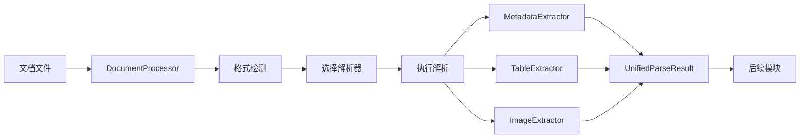

# 文档解析器模块 (parsers)

## 模块概述

文档解析器模块是文档预处理系统的入口组件，负责将各种格式的文档转换为统一的结构化数据。该模块提供多种专门的解析器来处理不同格式的文档，并通过统一的接口提供一致的解析结果。

## 设计目标

- **多格式支持**: 支持PDF、Word、Excel、PowerPoint等主流文档格式
- **统一接口**: 提供一致的解析接口和结果格式
- **高质量解析**: 保持文档结构和格式信息
- **性能优化**: 高效的解析算法和内存管理
- **扩展性**: 易于添加新的文档格式支持

## 模块结构

```
parsers/
├── __init__.py              # 模块初始化
├── README.md               # 模块文档（本文件）
├── document_processor.py   # 统一文档处理器
├── pdf_parser.py           # PDF解析器
├── word_parser.py          # Word解析器
├── excel_parser.py         # Excel解析器
├── powerpoint_parser.py    # PowerPoint解析器
└── docling_parser.py       # Docling统一解析器
```

## 核心类和方法

### DocumentProcessor - 统一文档处理器

**功能描述**: 提供统一的文档处理入口，自动检测文档类型并路由到相应的解析器。

**主要方法**:
- `parse(file_path)`: 解析单个文档
- `parse_batch(file_paths)`: 批量解析文档
- `detect_document_type(file_path)`: 检测文档类型
- `is_supported_format(file_path)`: 检查格式支持
- `extract_text_only(file_path)`: 仅提取文本
- `extract_metadata_only(file_path)`: 仅提取元数据

**支持的文档类型**:
```python
class DocumentType(Enum):
    PDF = "pdf"
    WORD = "word"
    EXCEL = "excel"
    POWERPOINT = "powerpoint"
    DOCLING = "docling"  # 多格式统一处理
    UNKNOWN = "unknown"
```

### PDFParser - PDF解析器

**功能描述**: 专门处理PDF文档，支持文本提取、表格识别、图像提取等功能。

**主要特性**:
- 基于PyMuPDF的高性能解析
- 支持文本、表格、图像提取
- 保持页面布局和格式
- 可选OCR文本识别
- 元数据提取

**配置参数**:
```python
{
    'extract_images': True,      # 是否提取图像
    'extract_tables': True,      # 是否提取表格
    'ocr_enabled': False,        # 是否启用OCR
    'preserve_layout': True,     # 是否保持布局
    'password': None,            # PDF密码
    'page_range': None,          # 页面范围
}
```

### WordParser - Word解析器

**功能描述**: 处理Word文档，保持格式和结构信息。

**主要特性**:
- 基于python-docx的解析
- 支持文本、表格、图像提取
- 保持文档结构和样式
- 处理页眉页脚
- 元数据提取

### ExcelParser - Excel解析器

**功能描述**: 处理Excel文档，支持多工作表和复杂表格。

**主要特性**:
- 基于openpyxl的解析
- 支持多工作表处理
- 保持单元格格式
- 处理公式和图表
- 数据类型识别

### PowerPointParser - PowerPoint解析器

**功能描述**: 处理PowerPoint文档，提取幻灯片内容。

**主要特性**:
- 基于python-pptx的解析
- 提取幻灯片文本和图像
- 保持幻灯片结构
- 处理备注和母版
- 元数据提取

### DoclingParser - Docling统一解析器

**功能描述**: 基于Docling库的统一解析器，支持多种格式的统一处理。

**主要特性**:
- 支持PDF、Word、HTML、Excel、CSV、Markdown、图片等格式
- 统一的解析接口和结果格式
- 高级功能：OCR、表格结构识别、图片描述、公式识别等
- 可配置的处理管道
- 支持VLM（视觉语言模型）管道

## 使用示例

### 基本使用

```python
from rag_flow.src.core.document_processor.parsers import DocumentProcessor

# 初始化文档处理器
processor = DocumentProcessor()

# 解析文档
result = processor.parse("document.pdf")

print(f"文档类型: {result.document_type}")
print(f"文本内容: {result.text_content[:200]}...")
print(f"表格数量: {len(result.structured_data.get('tables', []))}")
print(f"图像数量: {len(result.structured_data.get('images', []))}")
```

### 使用特定解析器

```python
from rag_flow.src.core.document_processor.parsers import PDFParser

# 配置PDF解析器
config = {
    'extract_images': True,
    'extract_tables': True,
    'ocr_enabled': False
}
parser = PDFParser(config)

# 解析PDF文档
result = parser.parse("document.pdf")

# 访问解析结果
print(f"页数: {result.metadata.get('page_count', 0)}")
print(f"文件大小: {result.metadata.get('file_size', 0)} 字节")

# 处理表格
for i, table in enumerate(result.structured_data.get('tables', [])):
    print(f"表格 {i+1}: {table['rows']}行 x {table['columns']}列")
```

### 使用Docling解析器

```python
from rag_flow.src.core.document_processor.parsers import DoclingParser

# 配置Docling解析器
config = {
    'enable_ocr': True,
    'enable_table_structure': True,
    'enable_picture_description': True,
    'enable_formula_enrichment': True,
    'table_mode': 'accurate',
    'use_vlm_pipeline': False
}
parser = DoclingParser(config)

# 解析文档
result = parser.parse("document.pdf")

# 导出图形和表格
figures = parser.export_figures("document.pdf", "output/figures/")
tables = parser.export_tables("document.pdf", "output/tables/")

print(f"导出图形: {len(figures)}个")
print(f"导出表格: {len(tables)}个")
```

### 批量处理

```python
# 批量解析文档
file_paths = [
    "doc1.pdf",
    "doc2.docx",
    "doc3.xlsx",
    "doc4.pptx"
]

results = processor.parse_batch(file_paths)

for result in results:
    print(f"文档: {result.metadata['file_name']}")
    print(f"类型: {result.document_type}")
    print(f"状态: {'成功' if result.text_content else '失败'}")
```

## 配置参数

### DocumentProcessor 配置

| 参数 | 类型 | 默认值 | 说明 |
|------|------|--------|------|
| `use_docling` | bool | False | 是否优先使用Docling |
| `enable_performance_monitoring` | bool | True | 是否启用性能监控 |
| `pdf_config` | dict | {} | PDF解析器配置 |
| `word_config` | dict | {} | Word解析器配置 |
| `excel_config` | dict | {} | Excel解析器配置 |
| `powerpoint_config` | dict | {} | PowerPoint解析器配置 |
| `docling_config` | dict | {} | Docling解析器配置 |

### 各解析器通用配置

| 参数 | 类型 | 默认值 | 说明 |
|------|------|--------|------|
| `extract_metadata` | bool | True | 是否提取元数据 |
| `extract_text` | bool | True | 是否提取文本 |
| `extract_images` | bool | False | 是否提取图像 |
| `extract_tables` | bool | False | 是否提取表格 |
| `preserve_formatting` | bool | False | 是否保持格式 |

## 解析结果格式

### UnifiedParseResult

```python
@dataclass
class UnifiedParseResult:
    document_type: DocumentType      # 文档类型
    text_content: str               # 文本内容
    metadata: Dict[str, Any]        # 元数据
    structured_data: Dict[str, Any] # 结构化数据
    structure_info: Dict[str, Any]  # 结构信息
    original_result: Union[...]     # 原始解析结果
```

### 元数据格式

```python
{
    'file_info': {
        'file_name': str,           # 文件名
        'file_path': str,           # 文件路径
        'file_size': int,           # 文件大小
        'file_extension': str,      # 文件扩展名
        'creation_time': datetime,  # 创建时间
        'modification_time': datetime, # 修改时间
    },
    'document_info': {
        'title': str,               # 文档标题
        'author': str,              # 作者
        'subject': str,             # 主题
        'keywords': list,           # 关键词
        'page_count': int,          # 页数
        'language': str,            # 语言
    },
    'parser_info': {
        'parser_type': str,         # 解析器类型
        'parser_version': str,      # 解析器版本
        'processing_time': float,   # 处理时间
        'success': bool,            # 是否成功
    }
}
```

### 结构化数据格式

```python
{
    'tables': [                     # 表格列表
        {
            'table_id': str,
            'caption': str,
            'headers': list,
            'data': list,
            'position': dict,
        }
    ],
    'images': [                     # 图像列表
        {
            'image_id': str,
            'caption': str,
            'description': str,
            'format': str,
            'dimensions': dict,
            'position': dict,
        }
    ],
    'headings': [                   # 标题列表
        {
            'text': str,
            'level': int,
            'position': dict,
        }
    ],
    'lists': [                      # 列表
        {
            'items': list,
            'list_type': str,
            'position': dict,
        }
    ]
}
```

## 独立测试指南

### 测试环境准备

```bash
# 安装测试依赖
pip install pytest pytest-cov
pip install pymupdf python-docx openpyxl python-pptx

# 可选：安装Docling
pip install docling

# 准备测试文档
mkdir test_documents
# 放置各种格式的测试文档
```

### 单元测试

```python
# test_parsers.py
import pytest
from parsers.document_processor import DocumentProcessor
from parsers.pdf_parser import PDFParser

def test_document_processor():
    """测试文档处理器"""
    processor = DocumentProcessor()
    
    # 测试文档类型检测
    doc_type = processor.detect_document_type("test.pdf")
    assert doc_type.value == "pdf"
    
    # 测试格式支持检查
    assert processor.is_supported_format("test.pdf") == True
    assert processor.is_supported_format("test.xyz") == False

def test_pdf_parser():
    """测试PDF解析器"""
    parser = PDFParser({'extract_tables': True})
    
    # 测试解析
    result = parser.parse("test_document.pdf")
    
    assert result.document_type == "pdf"
    assert len(result.text_content) > 0
    assert 'file_name' in result.metadata

# 运行测试
pytest test_parsers.py -v
```

### 集成测试

```python
def test_full_parsing_pipeline():
    """测试完整解析流程"""
    processor = DocumentProcessor()
    
    # 测试不同格式文档
    test_files = [
        "test.pdf",
        "test.docx",
        "test.xlsx",
        "test.pptx"
    ]
    
    for file_path in test_files:
        if os.path.exists(file_path):
            result = processor.parse(file_path)
            
            # 验证基本结果
            assert result.text_content is not None
            assert result.metadata is not None
            assert result.structured_data is not None
```

### 性能测试

```python
import time

def test_parsing_performance():
    """测试解析性能"""
    processor = DocumentProcessor()
    
    start_time = time.time()
    result = processor.parse("large_document.pdf")
    end_time = time.time()
    
    processing_time = end_time - start_time
    file_size = os.path.getsize("large_document.pdf")
    
    print(f"解析时间: {processing_time:.2f}秒")
    print(f"文件大小: {file_size/1024/1024:.2f}MB")
    print(f"处理速度: {file_size/processing_time/1024/1024:.2f}MB/秒")
```

## 与其他模块的接口

### 输出接口

**目标**: `extractors` 模块进行内容提取，`chunking` 模块进行分块处理
**数据格式**: `UnifiedParseResult` 统一解析结果

### 依赖关系



## 扩展和自定义

### 添加新的解析器

```python
from parsers.base_parser import BaseParser

class CustomParser(BaseParser):
    def __init__(self, config=None):
        super().__init__(config)
    
    def parse(self, file_path):
        # 实现自定义解析逻辑
        result = CustomParseResult()
        # ... 解析处理
        return result
    
    def is_supported_format(self, file_path):
        # 检查格式支持
        return file_path.endswith('.custom')

# 注册新解析器
processor = DocumentProcessor()
processor.register_parser('custom', CustomParser())
```

### 自定义解析配置

```python
# 针对特定需求的配置
high_quality_config = {
    'pdf_config': {
        'extract_images': True,
        'extract_tables': True,
        'ocr_enabled': True,
        'preserve_layout': True
    },
    'docling_config': {
        'enable_ocr': True,
        'enable_table_structure': True,
        'table_mode': 'accurate',
        'enable_picture_description': True,
        'enable_formula_enrichment': True
    }
}

# 快速处理配置
fast_config = {
    'pdf_config': {
        'extract_images': False,
        'extract_tables': False,
        'ocr_enabled': False
    }
}
```

## 最佳实践

1. **选择合适的解析器**: 根据文档类型和需求选择最适合的解析器
2. **配置优化**: 根据性能和质量需求调整解析配置
3. **错误处理**: 妥善处理解析失败和异常情况
4. **内存管理**: 及时释放大文档的解析资源
5. **批量处理**: 对于大量文档，使用批量处理提高效率

## 故障排除

### 常见问题

1. **解析失败**: 检查文档格式、权限和依赖库
2. **内存不足**: 优化配置或分批处理大文档
3. **格式不支持**: 检查文件扩展名和解析器支持
4. **性能问题**: 调整解析配置或使用并行处理

### 调试技巧

```python
# 启用详细日志
import logging
logging.basicConfig(level=logging.DEBUG)

# 检查解析结果
print(f"解析状态: {result.metadata.get('success', False)}")
print(f"处理时间: {result.metadata.get('processing_time', 0):.2f}秒")
print(f"文本长度: {len(result.text_content)}")
print(f"表格数量: {len(result.structured_data.get('tables', []))}")
```
