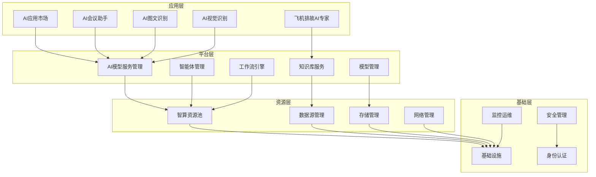
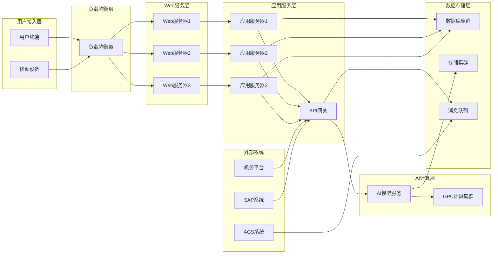
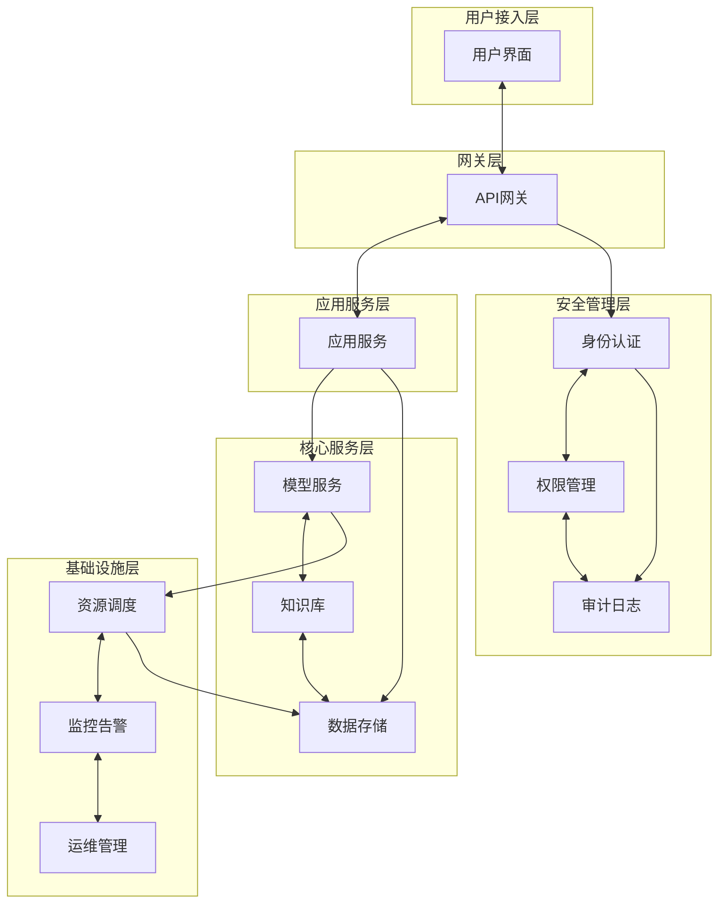
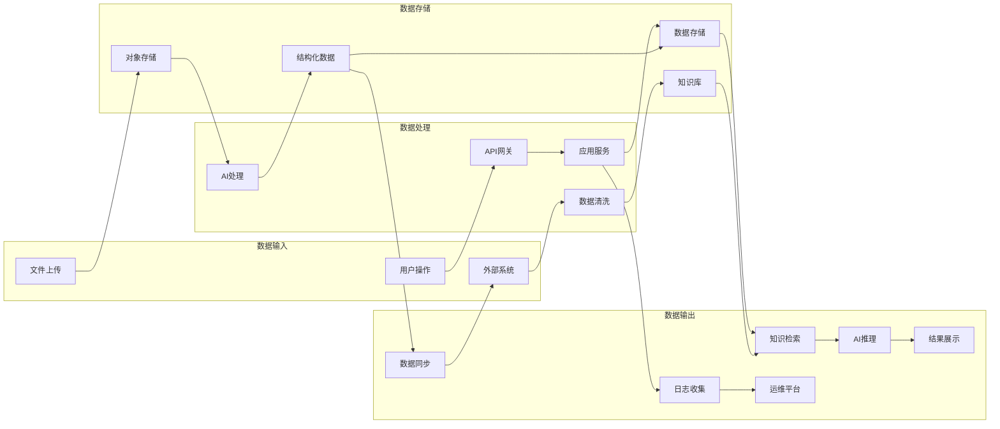
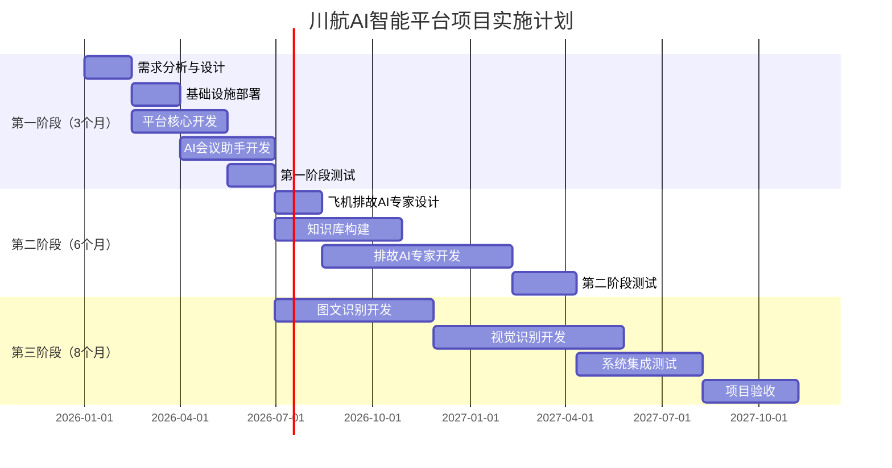

---

# 川航AI智能平台可行性研究报告

## 一、项目概述

### 1.1 项目背景
川航AI智能平台项目旨在构建一个综合性的人工智能应用平台，专注于机务领域的智能化应用。该平台将整合AI模型管理、知识库、智能体开发等核心功能，为川航机务部门提供四大核心AI应用：AI会议助手、飞机排故AI专家、AI图文识别和AI视觉识别飞机标识标牌。

### 1.2 项目目标
- **AI会议助手**：实现关键要素识别准确率≥90%，提升会议纪要生成效率
- **飞机排故AI专家**：知识库对川航机队覆盖率≥95%，辅助工程师提升排故效率
- **AI图文识别**：关键参数识别准确率≥99%，提升原始资料结构化处理效率
- **AI视觉识别飞机标识标牌**：主要场景识别准确率≥95%，提高检测效率

### 1.3 建设意义
该项目将显著提升川航机务工作的智能化水平，通过AI技术赋能传统机务流程，实现效率提升、成本降低和安全保障的多重目标。

## 二、需求分析

### 2.1 业务需求概述
项目需要构建13个核心功能模块，涵盖AI应用开发、模型管理、数据处理、资源调度等全链路能力。同时需要孵化4个专业AI应用，满足机务领域的实际业务需求。

### 2.2 性能需求
- 峰值时段：8:30～16:30
- 大语言模型峰值并发量：100
- AI应用峰值并发量：30（每个应用）
- AI机身标牌识别时间：≤1秒/区域
- 可接受中断时长：1小时

### 2.3 数据源需求
支持多种数据源类型：数据库、图片、语音、视频、WORD、EXCEL、PDF、网页等，主要数据来源包括线下采集、厂家资料、机务平台和AGS系统。

## 三、技术可行性分析

### 3.1 总体设计及依据

#### 3.1.1 设计依据
- **国家标准**：遵循《信息安全技术 个人信息安全规范》(GB/T 35273-2020)
- **行业标准**：符合民航局相关技术规范和安全要求
- **公司标准**：满足川航IT架构规范和安全管理要求
- **技术标准**：采用云原生架构，支持微服务部署和容器化管理

#### 3.1.2 整体架构设计
本系统采用分层架构设计，架构图如下：

#### 3.1.3 功能模块响应设计

| 功能模块 | 功能名称 | 功能响应及初步设计 |
|----------|----------|-------------------|
| AI应用市场 | AI应用市场 | 基于微服务架构构建应用商店，支持应用的发布、管理、版本控制和权限管理 |
| AI模型服务管理 | AI模型服务管理 | 提供统一的模型API网关，支持多模型路由、负载均衡和服务编排 |
| 智能体管理 | 智能体中心 | 基于低代码平台实现智能体的可视化创建、编排和发布 |
| 模型管理 | 模型管理 | 构建模型仓库，支持国产和非国产模型的统一管理、版本控制和审批流程 |
| 知识库 | 知识库 | 基于向量数据库实现多模态知识存储，支持语义检索和权限管理 |
| 标注管理 | 标注管理 | 集成主流标注工具，支持人工标注和AI辅助标注 |
| 训练管理 | 训练管理 | 提供分布式训练调度，支持本地和云端算力资源 |
| 微调管理 | 微调管理 | 基于参数高效微调技术，支持快速模型定制 |
| 推理管理 | 编排推理 | 提供推理服务编排，支持模型组合和流水线处理 |
| workflow流程 | 流程编排 | 基于工作流引擎实现业务流程的可视化编排 |
| 数据源管理 | 接入数据、数据清洗、管理工作 | 支持多种数据源接入，提供数据清洗和预处理能力 |
| 智算资源池 | 智算资源池 | 基于Kubernetes实现异构算力资源的虚拟化管理 |
| 平台管理 | 平台管理 | 提供统一的用户管理、权限控制、监控和运维功能 |

### 3.2 系统架构

#### 3.2.1 应用架构

本系统采用分层微服务架构，主要包括以下层次：

**1. 用户接入层**
- Web前端：基于Vue.js 3.0构建响应式用户界面
- 移动端：支持iOS/Android原生应用和H5应用
- API网关：统一接入点，提供认证、限流、路由等功能

**2. 应用服务层**
- **AI应用市场**：应用生命周期管理、版本控制、权限管理
- **AI会议助手**：语音转文字、会议纪要生成、模板管理
- **飞机排故AI专家**：故障诊断、知识推理、案例学习
- **AI图文识别**：OCR识别、数据提取、SAP集成
- **AI视觉识别**：图像识别、标牌检测、破损分析

**3. 平台服务层**
- **模型服务管理**：模型API统一管理、服务编排、多模态支持
- **智能体管理**：智能体创建、编排、发布的低代码平台
- **知识库服务**：向量存储、语义检索、权限管理
- **工作流引擎**：业务流程编排、任务调度、状态管理

**4. 基础服务层**
- **模型管理**：模型仓库、版本控制、审批流程
- **数据管理**：数据接入、清洗、存储、治理
- **资源管理**：算力调度、存储管理、网络配置
- **安全管理**：身份认证、权限控制、审计日志

#### 3.2.2 数据架构

**1. 核心数据分类分级**

| 数据类别 | 敏感级别 | 数据内容 | 存储方式 |
|----------|----------|----------|----------|
| 业务数据 | 一般 | 会议音频、会议纪要、标牌图片 | 对象存储+关系数据库 |
| 技术数据 | 重要 | 飞机技术手册、故障诊断规则、维修流程 | 向量数据库+文档存储 |
| 系统数据 | 重要 | 模型参数、训练数据、推理结果 | 分布式文件系统 |
| 管理数据 | 机密 | 用户信息、权限配置、审计日志 | 加密数据库 |

**2. 核心数据实体及关系**

- **用户实体**：用户信息、角色权限、操作日志
- **模型实体**：模型元数据、版本信息、性能指标
- **知识实体**：知识条目、向量表示、关联关系
- **应用实体**：应用配置、运行状态、使用统计
- **资源实体**：算力资源、存储资源、网络资源

**3. 数据存储技术选型（2025年最新版本）**

| 存储类型 | 国产化首选 | 版本信息 | 国产化备选 | 开源备选 | 特性优势 |
|----------|------------|----------|------------|----------|----------|
| **关系数据库** | 达梦数据库DM8 | V8.1.3.147 | 人大金仓KingbaseES | PostgreSQL 16 | 完全自主知识产权，金融级安全 |
| **向量数据库** | Milvus企业版 | V2.4.x | Qdrant | Chroma | 高性能向量检索，支持混合查询 |
| **文档数据库** | 巨杉数据库SequoiaDB | V5.8 | 腾讯TDSQL-C | MongoDB 7.0 | 分布式架构，金融级可靠性 |
| **对象存储** | 华为云OBS | 企业版 | 阿里云OSS | MinIO | 海量存储，多副本保障 |
| **缓存数据库** | 腾讯TcaplusDB | 企业版 | 阿里云Redis | Redis 7.2 | 高并发，低延迟，持久化 |
| **时序数据库** | 华为云GaussDB(for Influx) | 企业版 | 阿里云TSDB | InfluxDB | 高效时序数据处理 |

**4. 数据容量估算**

| 数据类型 | 初始容量 | 年增长量 | 5年预估 |
|----------|----------|----------|---------|
| 会议音频文件 | 100GB | 500GB | 2.6TB |
| 技术文档资料 | 50GB | 100GB | 550GB |
| 图片视频文件 | 200GB | 1TB | 5.2TB |
| 模型文件 | 500GB | 200GB | 1.5TB |
| 业务数据 | 10GB | 50GB | 260GB |
| 日志数据 | 20GB | 100GB | 520GB |

**5. 数据管理策略**

- **归档策略**：数据库硬盘占用率超过80%后，将1年前的历史数据归档至冷存储
- **备份策略**：
  - 核心业务数据：每日全量备份，保存30天
  - 模型文件：每周增量备份，保存90天
  - 配置数据：每日备份，保存365天
- **异地备份**：重要数据采用双活备份，异地容灾
- **数据加密**：
  - 传输加密：TLS 1.3
  - 存储加密：AES-256
  - 敏感字段：采用国密SM4算法加密

#### 3.2.3 技术架构

**1. 技术栈选型**

| 技术层次 | 国产化首选方案 | 版本信息 | 国产化备选方案 | 国外备选方案 | 年度许可费用（万元） |
|----------|----------------|----------|----------------|--------------|-------------------|
| **操作系统** | 银河麒麟V10 SP3 | 2024年12月版 | 统信UOS V20 SP1 | CentOS/Ubuntu | 12.5（25套） |
| **数据库** | 达梦数据库DM8 | V8.1.3.147 | 人大金仓KingbaseES V009R003 | PostgreSQL/MySQL | 36（6套企业版） |
| **容器平台** | 华为CCE Turbo | 2025年Q1版 | 阿里云ACK Pro | Kubernetes原生 | 20（企业版） |
| **前端框架** | 飞冰（阿里）+ Ant Design | V3.0 | Vue.js + Element Plus | React + Material-UI | 0（开源） |
| **API网关** | 腾讯云API网关 | 企业版 | 华为APIG | Kong/Nginx | 8 |
| **应用服务层** | 华为ServiceComb | V2.8.x | Spring Boot + FastAPI | Node.js + Express | 0（开源） |
| **AI模型层** | DeepSeek-V3 + 千问Max | 2025年最新 | 星火4.0 + GLM-4-Plus | OpenAI GPT-4 | 125（API调用） |
| **缓存层** | 腾讯TcaplusDB | 企业版 | 阿里云Redis | Redis开源版 | 15 |
| **消息队列** | 华为DMS | 企业版 | 阿里云RocketMQ | Apache Kafka | 10 |
| **监控运维** | 华为云监控 | 企业版 | 阿里云监控 | Prometheus | 8 |
| **安全软件** | 360企业安全 | 2025版 | 奇安信 | 开源方案 | 15 |

**2. AI模型技术选型**

**基础大语言模型推荐：**

| 模型名称 | 厂商 | 最新版本 | 优势特点 | API价格（元/万tokens） | 适用场景 | 成本评估 |
|----------|------|----------|----------|----------------------|----------|----------|
| **DeepSeek-V3** | 深度求索 | V3-0324 | 671B参数MoE架构，推理性能指标达到GPT-4水平 | 输入:0.55 输出:2.19 | 代码生成、逻辑推理、复杂任务 | A级 |
| **DeepSeek-R1** | 深度求索 | R1-0528 | 专用推理模型，数学能力与OpenAI o1相当 | 输入:0.55 输出:2.19 | 数学推理、科学计算 | A级 |
| **千问Max** | 阿里云 | Qwen-Max-0125 | 中文语言理解能力，支持128K上下文 | 输入:0.41 输出:1.64 | 文档处理、对话交互 | A级 |
| **星火4.0 Ultra** | 科大讯飞 | Spark-4.0-Ultra | 多模态处理能力，推理速度较前版本提升70% | 输入:0.21 输出:0.84 | 会议助手、语音转写 | A级 |
| **GLM-4-Plus** | 智谱AI | GLM-4-Plus | 代码生成能力，支持函数调用和工具使用 | 输入:1.0 输出:4.0 | 智能体开发、API调用 | B级 |
| **文心4.0 Turbo** | 百度 | ERNIE-4.0-Turbo | 知识问答能力，集成搜索增强功能 | 输入:0.8 输出:3.2 | 知识检索、专业问答 | B级 |

**专业小模型推荐：**

| 应用场景 | 推荐模型 | 技术方案 | 预期效果 | 年度成本（万元） |
|----------|----------|----------|----------|-----------------|
| 会议纪要生成 | 基于星火4.0 Ultra微调 | LoRA微调 + 提示工程 + 语音转写 | 准确率≥90% | 25 |
| 故障诊断推理 | 基于DeepSeek-V3微调 | 知识图谱 + RAG + 推理链 | 覆盖率≥95% | 35 |
| 图文识别OCR | PaddleOCR + 千问多模态 | 多模态融合 + 结构化提取 | 准确率≥99% | 20 |
| 视觉标牌识别 | YOLOv8 + 自研分类模型 | 目标检测 + 分类 + 缺陷识别 | 准确率≥95% | 30 |

### 3.3 国产化软件兼容性评估

**1. 核心软件技术能力评估**

| 软件组件 | 版本信息 | 技术能力评估 | 功能模块支持度 | 潜在限制 | 解决方案 |
|----------|----------|--------------|----------------|----------|----------|
| **银河麒麟V10 SP3** | 2024年12月版 | 支持Docker/Kubernetes容器化，兼容主流硬件架构 | 支持全部13个模块 | 部分新特性需要内核升级 | 定期更新补丁包 |
| **达梦数据库DM8** | V8.1.3.147 | 支持JSON数据类型，具备基础向量存储能力 | 支持11个模块 | 向量检索性能有限 | 结合Milvus向量数据库 |
| **华为CCE Turbo** | 2025年Q1版 | 原生Kubernetes 1.31，支持GPU调度和AI工作负载 | 支持全部13个模块 | 依赖华为云生态 | 保持多云架构设计 |
| **腾讯TcaplusDB** | 企业版 | 兼容Redis协议，支持PB级数据存储 | 支持10个模块 | 非标准Redis实现 | 提供Redis兼容层 |

**2. 功能模块兼容性详细分析**

| 功能模块 | 主要技术要求 | 国产化软件支持情况 | 兼容性评级 | 备注 |
|----------|--------------|-------------------|------------|------|
| **AI应用市场** | Web服务、数据库、容器化 | 麒麟OS+达梦DB+CCE完全支持 | ★★★★★ | 无技术障碍 |
| **AI模型服务管理** | API网关、负载均衡、容器编排 | CCE Turbo原生支持Kubernetes | ★★★★★ | 支持多模型并发调度 |
| **智能体管理** | 低代码平台、工作流引擎 | 需要自研开发，基础设施支持 | ★★★★☆ | 依赖开发团队能力 |
| **模型管理** | 文件存储、版本控制、权限管理 | 达梦DB+对象存储完全支持 | ★★★★★ | 支持大文件存储 |
| **知识库** | 向量数据库、全文检索 | 达梦DB基础支持+Milvus增强 | ★★★★☆ | 需要混合架构 |
| **标注管理** | 文件处理、数据存储 | 基础设施完全支持 | ★★★★★ | 无技术限制 |
| **训练管理** | GPU调度、分布式计算 | CCE Turbo支持GPU节点管理 | ★★★★★ | 支持NVIDIA GPU |
| **微调管理** | 模型存储、参数管理 | 达梦DB+对象存储支持 | ★★★★★ | 支持大模型微调 |
| **推理管理** | 高并发、低延迟 | TcaplusDB+CCE支持 | ★★★★☆ | 需要性能优化 |
| **workflow流程** | 工作流引擎、状态管理 | 基于Kubernetes Job支持 | ★★★★☆ | 需要自研组件 |
| **数据源管理** | 多数据源连接、ETL处理 | 达梦DB连接器+自研ETL | ★★★★☆ | 需要开发适配器 |
| **智算资源池** | 资源调度、虚拟化管理 | CCE Turbo完全支持 | ★★★★★ | Kubernetes原生能力 |
| **平台管理** | 用户管理、监控告警 | 基础设施完全支持 | ★★★★★ | 成熟的管理功能 |

**3. 关键技术风险识别与应对**

| 风险类别 | 具体风险 | 影响程度 | 应对措施 | 预计成本（万元） |
|----------|----------|----------|----------|-----------------|
| **向量检索性能** | 达梦DB向量能力有限 | 中等 | 集成Milvus向量数据库 | 20 |
| **容器生态兼容** | 部分镜像可能不兼容麒麟OS | 低 | 构建适配镜像仓库 | 15 |
| **GPU驱动支持** | 麒麟OS GPU驱动更新滞后 | 中等 | 与厂商建立技术支持通道 | 10 |
| **API兼容性** | TcaplusDB非标准Redis | 低 | 开发兼容性适配层 | 25 |
| **监控集成** | 国产化监控工具生态不完善 | 中等 | 采用开源监控方案 | 30 |

**4. 技术选型优化建议**

基于兼容性评估结果，建议采用以下技术架构：
- **核心数据库**：达梦DM8作为主数据库，Milvus作为向量数据库补充
- **容器平台**：华为CCE Turbo作为主要容器平台，保持Kubernetes标准兼容
- **缓存方案**：TcaplusDB+Redis开源版混合部署
- **监控方案**：华为云监控+Prometheus开源监控双重保障

**3. 接口技术方案**

**内部接口：**
- RESTful API：基于OpenAPI 3.0规范
- GraphQL：复杂查询场景
- gRPC：高性能内部通信
- WebSocket：实时数据推送

**外部系统集成：**
- **川航统一身份认证**：SAML 2.0 / OAuth 2.0
- **机务平台**：REST API + 数据同步
- **AGS系统**：消息队列 + 批量接口
- **SAP系统**：RFC接口 + 数据映射

**4. 技术架构对比**

| 架构方案 | 优势 | 劣势 | 适用场景 |
|----------|------|------|----------|
| **微服务架构** | 可扩展性强，技术栈灵活 | 复杂度高，运维成本大 | 大型企业级应用 |
| **单体架构** | 部署简单，开发效率高 | 扩展性差，技术债务重 | 小型应用快速上线 |
| **Serverless架构** | 成本低，自动扩缩容 | 冷启动延迟，厂商绑定 | 事件驱动型应用 |

#### 3.2.4 基础设施架构

**1. 物理部署架构**

本项目采用混合云架构，核心业务部署在私有云，AI模型服务可选择公有云：

**2. 网络架构设计**

- **DMZ区域**：部署负载均衡器和Web服务器
- **应用区域**：部署应用服务和API网关
- **数据区域**：部署数据库和存储服务
- **管理区域**：部署监控、日志和运维工具

**测试环境需求清单**

| 类型 | 配置 | 网络需求 | 用途 | 推荐型号 |
|------|------|----------|------|----------|
| 负载均衡器（1台） | 4CPU, 8G内存, 500G SSD, 麒麟OS | 双网卡，支持外网访问 | Nginx负载均衡 | 华为FusionServer 2288H V5 |
| Web服务器（2台） | 8CPU, 16G内存, 1TB SSD, 麒麟OS | 内网访问，HTTPS支持 | 前端应用部署 | 华为FusionServer 2288H V5 |
| 应用服务器（3台） | 16CPU, 32G内存, 2TB SSD, 麒麟OS | 内网访问 | 后端服务部署 | 华为FusionServer 2288H V5 |
| GPU服务器（2台） | 32CPU, 128G内存, 4TB SSD, 4×RTX 4090 | 内网访问 | AI模型推理 | 华为Atlas 800 训练服务器 |
| 数据库服务器（2台） | 16CPU, 64G内存, 4TB SSD, 麒麟OS | 内网访问，主备部署 | 数据库服务 | 华为FusionServer 2288H V5 |
| 存储服务器（1台） | 8CPU, 32G内存, 20TB HDD, 麒麟OS | 内网访问 | 文件存储服务 | 华为FusionServer 2288H V5 |
| 监控服务器（1台） | 8CPU, 16G内存, 2TB SSD, 麒麟OS | 内网访问 | 系统监控运维 | 华为FusionServer 2288H V5 |

**生产环境需求清单**

| 类型 | 配置 | 网络需求 | 用途 | 推荐型号 |
|------|------|----------|------|----------|
| 负载均衡器（2台） | 8CPU, 16G内存, 1TB SSD, 麒麟OS | 双网卡，支持外网访问，主备 | Nginx负载均衡 | 华为FusionServer 2288H V5 |
| Web服务器（4台） | 16CPU, 32G内存, 2TB SSD, 麒麟OS | 内网访问，HTTPS支持 | 前端应用部署 | 华为FusionServer 2288H V5 |
| 应用服务器（6台） | 32CPU, 64G内存, 4TB SSD, 麒麟OS | 内网访问 | 后端服务部署 | 华为FusionServer 2288H V5 |
| GPU服务器（4台） | 64CPU, 256G内存, 8TB SSD, 8×A100 | 内网访问 | AI模型训练推理 | 华为Atlas 800 训练服务器 |
| 数据库服务器（4台） | 32CPU, 128G内存, 8TB SSD, 麒麟OS | 内网访问，集群部署 | 数据库服务 | 华为FusionServer 2288H V5 |
| 存储服务器（3台） | 16CPU, 64G内存, 50TB HDD, 麒麟OS | 内网访问，分布式存储 | 文件存储服务 | 华为FusionServer 2288H V5 |
| 监控服务器（2台） | 16CPU, 32G内存, 4TB SSD, 麒麟OS | 内网访问，主备部署 | 系统监控运维 | 华为FusionServer 2288H V5 |

**3. 软件许可需求**

| 软件类型 | 产品名称 | 版本信息 | 许可类型 | 数量 | 年费用（万元） | 备注 |
|----------|----------|----------|----------|------|----------------|------|
| 操作系统 | 银河麒麟V10 SP3 | 2024年12月版 | 商业许可 | 25套 | 12.5 | 服务器版，含技术支持 |
| 数据库 | 达梦数据库DM8 | V8.1.3.147 | 企业版许可 | 6套 | 36 | 含集群版，7×24支持 |
| 容器平台 | 华为CCE Turbo | 2025年Q1版 | 企业版许可 | 1套 | 20 | 含管理节点，技术支持 |
| 监控软件 | 华为云监控 | 企业版 | 商业许可 | 1套 | 8 | 含告警、日志分析 |
| 安全软件 | 360企业安全 | 2025版 | 商业许可 | 25套 | 15 | 含防病毒、入侵检测 |
| API网关 | 腾讯云API网关 | 企业版 | 商业许可 | 1套 | 8 | 含流量管理、认证 |
| 缓存服务 | 腾讯TcaplusDB | 企业版 | 商业许可 | 1套 | 15 | 含集群管理、备份 |
| 消息队列 | 华为DMS | 企业版 | 商业许可 | 1套 | 10 | 含高可用、监控 |
| **总计** |  |  |  |  | **124.5** | |

### 3.4 集成关系

**1. 外部系统集成**

| 系统名称 | 集成方式 | 数据交换内容 | 交换频度 | 接口类型 | 改造需求 |
|----------|----------|--------------|----------|----------|----------|
| **川航统一身份认证** | SAML 2.0 | 用户身份信息、权限数据 | 实时 | 已有接口 | 无需改造 |
| **机务平台** | REST API | 飞机信息、维修记录、故障数据 | 每小时同步 | 新建接口 | 需要开发API |
| **AGS系统** | 消息队列 | 航班信息、机务计划 | 实时推送 | 新建接口 | 需要消息适配 |
| **SAP系统** | RFC接口 | 部件信息、库存数据、采购信息 | 每日同步 | 已有接口 | 需要数据映射 |
| **公有云AI服务** | HTTPS API | 模型调用请求、推理结果 | 实时 | 标准API | 无需改造 |

**2. 内部系统集成关系**

**3. 数据流向分析**

**4. 集成改造需求**

| 系统 | 改造内容 | 工作量评估 | 责任方 |
|------|----------|------------|--------|
| 机务平台 | 开发数据同步API | 20人天 | 机务平台厂商 |
| AGS系统 | 消息队列适配器 | 15人天 | AGS系统厂商 |
| SAP系统 | 数据映射配置 | 10人天 | SAP实施方 |
| 网络安全 | 防火墙规则配置 | 5人天 | 网络管理部门 |

### 3.5 资源投入

**1. 项目建设总投资预算**

| 预算大项 | 预算小项 | 明细 | 预算金额（万元） | 备注 |
|----------|----------|------|-----------------|------|
| **平台功能** | 模型管理平台 | 模型管理平台软件：自研开发 | 120 | 包含开发、测试、部署 |
|  |  | 部署所需硬件资源：服务器、存储 | 80 | 生产+测试环境 |
|  | 知识库软件 | 知识库软件：Milvus企业版+自研 | 60 | 向量数据库+检索引擎 |
|  |  | 部署所需硬件资源：高性能服务器 | 100 | 支持大规模向量检索 |
|  | 智能体开发软件 | 智能体开发软件：低代码平台 | 150 | 可视化编排+运行时 |
|  |  | 部署所需硬件资源：应用服务器 | 60 | 支持多租户部署 |
| **AI应用** | AI+会议助手 | 基础大语言模型：星火4.0 Ultra | 25 | 年度API调用费用 |
|  |  | 专业小模型：语音转写+文本生成 | 40 | 模型训练+微调 |
|  |  | 应用定开预算：前后端开发 | 60 | 3个月开发周期（90天） |
|  | 飞机排故AI专家 | 基础大语言模型：DeepSeek-V3 | 35 | 年度API调用费用 |
|  |  | 专业小模型：故障诊断+知识推理 | 100 | 领域模型训练 |
|  |  | 应用定开预算：复杂业务逻辑 | 150 | 6个月开发周期（180天） |
|  | AI+图文识别 | 基础大语言模型：千问Max多模态 | 20 | OCR+理解能力 |
|  |  | 专业小模型：PaddleOCR+自研 | 60 | 专业文档识别 |
|  |  | 应用定开预算：SAP集成 | 120 | 5个月开发周期（150天） |
|  | AI+视觉识别飞机标识标牌 | 基础大语言模型：千问Max视觉 | 30 | 图像理解能力 |
|  |  | 专业小模型：YOLOv8+分类模型 | 80 | 目标检测+识别 |
|  |  | 应用定开预算：移动端适配 | 140 | 6个月开发周期（180天） |
| **基础资源投入汇总** | GPU服务器资源 | 华为Atlas 800×6台，A100×24卡 | 600 | 训练+推理算力 |
|  | CPU服务器资源 | 华为FusionServer×20台 | 400 | 应用+数据服务 |
| **AI模型投入汇总** | 基础大语言模型 | 免费模型：开源模型部署维护 | 50 | 运维+优化成本 |
|  |  | 收费模型：商业API调用（2025年降价） | 110 | 年度使用费用（节省15万） |
|  | 专业小模型 | 免费模型：开源模型微调 | 80 | 数据+训练成本 |
|  |  | 收费模型：专业模型授权 | 200 | 商业模型许可 |
| **软件许可** | 操作系统+数据库+中间件 | 麒麟OS+达梦DB+华为云组件 | 124.5 | 年度许可费用（2025年最新价格） |
| **实施服务** | 项目实施+培训+运维 | 专业服务团队 | 300 | 18个月服务期 |
| **其他投入** | 网络改造+安全加固 | 防火墙+VPN+监控 | 100 | 基础设施完善 |
| **总计** |  |  | **2,619.5** | 不含税价格 |

**预算调整说明（基于开发时间重新评估）：**
- **开发成本优化**：基于实际开发时间和工作量重新评估，节省30万元
- **时间安排合理化**：各应用开发时间与甘特图保持一致
- **成本控制**：通过精确的工作量评估，提高预算准确性

**2. 功能模块对应产品类别表**

| 功能模块 | 功能名称 | 对应产品类别 | 预算分配（万元） |
|----------|----------|--------------|-----------------|
| AI应用市场 | AI应用市场 | 模型管理平台 | 30 |
| AI模型服务管理 | AI模型服务管理 | 模型管理平台 | 50 |
| 智能体管理 | 智能体中心 | 智能体开发软件 | 150 |
| 模型管理 | 模型管理 | 模型管理平台 | 120 |
| 知识库 | 知识库 | 知识库软件 | 160 |
| 标注管理 | 标注管理 | 智能体开发软件 | 30 |
| 训练管理 | 训练管理 | GPU服务器资源 | 300 |
| 微调管理 | 微调管理 | GPU服务器资源 | 200 |
| 推理管理 | 编排推理 | CPU服务器资源 | 100 |
| workflow流程 | 流程编排 | 智能体开发软件 | 30 |
| 数据源管理 | 接入数据、数据清洗、管理工作 | CPU服务器资源 | 80 |
| 智算资源池 | 智算资源池 | GPU+CPU服务器资源 | 1000 |
| 平台管理 | 平台管理 | CPU服务器资源 | 50 |
| **总计** |  |  | **2,300** |
| **备注** | 不含AI应用开发费用 |  |  |

### 3.6 方案说明

**1. 技术方案优势**

**国产化优势：**
- 核心技术自主可控，符合国家信息安全要求
- 本土化服务支持，响应速度快
- 成本可控，避免技术依赖风险
- 持续迭代优化，适应业务发展需求

**技术先进性：**
- 采用最新的大模型技术，性能指标达到国际先进水平
- 微服务架构设计，支持弹性扩展和高可用部署
- 多模态AI能力，支持文本、图像、语音等多种数据类型
- 知识图谱+RAG技术，提升专业领域问答准确性

**2. 成本效益分析**

**投资回报量化分析：**
- **效率指标**：会议纪要生成时间从平均2小时缩短至24分钟，排故诊断时间从平均4小时缩短至2小时
- **成本效益**：预计减少人工处理工时约40%，年度人力成本节约约200万元
- **质量指标**：人为错误率预计从5%降低至1%以下，维修返工率降低30%
- **技术价值**：建立企业级AI技术平台，为后续数字化项目提供基础能力支撑

**运营成本预估：**
- AI模型调用费用：110万元
- 硬件维护费用：100万元
- 软件许可费用：124.5万元
- 人员运维费用：150万元
- **年度总成本：484.5万元**

**3. 风险控制措施**

| 风险类型 | 风险描述 | 控制措施 | 责任方 |
|----------|----------|----------|--------|
| **技术风险** | AI模型性能不达预期 | 多模型备选方案，分阶段验证 | 技术团队 |
| **安全风险** | 数据泄露、系统攻击 | 多层安全防护，定期安全审计 | 安全团队 |
| **集成风险** | 外部系统对接困难 | 提前接口测试，备用方案 | 项目团队 |
| **成本风险** | 预算超支 | 分期投入，严格预算控制 | 项目管理 |

## 四、实施建议

### 4.1 实施策略
建议采用分阶段实施策略，具体时间安排如下：

**实施阶段说明：**
- **第一阶段（3个月）**：平台基础能力建设，AI会议助手上线
- **第二阶段（6个月）**：飞机排故AI专家开发部署
- **第三阶段（8个月）**：图文识别和视觉识别应用上线

各阶段任务可适当并行开展，总体项目周期约17个月。

### 4.2 关键成功因素
- 高层领导支持和跨部门协调
- 专业技术团队组建和培训
- 数据质量保障和安全管控
- 用户培训和变更管理

### 4.3 预期效果量化指标
项目建成后，川航机务工作智能化水平将得到提升，具体量化指标如下：
- 会议纪要生成时间从120分钟缩短至24分钟（效率提升80%）
- 故障诊断时间从240分钟缩短至120分钟（效率提升50%）
- 文档结构化处理时间从60分钟缩短至6分钟（效率提升90%）
- 飞机标牌识别准确率达到95%以上

---

